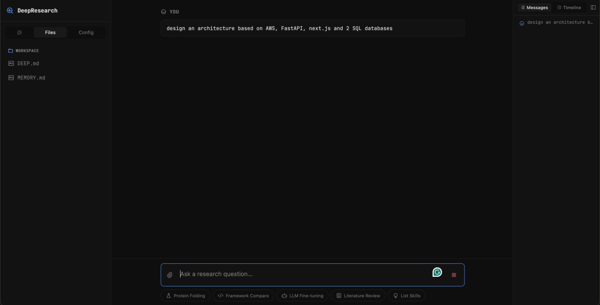

<p align="center">
  <!-- TODO: Replace with actual banner image -->
  
</p>

<h1 align="center">Pydantic AI Deep Agents Framework</h1>

<p align="center">
  <b>Build Claude Code-Style AI Agents — In 10 Lines of Python</b>
</p>

<p align="center">
  <a href="https://vstorm-co.github.io/pydantic-deepagents/">Docs</a> •
  <a href="https://vstorm-co.github.io/pydantic-deepagents/examples/">Examples</a> •
  <a href="https://pypi.org/project/pydantic-deep/">PyPI</a> •
  <a href="apps/deepresearch/">DeepResearch</a>
</p>

<p align="center">
  <a href="https://pypi.org/project/pydantic-deep/"></a>
  <a href="https://www.python.org/downloads/"></a>
  <a href="https://opensource.org/licenses/MIT"></a>
  <a href="https://coveralls.io/github/vstorm-co/pydantic-deepagents?branch=main"></a>
  <a href="https://github.com/vstorm-co/pydantic-deepagents/actions/workflows/ci.yml"></a>
  <a href="https://github.com/pydantic/pydantic-ai"></a>
</p>

<p align="center">
  <b>🔄 Unlimited Context</b> via summarization
  &nbsp;•&nbsp;
  <b>🤖 Subagent Delegation</b> sync & async
  &nbsp;•&nbsp;
  <b>🧩 Modular</b> use only what you need
  &nbsp;•&nbsp;
  <b>🎯 Fully Type-Safe</b>
</p>

---

## See It In Action

<table>
<tr>
<td width="50%">

</td>
<td width="50%">

</td>
</tr>
</table>

---

## Get Started in 60 Seconds

```bash
pip install pydantic-deep
```

```python
from pydantic_ai_backends import StateBackend
from pydantic_deep import create_deep_agent, create_default_deps

agent = create_deep_agent()
deps = create_default_deps(StateBackend())

result = await agent.run("Create a todo list for building a REST API", deps=deps)
```

**That's it.** Or use the **CLI** directly from your terminal:

```bash
pip install pydantic-deep[cli]

# Run a task
pydantic-deep run "Create a REST API with FastAPI"

# Interactive chat
pydantic-deep chat

# Run in Docker sandbox
pydantic-deep run "Build a web scraper" --sandbox --runtime python-web
```

Your agent can now:

- ✅ **Plan tasks** — break down complex work into steps
- ✅ **Read & write files** — navigate and modify codebases
- ✅ **Delegate to subagents** — spawn specialists for specific tasks
- ✅ **Load skills** — use domain-specific instructions
- ✅ **Manage context** — handle unlimited conversation length
- ✅ **Checkpoint & rewind** — save conversation state, rewind, or fork sessions
- ✅ **Agent teams** — shared TODO lists and peer-to-peer messaging
- ✅ **Persistent memory** — remember facts across sessions via MEMORY.md
- ✅ **Lifecycle hooks** — Claude Code-style hooks for audit, safety gates, and custom logic
- ✅ **Output styles** — built-in or custom response formatting
- ✅ **Cost tracking** — token/USD budgets with automatic enforcement
- ✅ **Middleware** — composable before/after hooks with permission handling
- ✅ **Context files** — auto-inject DEEP.md, AGENTS.md, CLAUDE.md into system prompt
- ✅ **Context manager** — hybrid summarization + sliding window middleware
- ✅ **Custom tool descriptions** — override any tool's built-in description via `descriptions` parameter
- ✅ **Custom commands** — user-defined slash commands from `.md` files (built-in, user, and project scopes)

---

## Same Architecture as the Best

pydantic-deep implements the **deep agent architecture** — the same patterns powering:

| | Product | What They Built |
|:-:|---------|-----------------|
| 🤖 | [**Claude Code**](https://claude.ai/code) | Anthropic's AI coding assistant |
| 🦾 | [**Manus AI**](https://manus.ai) | Autonomous task execution |
| 👨‍💻 | [**Devin**](https://devin.ai) | AI software engineer |

**Now you can build the same thing.**

> **Inspired by:** This framework is also inspired by [LangChain's Deep Agents](https://github.com/langchain-ai/deepagents) research on autonomous agent architectures.

---

### [DeepResearch](apps/deepresearch/) — Full-Featured Reference App

<table>
<tr>
<td width="50%">
<a href="apps/deepresearch/"></a>
<p align="center"><b>Plan Mode</b> — planner asks clarifying questions before research</p>
</td>
<td width="50%">
<a href="apps/deepresearch/"></a>
<p align="center"><b>Parallel Subagents</b> — 5 agents researching simultaneously</p>
</td>
</tr>
</table>

---

## Features

### Core Toolsets

🧠 **Planning** — [pydantic-ai-todo](https://github.com/vstorm-co/pydantic-ai-todo)
> Task tracking with `read_todos` / `write_todos`. Subtasks & dependencies with cycle detection. PostgreSQL storage. Event system for webhooks.

📁 **Filesystem** — [pydantic-ai-backend](https://github.com/vstorm-co/pydantic-ai-backend)
> Full access: `ls`, `read_file`, `write_file`, `edit_file`, `glob`, `grep`, `execute`. Docker sandbox for isolation. Permission system (allow/deny/ask). Session manager for multi-user apps.

🤖 **Subagents** — [subagents-pydantic-ai](https://github.com/vstorm-co/subagents-pydantic-ai)
> Delegate with `task` in sync or async mode. Background task management. Dynamic agent creation at runtime. Soft/hard cancellation.

💬 **Summarization** — [summarization-pydantic-ai](https://github.com/vstorm-co/summarization-pydantic-ai)
> Two modes: LLM-based intelligent summaries or zero-cost sliding window. Trigger on tokens, messages, or context fraction. Custom prompts.

🛡️ **Middleware** — [pydantic-ai-middleware](https://github.com/vstorm-co/pydantic-ai-middleware)
> 7 lifecycle hooks: `before_run`, `after_run`, `before_model_request`, `before_tool_call`, `after_tool_call`, `on_tool_error`, `on_error`. Composable chains. Permission handling.

### Advanced Features

💾 **Checkpointing** — Save conversation state at intervals. Rewind to any checkpoint, or fork into a new session from a past state. In-memory and file-based stores.

👥 **Agent Teams** — Shared TODO lists with claiming and dependency tracking. Peer-to-peer message bus between team members. Spawn, assign, and dissolve teams via tools.

🪝 **Hooks** — Claude Code-style lifecycle hooks. Run shell commands or scripts on events like `before_tool_call` or `after_run`. Use for audit logging, safety gates, or custom side effects.

🧠 **Persistent Memory** — Agents read/write a `MEMORY.md` file that persists across sessions. Automatic injection into system prompt. Tools: `read_memory`, `write_memory`.

📄 **Context Files** — Auto-discover and inject `DEEP.md`, `AGENTS.md`, `CLAUDE.md`, and `SOUL.md` from the working directory into the system prompt.

🎨 **Output Styles** — Built-in styles (concise, detailed, markdown, etc.) or load custom styles from files. Control response formatting via `output_style`.

📋 **Plan Mode** — Dedicated plan mode subagent for structured planning before execution. Separate toolset with plan-specific instructions.

💰 **Cost Tracking** — Track token usage and USD costs per run. Set budgets with automatic enforcement. Callbacks for real-time cost updates.

📦 **Eviction Processor** — Automatically evict large tool outputs to files when they exceed token limits. Keeps conversation lean while preserving data access.

🔧 **Patch Tool Calls** — On session resume, patch stale tool call results so the model sees clean history without re-executing tools.

🏷️ **Custom Tool Descriptions** — All toolset factories accept a `descriptions` parameter to override any tool's built-in description. Useful for tuning tool usage behavior without forking toolsets.

⚡ **Custom Commands** — User-triggered slash commands from `.md` files. Built-in commands include `/commit`, `/pr`, `/review`, `/test`, `/fix`, `/explain`. Three-scope discovery: built-in, user (`~/.pydantic-deep/commands/`), and project (`.pydantic-deep/commands/`).

### Built-in Capabilities

🎯 **Skills** — Load domain instructions from markdown files with YAML frontmatter.

📊 **Structured Output** — Type-safe responses with Pydantic models via `output_type`.

👤 **Human-in-the-Loop** — Built-in confirmation workflows for sensitive operations.

⚡ **Streaming** — Full streaming support for real-time responses.

🖼️ **Image Support** — Pass images to the agent for multi-modal analysis.

---

## Use Cases

| What You Want to Build | Key Components |
|------------------------|----------------|
| **AI Coding Assistant** | Planning + Filesystem + Skills + Memory + Hooks |
| **Data Analysis Agent** | File Uploads + Structured Output + Teams |
| **Document Processor** | Filesystem + Summarization + Eviction |
| **Research Agent** | Subagents + Planning + Checkpointing — see [DeepResearch](apps/deepresearch/) |
| **Project Scaffolder** | Planning + Filesystem + Output Styles |
| **Test Generator** | Filesystem + Docker Sandbox + Cost Tracking |
| **Multi-Agent Workflow** | Teams + Subagents + Middleware |
| **Audited Enterprise Agent** | Hooks + Middleware + Cost Tracking |

> **Reference app:** [**DeepResearch**](apps/deepresearch/) is a full-featured research agent built with pydantic-deep. It includes a web UI, MCP-powered web search, Excalidraw diagrams, code execution in Docker, and more. See [apps/deepresearch/README.md](apps/deepresearch/README.md) for setup instructions.

---

## CLI — Your Terminal AI Assistant

The pydantic-deep CLI gives you a Claude Code-style experience powered by the full framework.

```bash
pip install pydantic-deep[cli]
```

### Commands

```bash
# Non-interactive (benchmark mode) — stdout is clean, diagnostics go to stderr
pydantic-deep run "Fix the failing tests in src/" --model openai:gpt-4.1

# Interactive chat with streaming and tool visibility
pydantic-deep chat

# Docker sandbox for isolated execution
pydantic-deep run "Set up a Django project" --sandbox --runtime python-web

# Manage skills
pydantic-deep skills list                     # List built-in + user skills
pydantic-deep skills info code-review         # Show skill details
pydantic-deep skills create my-skill          # Scaffold a new skill

# Manage conversation threads
pydantic-deep threads list                    # List saved sessions
pydantic-deep threads delete abc12345         # Delete a session

# Configuration
pydantic-deep config show                     # Show current config
pydantic-deep config set model anthropic:claude-sonnet-4-20250514
```

### Configuration

Config file: `~/.pydantic-deep/config.toml`

```toml
model = "openai:gpt-4.1"
include_skills = true
include_plan = true
include_memory = true
shell_allow_list = ["python", "pip", "npm", "make"]
```

CLI arguments override config file values.

### Built-in Skills

| Skill | Description |
|-------|-------------|
| `skill-creator` | Create new reusable skills from conversation context |
| `code-review` | Systematic code review for bugs, security, style, and performance |
| `test-writer` | Generate comprehensive test suites for existing code |
| `refactor` | Refactor code to improve structure and maintainability |
| `git-workflow` | Git operations: commits, branches, PRs, and conflict resolution |

Skills are SKILL.md files — create your own with `pydantic-deep skills create my-skill`.

### Sandbox Runtimes

| Runtime | Description |
|---------|-------------|
| `python-minimal` | Python 3.12 (default) |
| `python-datascience` | Python + numpy, pandas, matplotlib |
| `python-web` | Python + FastAPI, Django, Flask |
| `node-minimal` | Node.js 20 |
| `node-react` | Node.js + React, Next.js |

```bash
pydantic-deep run "Analyze this CSV" --sandbox --runtime python-datascience
```

### What's Included

The CLI wraps the full pydantic-deep framework with all features enabled by default:

- Planning (TodoToolset) + delegation (SubAgentToolset)
- Filesystem access (ConsoleToolset) + shell execution
- Skills, memory, checkpoints, context files
- Custom commands — `/commit`, `/pr`, `/review`, `/test`, `/fix`, `/explain` + user/project commands
- Loop detection middleware + context management
- Git/directory context injection into system prompt
- Cost tracking with real-time display
- Rich terminal UI — colored unified diffs for file approvals, context progress bar with threshold colors, tool call timing with success/error states, seamless streaming from spinner to Markdown

---

## Modular — Use What You Need

Every component works standalone:

| Component | Package | Use It For |
|-----------|---------|------------|
| **Backends** | [pydantic-ai-backend](https://github.com/vstorm-co/pydantic-ai-backend) | File storage, Docker sandbox |
| **Planning** | [pydantic-ai-todo](https://github.com/vstorm-co/pydantic-ai-todo) | Task tracking |
| **Subagents** | [subagents-pydantic-ai](https://github.com/vstorm-co/subagents-pydantic-ai) | Task delegation |
| **Summarization** | [summarization-pydantic-ai](https://github.com/vstorm-co/summarization-pydantic-ai) | Context management |
| **Middleware** | [pydantic-ai-middleware](https://github.com/vstorm-co/pydantic-ai-middleware) | Lifecycle hooks, permissions |

> **Full-stack template?** [fastapi-fullstack](https://github.com/vstorm-co/full-stack-fastapi-nextjs-llm-template) — Production-ready with FastAPI + Next.js

---

## Go Deeper

### Structured Output

```python
from pydantic import BaseModel

class CodeReview(BaseModel):
    summary: str
    issues: list[str]
    score: int

agent = create_deep_agent(output_type=CodeReview)
result = await agent.run("Review the auth module", deps=deps)
print(result.output.score)  # Type-safe!
```

### File Uploads

```python
from pydantic_deep import run_with_files

with open("data.csv", "rb") as f:
    result = await run_with_files(
        agent,
        "Analyze this data and find trends",
        deps,
        files=[("data.csv", f.read())],
    )
```

### Context Management

```python
from pydantic_deep import create_summarization_processor

processor = create_summarization_processor(
    trigger=("tokens", 100000),
    keep=("messages", 20),
)
agent = create_deep_agent(history_processors=[processor])
```

### Custom Subagents

```python
agent = create_deep_agent(
    subagents=[
        {
            "name": "code-reviewer",
            "description": "Reviews code for quality issues",
            "instructions": "You are a senior code reviewer...",
            "preferred_mode": "sync",
        },
    ],
)
```

### Checkpointing & Rewind

```python
from pydantic_deep import create_deep_agent

agent = create_deep_agent(
    include_checkpoints=True,
    checkpoint_frequency="every_tool",  # "every_tool", "every_turn", or "manual_only"
    max_checkpoints=20,
)
# Agent gets tools: save_checkpoint, list_checkpoints, rewind_to
```

### Agent Teams

```python
agent = create_deep_agent(include_teams=True)
# Agent gets tools: spawn_team, assign_task, check_teammates,
#                   message_teammate, dissolve_team
```

### Hooks (Claude Code-Style)

```python
from pydantic_deep import Hook, HookEvent

agent = create_deep_agent(
    hooks=[
        Hook(
            event=HookEvent.PRE_TOOL_USE,
            command="echo 'Tool called: $TOOL_NAME' >> /tmp/audit.log",
        ),
    ],
)
```

### Persistent Memory

```python
agent = create_deep_agent(include_memory=True, memory_dir="./agent-data")
# Agent reads MEMORY.md on start, can write_memory to persist facts
```

### Cost Tracking

```python
agent = create_deep_agent(
    cost_tracking=True,
    cost_budget_usd=5.0,  # Stop if costs exceed $5
    on_cost_update=lambda info: print(f"Cost: ${info.total_usd:.4f}"),
)
```

### Middleware

```python
from pydantic_ai_middleware import before_tool_call, ToolDecision

@before_tool_call
async def audit(ctx, tool_name, tool_args):
    print(f"Calling {tool_name}")
    return ToolDecision.ALLOW

agent = create_deep_agent(middleware=[audit])
```

### Output Styles

```python
agent = create_deep_agent(output_style="concise")  # Built-in: concise, explanatory, formal, conversational

# Or load custom styles from a directory
agent = create_deep_agent(output_style="my-style", styles_dir="./styles")
```

### Context Files

```python
agent = create_deep_agent(
    context_files=["DEEP.md", "AGENTS.md"],  # Explicit files
    context_discovery=True,  # Auto-discover DEEP.md, CLAUDE.md, SOUL.md in working dir
)
```

### Plan Mode

```python
agent = create_deep_agent(include_plan=True, plans_dir="./plans")
# Agent gets a dedicated plan mode subagent for structured planning
```

### Context Manager (Hybrid)

```python
## Combines token tracking + auto-compression in a single middleware
agent = create_deep_agent(
    context_manager=True,
    context_manager_max_tokens=100000,
)
```

### Skills

Create `~/.pydantic-deep/skills/review/SKILL.md`:

```markdown
---
name: code-review
description: Review Python code for quality
---

# Code Review Skill

Check for:
- [ ] Security issues
- [ ] Type hints
- [ ] Error handling
```

```python
agent = create_deep_agent(
    skill_directories=[{"path": "~/.pydantic-deep/skills", "recursive": True}],
)
```

### Custom Tool Descriptions

```python
from pydantic_deep import create_deep_agent

agent = create_deep_agent(
    descriptions={
        "write_file": "Create or overwrite a file. Always confirm with the user first.",
        "execute": "Run a shell command in the working directory.",
    },
)
```

All toolset factories (`CheckpointToolset`, `AgentMemoryToolset`, `create_team_toolset()`, `create_plan_toolset()`, `SkillsToolset`, `create_web_toolset()`) also accept a `descriptions` parameter individually.

---

## Project Structure

```
pydantic_deep/          # Core library — agent factory, toolsets, processors, types
cli/                    # CLI frontend — terminal UI, commands, interactive chat
apps/                   # Applications built on pydantic-deep
  swebench_agent/       #   SWE-bench evaluation runner
  harbor_agent/         #   Harbor benchmark adapter
  deepresearch/         #   Full-featured research agent with web UI
tests/                  # Unit tests (100% coverage required)
docs/                   # MkDocs documentation source
```

## Architecture

```
                              pydantic-deep
┌─────────────────────────────────────────────────────────────────────┐
│                                                                     │
│   ┌──────────┐ ┌──────────┐ ┌──────────┐ ┌──────────┐ ┌─────────┐  │
│   │ Planning │ │Filesystem│ │ Subagents│ │  Skills  │ │  Teams  │  │
│   └────┬─────┘ └────┬─────┘ └────┬─────┘ └────┬─────┘ └────┬────┘  │
│        │            │            │            │            │        │
│        └────────────┴─────┬──────┴────────────┴────────────┘        │
│                           │                                         │
│                           ▼                                         │
│  Summarization ──► ┌──────────────────┐ ◄── Middleware              │
│  Checkpointing ──► │    Deep Agent    │ ◄── Hooks                   │
│  Cost Tracking ──► │   (pydantic-ai)  │ ◄── Memory                  │
│                    └────────┬─────────┘                              │
│                             │                                       │
│           ┌─────────────────┼─────────────────┐                     │
│           ▼                 ▼                 ▼                     │
│    ┌────────────┐    ┌────────────┐    ┌────────────┐               │
│    │   State    │    │   Local    │    │   Docker   │               │
│    │  Backend   │    │  Backend   │    │  Sandbox   │               │
│    └────────────┘    └────────────┘    └────────────┘               │
│                                                                     │
└─────────────────────────────────────────────────────────────────────┘
```

---

## Related Projects

- **[pydantic-ai](https://github.com/pydantic/pydantic-ai)** - The foundation: Agent framework by Pydantic
- **[pydantic-ai-backend](https://github.com/vstorm-co/pydantic-ai-backend)** - File storage and sandbox backends
- **[pydantic-ai-todo](https://github.com/vstorm-co/pydantic-ai-todo)** - Task planning toolset
- **[subagents-pydantic-ai](https://github.com/vstorm-co/subagents-pydantic-ai)** - Multi-agent orchestration
- **[summarization-pydantic-ai](https://github.com/vstorm-co/summarization-pydantic-ai)** - Context management
- **[pydantic-ai-middleware](https://github.com/vstorm-co/pydantic-ai-middleware)** - Middleware system with lifecycle hooks
- **[DeepResearch](apps/deepresearch/)** - Full-featured research agent built with pydantic-deep (included in this repo)
- **[SWE-bench Agent](apps/swebench_agent/)** - SWE-bench evaluation runner (included in this repo)
- **[Harbor Agent](apps/harbor_agent/)** - Harbor benchmark adapter (included in this repo)
- **[fastapi-fullstack](https://github.com/vstorm-co/full-stack-fastapi-nextjs-llm-template)** - Full-stack AI app template
- **[deepagents](https://github.com/langchain-ai/deepagents)** - Deep Agent implementation by LangChain (inspiration)

---

## Contributing

```bash
git clone https://github.com/vstorm-co/pydantic-deepagents.git
cd pydantic-deepagents
make install
make test  # 100% coverage required
make all   # lint + typecheck + test
```

See [CONTRIBUTING.md](CONTRIBUTING.md) for full guidelines.

---

## Star History

<p align="center">
  <a href="https://www.star-history.com/#vstorm-co/pydantic-deepagents&type=date">
    
  </a>
</p>

---

## License

MIT — see [LICENSE](LICENSE)

---

<div align="center">

### Need help implementing this in your company?

<p>We're <a href="https://vstorm.co"><b>Vstorm</b></a> — an Applied Agentic AI Engineering Consultancy<br>with 30+ production AI agent implementations.</p>

<a href="https://vstorm.co/contact-us/">
  
</a>

<br><br>

Made with ❤️ by <a href="https://vstorm.co"><b>Vstorm</b></a>

</div>
