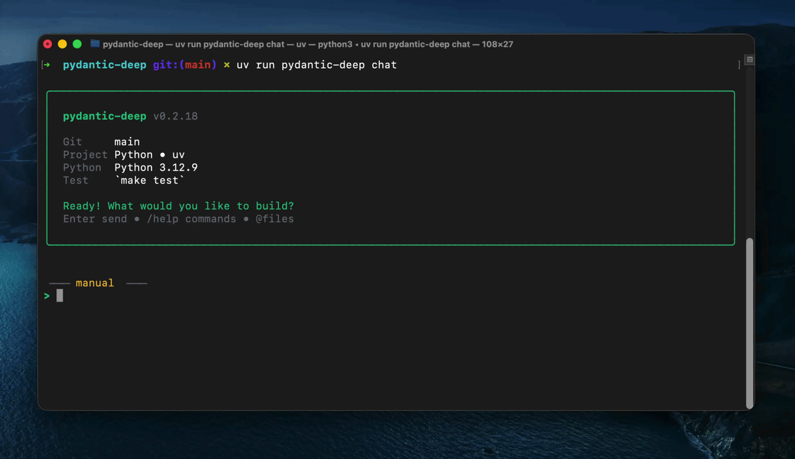

<p align="center">
  
</p>

<h1 align="center">Pydantic Deep Agents</h1>

<p align="center">
  <b>From framework to terminal — autonomous AI agents that plan, code, and ship</b>
</p>

<p align="center">
  <a href="https://vstorm-co.github.io/pydantic-deepagents/">Docs</a> &middot;
  <a href="https://pypi.org/project/pydantic-deep/">PyPI</a> &middot;
  <a href="#cli--terminal-ai-assistant">CLI</a> &middot;
  <a href="#deepresearch--reference-app">DeepResearch</a> &middot;
  <a href="https://vstorm-co.github.io/pydantic-deepagents/examples/">Examples</a>
</p>

<p align="center">
  <a href="https://pypi.org/project/pydantic-deep/"></a>
  <a href="https://www.python.org/downloads/"></a>
  <a href="https://opensource.org/licenses/MIT"></a>
  <a href="https://coveralls.io/github/vstorm-co/pydantic-deepagents?branch=main"></a>
  <a href="https://github.com/vstorm-co/pydantic-deepagents/actions/workflows/ci.yml"></a>
  <a href="https://github.com/pydantic/pydantic-ai"></a>
</p>

<p align="center">
  <b>🔄 Unlimited Context</b>
  &nbsp;&bull;&nbsp;
  <b>🤖 Subagent Delegation</b>
  &nbsp;&bull;&nbsp;
  <b>🧠 Persistent Memory</b>
  &nbsp;&bull;&nbsp;
  <b>🛡️ Lifecycle Hooks</b>
</p>

---

### Same Architecture as the Best

pydantic-deep implements the **deep agent pattern** — the same architecture powering:

| | Product | What They Built |
|:-:|---------|-----------------|
| 🤖 | [**Claude Code**](https://claude.ai/code) | Anthropic's AI coding assistant |
| 🦾 | [**Manus AI**](https://manus.ai) | Autonomous task execution |
| 👨‍💻 | [**Devin**](https://devin.ai) | AI software engineer |

**Now you can build the same thing** — or just use the CLI.

> **Inspired by:** [LangChain's Deep Agents](https://github.com/langchain-ai/deepagents) research on autonomous agent architectures.

---

**pydantic-deep** is three things:

1. **A Python framework** for building Claude Code-style agents with planning, filesystem access, subagents, memory, and unlimited context
2. **A CLI** that gives you a terminal AI assistant out of the box
3. **DeepResearch** — a full-featured research agent with web UI, web search, diagrams, and sandboxed code execution

---

## CLI — Terminal AI Assistant

<p align="center">
  
</p>

```bash
pip install pydantic-deep[cli]
pydantic-deep chat
```

That's it. You get an interactive AI agent in your terminal with:

- File read/write/edit, shell execution, glob, grep
- Task planning and subagent delegation
- Persistent memory across sessions
- Context compression for unlimited conversations
- Git-aware project context
- Built-in commands: `/commit`, `/pr`, `/review`, `/test`, `/fix`, `/explain`
- Customizable skills, hooks, and output styles

```bash
# Interactive mode
pydantic-deep chat

# Run a single task
pydantic-deep run "Fix the failing tests in src/"

# Docker sandbox for isolated execution
pydantic-deep run "Build a web scraper" --sandbox

# Pick a model
pydantic-deep chat --model anthropic:claude-sonnet-4-20250514

# Manage config
pydantic-deep config set model openai:gpt-4.1
```

> See [CLI docs](docs/cli/index.md) for the full reference.

---

## Framework — Build Your Own Agent

```bash
pip install pydantic-deep
```

```python
from pydantic_ai_backends import StateBackend
from pydantic_deep import create_deep_agent, create_default_deps

agent = create_deep_agent()
deps = create_default_deps(StateBackend())

result = await agent.run("Create a todo list for building a REST API", deps=deps)
```

One function call gives you an agent with planning, filesystem tools, subagents, skills, context management, and cost tracking. Everything is toggleable:

```python
agent = create_deep_agent(
    model="openai:gpt-4.1",
    include_todo=True,          # Task planning
    include_filesystem=True,    # File read/write/edit/execute
    include_subagents=True,     # Delegate to subagents
    include_skills=True,        # Domain-specific skills from SKILL.md files
    include_memory=True,        # Persistent MEMORY.md across sessions
    include_plan=True,          # Structured planning before execution
    include_teams=True,         # Multi-agent teams with shared TODOs
    include_web=True,           # Web search and URL fetching
    context_manager=True,       # Auto-summarization for unlimited context
    cost_tracking=True,         # Token/USD budget enforcement
    include_checkpoints=True,   # Save, rewind, and fork conversations
)
```

### Structured Output

```python
from pydantic import BaseModel

class CodeReview(BaseModel):
    summary: str
    issues: list[str]
    score: int

agent = create_deep_agent(output_type=CodeReview)
result = await agent.run("Review the auth module", deps=deps)
print(result.output.score)  # Type-safe!
```

### Context Management

```python
from pydantic_deep import create_summarization_processor

processor = create_summarization_processor(
    trigger=("tokens", 100000),
    keep=("messages", 20),
)
agent = create_deep_agent(history_processors=[processor])
```

### Hooks (Claude Code-Style)

```python
from pydantic_deep import Hook, HookEvent

agent = create_deep_agent(
    hooks=[
        Hook(
            event=HookEvent.PRE_TOOL_USE,
            command="echo 'Tool called: $TOOL_NAME' >> /tmp/audit.log",
        ),
    ],
)
```

### Cost Tracking

```python
agent = create_deep_agent(
    cost_tracking=True,
    cost_budget_usd=5.0,
    on_cost_update=lambda info: print(f"Cost: ${info.total_usd:.4f}"),
)
```

### Custom Subagents

```python
agent = create_deep_agent(
    subagents=[
        {
            "name": "code-reviewer",
            "description": "Reviews code for quality issues",
            "instructions": "You are a senior code reviewer...",
            "preferred_mode": "sync",
        },
    ],
)
```

> See the full [API reference](https://vstorm-co.github.io/pydantic-deepagents/api/toolsets/) for all options.

---

## DeepResearch — Reference App

A full-featured research agent with web UI, built entirely on pydantic-deep.

<table>
<tr>
<td width="50%">
<a href="apps/deepresearch/"></a>
<p align="center"><b>Plan Mode</b> — planner asks clarifying questions</p>
</td>
<td width="50%">
<a href="apps/deepresearch/"></a>
<p align="center"><b>Parallel Subagents</b> — 5 agents researching simultaneously</p>
</td>
</tr>
<tr>
<td width="50%">
<a href="apps/deepresearch/"></a>
<p align="center"><b>Excalidraw Canvas</b> — live diagrams synced with agent</p>
</td>
<td width="50%">
<a href="apps/deepresearch/"></a>
<p align="center"><b>File Browser</b> — workspace files with inline preview</p>
</td>
</tr>
</table>

Web search (Tavily, Brave, Jina), sandboxed code execution, Excalidraw diagrams, subagents, plan mode, report export, and more.

```bash
cd apps/deepresearch
uv sync
cp .env.example .env  # Add your API keys
uv run deepresearch    # Open http://localhost:8080
```

> See [apps/deepresearch/README.md](apps/deepresearch/README.md) for full setup.

---

## Architecture

pydantic-deep implements the **deep agent pattern** — the same architecture powering Claude Code, Devin, and Manus AI. Every component is modular and works standalone:

| Component | Package | What It Does |
|-----------|---------|--------------|
| **Backends** | [pydantic-ai-backend](https://github.com/vstorm-co/pydantic-ai-backend) | File storage, Docker/Daytona sandbox |
| **Planning** | [pydantic-ai-todo](https://github.com/vstorm-co/pydantic-ai-todo) | Task tracking with dependencies |
| **Subagents** | [subagents-pydantic-ai](https://github.com/vstorm-co/subagents-pydantic-ai) | Sync/async delegation, cancellation |
| **Summarization** | [summarization-pydantic-ai](https://github.com/vstorm-co/summarization-pydantic-ai) | LLM summaries or sliding window |
| **Middleware** | [pydantic-ai-middleware](https://github.com/vstorm-co/pydantic-ai-middleware) | Lifecycle hooks, permissions |

```
                              pydantic-deep
┌─────────────────────────────────────────────────────────────────────┐
│                                                                     │
│   ┌──────────┐ ┌──────────┐ ┌──────────┐ ┌──────────┐ ┌─────────┐   │
│   │ Planning │ │Filesystem│ │ Subagents│ │  Skills  │ │  Teams  │   │
│   └────┬─────┘ └────┬─────┘ └────┬─────┘ └────┬─────┘ └────┬────┘   │
│        │            │            │            │            │        │
│        └────────────┴─────┬──────┴────────────┴────────────┘        │
│                           │                                         │
│                           ▼                                         │
│  Summarization ──► ┌──────────────────┐ ◄── Middleware              │
│  Checkpointing ──► │    Deep Agent    │ ◄── Hooks                   │
│  Cost Tracking ──► │   (pydantic-ai)  │ ◄── Memory                  │
│                    └────────┬─────────┘                             │
│                             │                                       │
│           ┌─────────────────┼─────────────────┐                     │
│           ▼                 ▼                 ▼                     │
│    ┌────────────┐    ┌────────────┐    ┌────────────┐               │
│    │   State    │    │   Local    │    │   Docker   │               │
│    │  Backend   │    │  Backend   │    │  Sandbox   │               │
│    └────────────┘    └────────────┘    └────────────┘               │
│                                                                     │
└─────────────────────────────────────────────────────────────────────┘
```

---

## All Features

<details>
<summary><b>Click to expand full feature list</b></summary>

### Core Toolsets

- **Planning** — Task tracking with subtasks, dependencies, cycle detection. PostgreSQL storage. Event system.
- **Filesystem** — `ls`, `read_file`, `write_file`, `edit_file`, `glob`, `grep`, `execute`. Docker sandbox. Permission system.
- **Subagents** — Sync/async delegation. Background task management. Soft/hard cancellation.
- **Summarization** — LLM-based summaries or zero-cost sliding window. Trigger on tokens, messages, or fraction.
- **Middleware** — 7 lifecycle hooks. Composable chains. Permission handling.

### Advanced

- **Checkpointing** — Save state at intervals. Rewind or fork sessions. In-memory and file-based stores.
- **Agent Teams** — Shared TODO lists with claiming and dependency tracking. Peer-to-peer message bus.
- **Hooks** — Claude Code-style lifecycle hooks. Shell commands on tool events. Audit logging, safety gates.
- **Persistent Memory** — `MEMORY.md` that persists across sessions. Auto-injected into system prompt.
- **Context Files** — Auto-discover and inject `AGENT.md` into the system prompt.
- **Output Styles** — Built-in (concise, explanatory, formal, conversational) or custom from files.
- **Plan Mode** — Dedicated planner subagent for structured planning before execution.
- **Cost Tracking** — Token/USD budgets with automatic enforcement and real-time callbacks.
- **Eviction Processor** — Evict large tool outputs to files. Keep context lean while preserving data.
- **Patch Tool Calls** — On resume, patch stale tool call results for clean history.
- **Custom Tool Descriptions** — Override any tool's description via `descriptions` parameter.
- **Custom Commands** — `/commit`, `/pr`, `/review`, `/test`, `/fix`, `/explain`. Three-scope discovery: built-in, user, project.
- **Web Tools** — Web search (Tavily) and URL fetching with automatic markdown conversion.
- **Structured Output** — Type-safe responses with Pydantic models via `output_type`.
- **Human-in-the-Loop** — Confirmation workflows for sensitive operations.
- **Streaming** — Full streaming support for real-time responses.
- **Image Support** — Multi-modal analysis with image inputs.

</details>

---

## Contributing

```bash
git clone https://github.com/vstorm-co/pydantic-deepagents.git
cd pydantic-deepagents
make install
make test  # 100% coverage required
make all   # lint + typecheck + test
```

---

## Star History

<p align="center">
  <a href="https://www.star-history.com/#vstorm-co/pydantic-deepagents&type=date">
    
  </a>
</p>

---

## License

MIT — see [LICENSE](LICENSE)

---

<div align="center">

### Need help implementing this in your company?

<p>We're <a href="https://vstorm.co"><b>Vstorm</b></a> — an Applied Agentic AI Engineering Consultancy<br>with 30+ production AI agent implementations.</p>

<a href="https://vstorm.co/contact-us/">
  
</a>

<br><br>

Made with &#10084;&#65039; by <a href="https://vstorm.co"><b>Vstorm</b></a>

</div>
