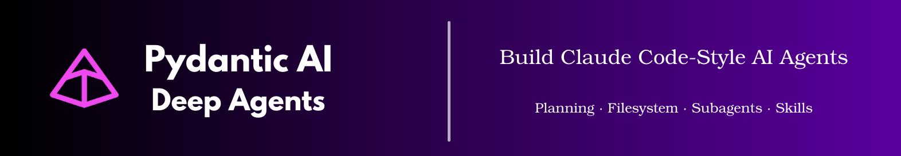

<p align="center">
  <!-- TODO: Replace with actual banner image -->
  
</p>

<h1 align="center">Pydantic AI Deep Agents Framework</h1>

<p align="center">
  <b>Build Claude Code-Style AI Agents — In 10 Lines of Python</b>
</p>

<p align="center">
  <a href="https://vstorm-co.github.io/pydantic-deepagents/">Docs</a> •
  <a href="https://vstorm-co.github.io/pydantic-deepagents/examples/">Examples</a> •
  <a href="https://pypi.org/project/pydantic-deep/">PyPI</a> •
  <a href="https://drive.google.com/file/d/1hqgXkbAgUrsKOWpfWdF48cqaxRht-8od/view?usp=sharing">Demo</a>
</p>

<p align="center">
  <a href="https://pypi.org/project/pydantic-deep/"></a>
  <a href="https://www.python.org/downloads/"></a>
  <a href="https://opensource.org/licenses/MIT"></a>
  <a href="https://coveralls.io/github/vstorm-co/pydantic-deepagents?branch=main"></a>
  <a href="https://github.com/vstorm-co/pydantic-deepagents/actions/workflows/ci.yml"></a>
  <a href="https://github.com/pydantic/pydantic-ai"></a>
</p>

<p align="center">
  <b>📦 80% Less Code</b> than alternatives
  &nbsp;•&nbsp;
  <b>🧪 100% Test Coverage</b>
  &nbsp;•&nbsp;
  <b>🎯 Fully Type-Safe</b>
</p>

---

## See It In Action

<p align="center">
  
</p>

<p align="center">
  <a href="https://drive.google.com/file/d/1hqgXkbAgUrsKOWpfWdF48cqaxRht-8od/view?usp=sharing">
    
  </a>
</p>

---

## Get Started in 60 Seconds

```bash
pip install pydantic-deep
```

```python
from pydantic_ai_backends import StateBackend
from pydantic_deep import create_deep_agent, create_default_deps

agent = create_deep_agent()
deps = create_default_deps(StateBackend())

result = await agent.run("Create a todo list for building a REST API", deps=deps)
```

**That's it.** Your agent can now:

- ✅ **Plan tasks** — break down complex work into steps
- ✅ **Read & write files** — navigate and modify codebases
- ✅ **Delegate to subagents** — spawn specialists for specific tasks
- ✅ **Load skills** — use domain-specific instructions
- ✅ **Manage context** — handle unlimited conversation length

---

## Same Architecture as the Best

pydantic-deep implements the **deep agent architecture** — the same patterns powering:

| | Product | What They Built |
|:-:|---------|-----------------|
| 🤖 | [**Claude Code**](https://claude.ai/code) | Anthropic's AI coding assistant |
| 🦾 | [**Manus AI**](https://manus.ai) | Autonomous task execution |
| 👨‍💻 | [**Devin**](https://devin.ai) | AI software engineer |

**Now you can build the same thing.**

> **Inspired by:** This framework is also inspired by [LangChain's Deep Agents](https://github.com/langchain-ai/deepagents) research on autonomous agent architectures.

---

## Features

🧠 **Planning** — [pydantic-ai-todo](https://github.com/vstorm-co/pydantic-ai-todo)
> Task tracking with `read_todos` / `write_todos`. Subtasks & dependencies with cycle detection. PostgreSQL storage. Event system for webhooks.

📁 **Filesystem** — [pydantic-ai-backend](https://github.com/vstorm-co/pydantic-ai-backend)
> Full access: `ls`, `read_file`, `write_file`, `edit_file`, `glob`, `grep`, `execute`. Docker sandbox for isolation. Permission system (allow/deny/ask). Session manager for multi-user apps.

🤖 **Subagents** — [subagents-pydantic-ai](https://github.com/vstorm-co/subagents-pydantic-ai)
> Delegate with `task` in sync or async mode. Background task management. Dynamic agent creation at runtime. Soft/hard cancellation.

💬 **Summarization** — [summarization-pydantic-ai](https://github.com/vstorm-co/summarization-pydantic-ai)
> Two modes: LLM-based intelligent summaries or zero-cost sliding window. Trigger on tokens, messages, or context fraction. Custom prompts.

🎯 **Skills** — Load domain instructions from markdown files with YAML frontmatter.

📊 **Structured Output** — Type-safe responses with Pydantic models via `output_type`.

👤 **Human-in-the-Loop** — Built-in confirmation workflows for sensitive operations.

⚡ **Streaming** — Full streaming support for real-time responses.

---

## Use Cases

| What You Want to Build | Key Components |
|------------------------|----------------|
| **AI Coding Assistant** | Planning + Filesystem + Skills |
| **Data Analysis Agent** | File Uploads + Structured Output |
| **Document Processor** | Filesystem + Summarization |
| **Research Agent** | Subagents + Planning |
| **Project Scaffolder** | Planning + Filesystem |
| **Test Generator** | Filesystem + Docker Sandbox |

---

## Modular — Use What You Need

Every component works standalone:

| Component | Package | Use It For |
|-----------|---------|------------|
| **Backends** | [pydantic-ai-backend](https://github.com/vstorm-co/pydantic-ai-backend) | File storage, Docker sandbox |
| **Planning** | [pydantic-ai-todo](https://github.com/vstorm-co/pydantic-ai-todo) | Task tracking |
| **Subagents** | [subagents-pydantic-ai](https://github.com/vstorm-co/subagents-pydantic-ai) | Task delegation |
| **Summarization** | [summarization-pydantic-ai](https://github.com/vstorm-co/summarization-pydantic-ai) | Context management |

> **Full-stack template?** [fastapi-fullstack](https://github.com/vstorm-co/full-stack-fastapi-nextjs-llm-template) — Production-ready with FastAPI + Next.js

---

## Go Deeper

### Structured Output

```python
from pydantic import BaseModel

class CodeReview(BaseModel):
    summary: str
    issues: list[str]
    score: int

agent = create_deep_agent(output_type=CodeReview)
result = await agent.run("Review the auth module", deps=deps)
print(result.output.score)  # Type-safe!
```

### File Uploads

```python
from pydantic_deep import run_with_files

with open("data.csv", "rb") as f:
    result = await run_with_files(
        agent,
        "Analyze this data and find trends",
        deps,
        files=[("data.csv", f.read())],
    )
```

### Context Management

```python
from pydantic_deep.processors import create_summarization_processor

processor = create_summarization_processor(
    trigger=("tokens", 100000),
    keep=("messages", 20),
)
agent = create_deep_agent(history_processors=[processor])
```

### Custom Subagents

```python
agent = create_deep_agent(
    subagents=[
        {
            "name": "code-reviewer",
            "description": "Reviews code for quality issues",
            "instructions": "You are a senior code reviewer...",
            "preferred_mode": "sync",
        },
    ],
)
```

### Skills

Create `~/.pydantic-deep/skills/review/SKILL.md`:

```markdown
---
name: code-review
description: Review Python code for quality
---

# Code Review Skill

Check for:
- [ ] Security issues
- [ ] Type hints
- [ ] Error handling
```

```python
agent = create_deep_agent(
    skill_directories=[{"path": "~/.pydantic-deep/skills", "recursive": True}],
)
```

---

## Architecture

```
                              pydantic-deep
┌──────────────────────────────────────────────────────────────────┐
│                                                                  │
│      ┌──────────┐ ┌──────────┐ ┌──────────┐ ┌──────────┐         │
│      │ Planning │ │Filesystem│ │ Subagents│ │  Skills  │         │
│      └────┬─────┘ └────┬─────┘ └────┬─────┘ └────┬─────┘         │
│           │            │            │            │               │
│           └────────────┴─────┬──────┴────────────┘               │
│                              │                                   │
│                              ▼                                   │
│                    ┌──────────────────┐                          │
│  Summarization ──► │    Deep Agent    │                          │
│                    │   (pydantic-ai)  │                          │
│                    └────────┬─────────┘                          │
│                             │                                    │
│           ┌─────────────────┼─────────────────┐                  │
│           ▼                 ▼                 ▼                  │
│    ┌────────────┐    ┌────────────┐    ┌────────────┐            │
│    │   State    │    │   Local    │    │   Docker   │            │
│    │  Backend   │    │  Backend   │    │  Sandbox   │            │
│    └────────────┘    └────────────┘    └────────────┘            │
│                                                                  │
└──────────────────────────────────────────────────────────────────┘
```

---

## Related Projects

- **[pydantic-ai](https://github.com/pydantic/pydantic-ai)** - The foundation: Agent framework by Pydantic
- **[pydantic-ai-backend](https://github.com/vstorm-co/pydantic-ai-backend)** - File storage and sandbox backends
- **[pydantic-ai-todo](https://github.com/vstorm-co/pydantic-ai-todo)** - Task planning toolset
- **[subagents-pydantic-ai](https://github.com/vstorm-co/subagents-pydantic-ai)** - Multi-agent orchestration
- **[summarization-pydantic-ai](https://github.com/vstorm-co/summarization-pydantic-ai)** - Context management
- **[fastapi-fullstack](https://github.com/vstorm-co/full-stack-fastapi-nextjs-llm-template)** - Full-stack AI app template
- **[deepagents](https://github.com/langchain-ai/deepagents)** - Deep Agent implementation by LangChain (inspiration)

---

## Contributing

```bash
git clone https://github.com/vstorm-co/pydantic-deepagents.git
cd pydantic-deepagents
make install
make test  # 100% coverage required
make all   # lint + typecheck + test
```

See [CONTRIBUTING.md](CONTRIBUTING.md) for full guidelines.

---

## Star History

<p align="center">
  <a href="https://www.star-history.com/#vstorm-co/pydantic-deepagents&type=date">
    
  </a>
</p>

---

## License

MIT — see [LICENSE](LICENSE)

<p align="center">
  <sub>Built with ❤️ by <a href="https://github.com/vstorm-co">vstorm-co</a></sub>
</p>
