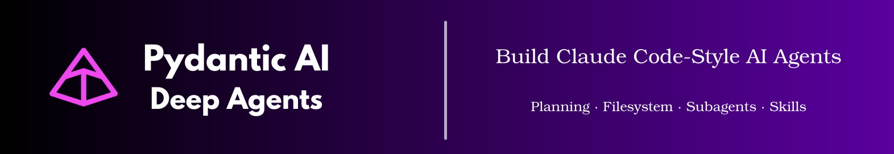
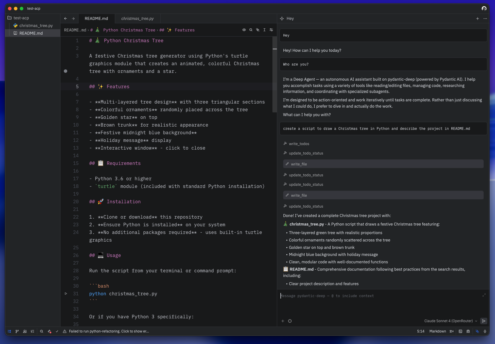

<p align="center">
  
</p>

<h1 align="center">Pydantic Deep Agents</h1>

<p align="center">
  <b>From framework to terminal -- autonomous AI agents that plan, code, and ship</b>
</p>

<p align="center">
  <a href="https://vstorm-co.github.io/pydantic-deepagents/">Docs</a> &middot;
  <a href="https://pypi.org/project/pydantic-deep/">PyPI</a> &middot;
  <a href="#cli--terminal-ai-assistant">CLI</a> &middot;
  <a href="#deepresearch--reference-app">DeepResearch</a> &middot;
  <a href="https://vstorm-co.github.io/pydantic-deepagents/examples/">Examples</a>
</p>

<p align="center">
  <a href="https://pypi.org/project/pydantic-deep/"></a>
  <a href="https://www.python.org/downloads/"></a>
  <a href="https://opensource.org/licenses/MIT"></a>
  <a href="https://coveralls.io/github/vstorm-co/pydantic-deepagents?branch=main"></a>
  <a href="https://github.com/vstorm-co/pydantic-deepagents/actions/workflows/ci.yml"></a>
  <a href="https://github.com/pydantic/pydantic-ai"></a>
</p>

<p align="center">
  <b>Unlimited Context</b>
  &nbsp;&bull;&nbsp;
  <b>Subagent Delegation</b>
  &nbsp;&bull;&nbsp;
  <b>Persistent Memory</b>
  &nbsp;&bull;&nbsp;
  <b>Lifecycle Hooks</b>
</p>

---

### Same Architecture as the Best

pydantic-deep implements the **deep agent pattern** -- the same architecture powering:

| | Product | What They Built |
|:-:|---------|-----------------|
| | [**Claude Code**](https://claude.ai/code) | Anthropic's AI coding assistant |
| | [**Manus AI**](https://manus.ai) | Autonomous task execution |
| | [**Devin**](https://devin.ai) | AI software engineer |

**Now you can build the same thing** -- or just use the CLI.

> **Inspired by:** [LangChain's Deep Agents](https://github.com/langchain-ai/deepagents) research on autonomous agent architectures.

---

**pydantic-deep** is four things:

1. **A Python framework** for building Claude Code-style agents with planning, filesystem access, subagents, memory, and unlimited context
2. **A CLI** that gives you a terminal AI assistant out of the box
3. **An ACP adapter** that runs deep agents inside editors like Zed
4. **DeepResearch** -- a full-featured research agent with web UI, web search, diagrams, and sandboxed code execution

---

## CLI -- Terminal AI Assistant

<p align="center">
  
</p>

```bash
pip install pydantic-deep[cli]
pydantic-deep
```

That's it. A Textual-based TUI launches with:

- Streaming chat with tool call visualization
- File read/write/edit, shell execution, glob, grep
- Task planning and subagent delegation
- Persistent memory across sessions
- Context compression for unlimited conversations
- Git-aware project context
- `/improve` -- learn from past sessions and update context files
- `/skills`, `/diff`, `/model`, `/provider`, `/compact`, and more
- Customizable themes, skills, and hooks

```bash
# Launch TUI (default)
pydantic-deep

# Pick a model
pydantic-deep tui --model anthropic:claude-sonnet-4-6

# Headless run (benchmarks, CI/CD, scripted automation)
pydantic-deep run "Fix the failing test in test_auth.py"
pydantic-deep run --task-file task.md --json
pydantic-deep run "Fix bug" --no-web-search --no-web-fetch --thinking false

# Manage config
pydantic-deep config set model anthropic:claude-sonnet-4-6

# List skills
pydantic-deep skills list
```

> See [CLI docs](docs/cli/index.md) for the full reference.

---

## Framework -- Build Your Own Agent

```bash
pip install pydantic-deep
```

**Requires pydantic-ai >= 1.77.0.**

```python
from pydantic_ai_backends import StateBackend
from pydantic_deep import create_deep_agent, create_default_deps

agent = create_deep_agent()
deps = create_default_deps(StateBackend())

result = await agent.run("Create a todo list for building a REST API", deps=deps)
```

One function call gives you an agent with planning, filesystem tools, subagents, skills, context management, and cost tracking. Everything is toggleable:

```python
agent = create_deep_agent(
    model="anthropic:claude-sonnet-4-6",
    include_todo=True,          # Task planning
    include_filesystem=True,    # File read/write/edit/execute
    include_subagents=True,     # Delegate to subagents
    include_skills=True,        # Domain-specific skills from SKILL.md files
    include_memory=True,        # Persistent MEMORY.md across sessions
    include_plan=True,          # Structured planning before execution
    include_teams=True,         # Multi-agent teams with shared TODOs
    web_search=True,            # WebSearch capability
    web_fetch=True,             # WebFetch capability
    thinking="high",            # Thinking/reasoning effort
    context_manager=True,       # Auto-summarization for unlimited context
    cost_tracking=True,         # Token/USD budget enforcement
    include_checkpoints=True,   # Save, rewind, and fork conversations
)
```

### Structured Output

```python
from pydantic import BaseModel

class CodeReview(BaseModel):
    summary: str
    issues: list[str]
    score: int

agent = create_deep_agent(output_type=CodeReview)
result = await agent.run("Review the auth module", deps=deps)
print(result.output.score)  # Type-safe!
```

### Context Management

```python
from pydantic_deep import create_summarization_processor

processor = create_summarization_processor(
    trigger=("tokens", 100000),
    keep=("messages", 20),
)
agent = create_deep_agent(history_processors=[processor])
```

### Hooks (Claude Code-Style)

```python
from pydantic_deep import Hook, HookEvent

agent = create_deep_agent(
    hooks=[
        Hook(
            event=HookEvent.PRE_TOOL_USE,
            command="echo 'Tool called: $TOOL_NAME' >> /tmp/audit.log",
        ),
    ],
)
```

### Cost Tracking

```python
agent = create_deep_agent(
    cost_tracking=True,
    cost_budget_usd=5.0,
    on_cost_update=lambda info: print(f"Cost: ${info.total_usd:.4f}"),
)
```

### MCP Servers

Connect to any [MCP](https://modelcontextprotocol.io/) server via pydantic-ai's `MCP` capability:

```python
from pydantic_ai.capabilities import MCP

agent = create_deep_agent(
    capabilities=[
        MCP(url="https://mcp.example.com/api"),
    ],
)
```

### Subagents

A built-in **research** subagent is included by default. Add your own:

```python
agent = create_deep_agent(
    subagents=[
        {
            "name": "code-reviewer",
            "description": "Reviews code for quality issues",
            "instructions": "Check for security, performance, error handling...",
        },
    ],
)
# The main agent delegates: task(description="Review auth.py", subagent_type="code-reviewer")
```

All subagents are full deep agents with filesystem, web, and memory tools. You only provide the specialized `instructions` — the framework adds `BASE_PROMPT` automatically.

### Project Files

pydantic-deep recognizes three special markdown files:

| File | Purpose | Who Sees It |
|------|---------|-------------|
| `AGENTS.md` | Project instructions, conventions, architecture | Main agent + subagents |
| `SOUL.md` | Agent personality, style, user preferences | Main agent only |
| `MEMORY.md` | Persistent memory across sessions (read/write/update tools) | Per-agent (isolated) |

```python
agent = create_deep_agent(
    context_discovery=True,  # Auto-discover AGENTS.md and SOUL.md at backend root
    include_memory=True,     # MEMORY.md with read/write/update tools (on by default)
)
```

`AGENTS.md` follows the [agents.md spec](https://agents.md/) — compatible with other agent frameworks.

> See the full [API reference](https://vstorm-co.github.io/pydantic-deepagents/api/toolsets/) for all options.

---

## ACP -- Editor Integration (Zed)


Run pydantic-deep agents inside [Zed](https://zed.dev) via the [Agent Client Protocol](https://agentclientprotocol.com):

```bash
pip install pydantic-deep[acp]
python -m apps.acp
```

Add to Zed settings (`Cmd+,`):

```json
{
  "agent_servers": {
    "pydantic-deep": {
      "type": "custom",
      "command": "/path/to/venv/bin/python",
      "args": ["-m", "apps.acp"],
      "cwd": "/path/to/pydantic-deep"
    }
  }
}
```

API keys are loaded from `~/.pydantic-deep/.env` (global) or `.pydantic-deep/.env` (per-project):

```bash
mkdir -p ~/.pydantic-deep
echo 'OPENROUTER_API_KEY=sk-or-your-key' > ~/.pydantic-deep/.env
```

> See [ACP README](apps/acp/README.md) for full configuration.

---

## DeepResearch -- Reference App

A full-featured research agent with web UI, built entirely on pydantic-deep.

<table>
<tr>
<td width="50%">
<a href="apps/deepresearch/"></a>
<p align="center"><b>Plan Mode</b> -- planner asks clarifying questions</p>
</td>
<td width="50%">
<a href="apps/deepresearch/"></a>
<p align="center"><b>Parallel Subagents</b> -- 5 agents researching simultaneously</p>
</td>
</tr>
<tr>
<td width="50%">
<a href="apps/deepresearch/"></a>
<p align="center"><b>Excalidraw Canvas</b> -- live diagrams synced with agent</p>
</td>
<td width="50%">
<a href="apps/deepresearch/"></a>
<p align="center"><b>File Browser</b> -- workspace files with inline preview</p>
</td>
</tr>
</table>

Web search (Tavily, Brave, Jina), sandboxed code execution, Excalidraw diagrams, subagents, plan mode, report export, and more.

```bash
cd apps/deepresearch
uv sync
cp .env.example .env  # Add your API keys
uv run deepresearch    # Open http://localhost:8080
```

> See [apps/deepresearch/README.md](apps/deepresearch/README.md) for full setup.

---

## Architecture

pydantic-deep v0.3.0 uses pydantic-ai's native **Capabilities API** (`Agent(capabilities=[...])`) for all cross-cutting concerns. This replaces the previous middleware wrapping approach and provides a cleaner, more composable architecture.

### Capabilities

All lifecycle features are implemented as capabilities that extend `AbstractCapability` from pydantic-ai:

| Capability | Package | What It Does |
|-----------|---------|--------------|
| **CostTracking** | [pydantic-ai-shields](https://github.com/vstorm-co/pydantic-ai-shields) | Token/USD budget enforcement and real-time cost callbacks |
| **ContextManagerCapability** | [summarization-pydantic-ai](https://github.com/vstorm-co/summarization-pydantic-ai) | Auto-compression when approaching token budget |
| **HooksCapability** | pydantic-deep | Claude Code-style lifecycle hooks on tool events |
| **CheckpointMiddleware** | pydantic-deep | Save, rewind, and fork conversation state |
| **WebSearch / WebFetch** | pydantic-ai (built-in) | Web search and URL fetching |

pydantic-deep also provides 5 **internal capabilities** that are automatically wired up when their corresponding `include_*` flags are set:

| Internal Capability | Activated By | What It Does |
|-----------|---------|--------------|
| **SkillsCapability** | `include_skills=True` | Domain-specific skills from SKILL.md files |
| **ContextFilesCapability** | `context_files` / `context_discovery` | Auto-discover and inject DEEP.md, AGENTS.md, CLAUDE.md |
| **MemoryCapability** | `include_memory=True` | Persistent MEMORY.md across sessions |
| **TeamCapability** | `include_teams=True` | Multi-agent teams with shared TODOs and message bus |
| **PlanCapability** | `include_plan=True` | Structured planning before execution |

### Component Packages

Every component is modular and works standalone:

| Component | Package | What It Does |
|-----------|---------|--------------|
| **Backends** | [pydantic-ai-backend](https://github.com/vstorm-co/pydantic-ai-backend) | File storage, Docker/Daytona sandbox |
| **Planning** | [pydantic-ai-todo](https://github.com/vstorm-co/pydantic-ai-todo) | Task tracking with dependencies |
| **Subagents** | [subagents-pydantic-ai](https://github.com/vstorm-co/subagents-pydantic-ai) | Sync/async delegation, cancellation |
| **Summarization** | [summarization-pydantic-ai](https://github.com/vstorm-co/summarization-pydantic-ai) | LLM summaries or sliding window |
| **Shields** | [pydantic-ai-shields](https://github.com/vstorm-co/pydantic-ai-shields) | Cost tracking, input/output/tool blocking |

```
                              pydantic-deep
+---------------------------------------------------------------------+
|                                                                     |
|   +----------+ +----------+ +----------+ +----------+ +---------+   |
|   | Planning | |Filesystem| | Subagents| |  Skills  | |  Teams  |   |
|   +----+-----+ +----+-----+ +----+-----+ +----+-----+ +----+----+   |
|        |            |            |            |            |        |
|        +------------+-----+------+------------+------------+        |
|                           |                                         |
|                           v                                         |
|  Summarization --> +------------------+ <-- Capabilities            |
|  Checkpointing --> |    Deep Agent    | <-- Hooks                   |
|  Cost Tracking --> |   (pydantic-ai)  | <-- Memory                  |
|                    +--------+---------+                             |
|                             |                                       |
|           +-----------------+-----------------+                     |
|           v                 v                 v                     |
|    +------------+    +------------+    +------------+               |
|    |   State    |    |   Local    |    |   Docker   |               |
|    |  Backend   |    |  Backend   |    |  Sandbox   |               |
|    +------------+    +------------+    +------------+               |
|                                                                     |
+---------------------------------------------------------------------+
```

---

## All Features

<details>
<summary><b>Click to expand full feature list</b></summary>

### Core Toolsets

- **Planning** -- Task tracking with subtasks, dependencies, cycle detection. PostgreSQL storage. Event system.
- **Filesystem** -- `ls`, `read_file`, `write_file`, `edit_file`, `glob`, `grep`, `execute`. Docker sandbox. Permission system.
- **Subagents** -- Sync/async delegation. Background task management. Soft/hard cancellation.
- **Summarization** -- LLM-based summaries or zero-cost sliding window. Trigger on tokens, messages, or fraction.

### Capabilities

- **CostTracking** -- Token/USD budgets with automatic enforcement and real-time callbacks (from `pydantic-ai-shields`).
- **ContextManagerCapability** -- Auto-compression when approaching token budget (from `summarization-pydantic-ai`).
- **HooksCapability** -- Claude Code-style lifecycle hooks. Shell commands on tool events. Audit logging, safety gates.
- **CheckpointMiddleware** -- Save state at intervals. Rewind or fork sessions. In-memory and file-based stores. Extends `AbstractCapability`.
- **WebSearch / WebFetch** -- Built-in pydantic-ai capabilities for web search and URL fetching.
- **SkillsCapability** -- Domain-specific skills loaded from SKILL.md files.
- **ContextFilesCapability** -- Auto-discover and inject DEEP.md, AGENTS.md, CLAUDE.md, SOUL.md into the system prompt.
- **MemoryCapability** -- Persistent MEMORY.md across sessions, auto-injected into system prompt.
- **TeamCapability** -- Multi-agent teams with shared TODO lists, claiming, dependency tracking, and peer-to-peer message bus.
- **PlanCapability** -- Dedicated planner subagent for structured planning before execution.

### Advanced

- **Agent Teams** -- Shared TODO lists with claiming and dependency tracking. Peer-to-peer message bus.
- **Persistent Memory** -- `MEMORY.md` that persists across sessions. Auto-injected into system prompt.
- **Context Files** -- Auto-discover and inject `AGENT.md` into the system prompt.
- **Output Styles** -- Built-in (concise, explanatory, formal, conversational) or custom from files.
- **Plan Mode** -- Dedicated planner subagent for structured planning before execution.
- **Eviction Processor** -- Evict large tool outputs to files. Keep context lean while preserving data.
- **Patch Tool Calls** -- On resume, patch stale tool call results for clean history.
- **Custom Tool Descriptions** -- Override any tool's description via `descriptions` parameter.
- **Custom Commands** -- `/commit`, `/pr`, `/review`, `/test`, `/fix`, `/explain`. Three-scope discovery: built-in, user, project.
- **Structured Output** -- Type-safe responses with Pydantic models via `output_type`.
- **Human-in-the-Loop** -- Confirmation workflows for sensitive operations.
- **Streaming** -- Full streaming support for real-time responses.
- **Image Support** -- Multi-modal analysis with image inputs.

</details>

---

## Contributing

```bash
git clone https://github.com/vstorm-co/pydantic-deepagents.git
cd pydantic-deepagents
make install
make test  # 100% coverage required
make all   # lint + typecheck + test
```

---

## Star History

<p align="center">
  <a href="https://www.star-history.com/#vstorm-co/pydantic-deepagents&type=date">
    
  </a>
</p>

---

## License

MIT -- see [LICENSE](LICENSE)

---

<div align="center">

### Need help implementing this in your company?

<p>We're <a href="https://vstorm.co"><b>Vstorm</b></a> -- an Applied Agentic AI Engineering Consultancy<br>with 30+ production AI agent implementations.</p>

<a href="https://vstorm.co/contact-us/">
  
</a>

<br><br>

Made with <b>care</b> by <a href="https://vstorm.co"><b>Vstorm</b></a>

</div>
