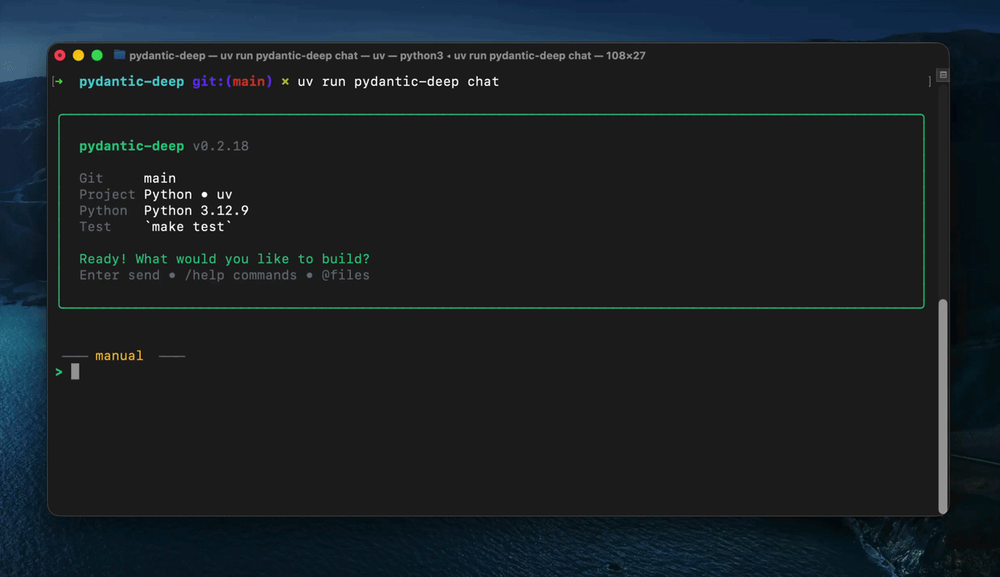
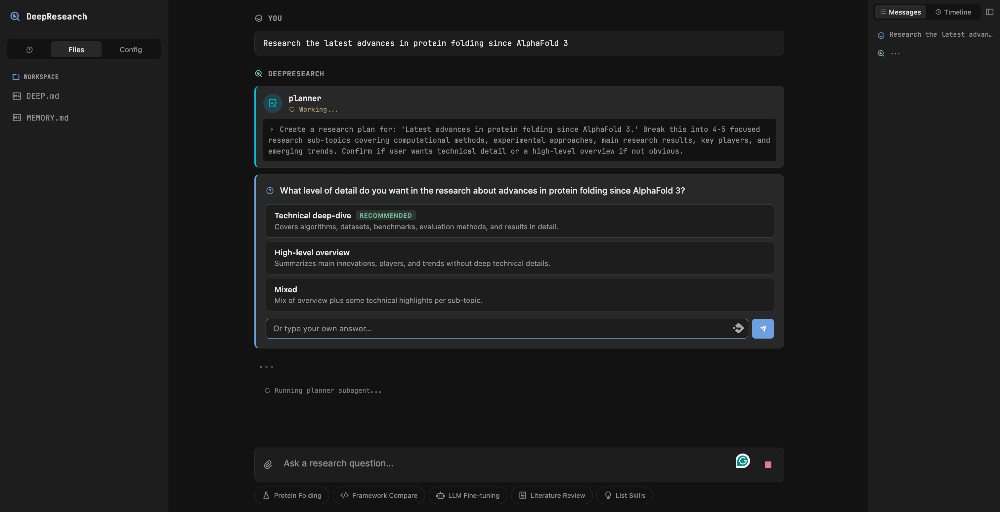
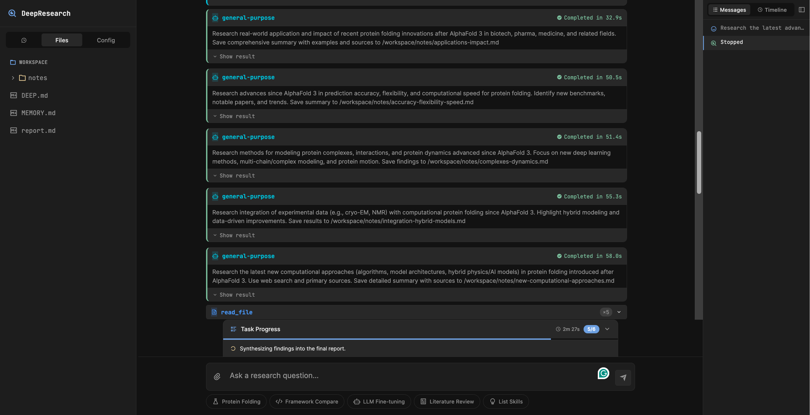
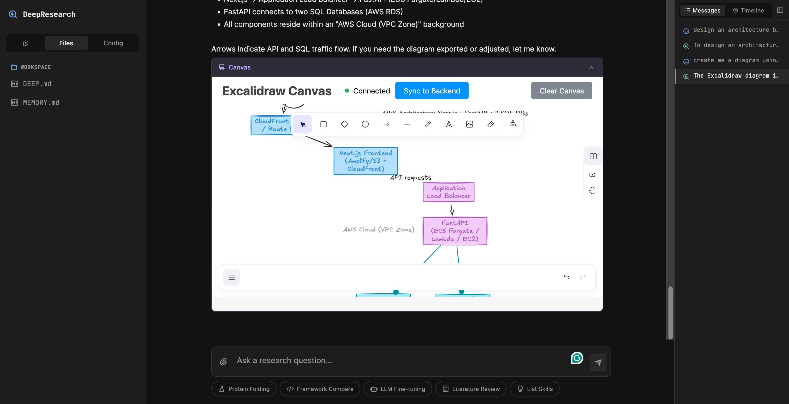
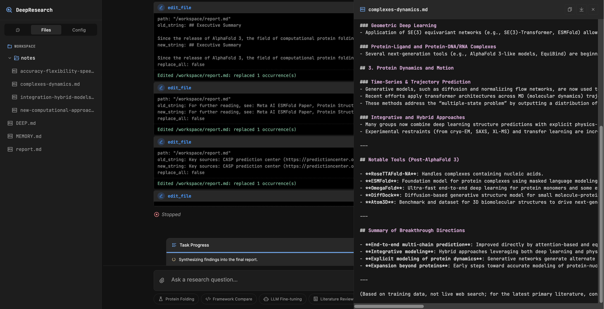

<h1 align="center">Pydantic Deep Agents</h1>

<p align="center">
  
</p>

<p align="center">
  <b>The batteries-included deep agent harness for Python.</b><br>
  Terminal AI assistant out of the box — or build production agents with one function call.
</p>

<p align="center">
  <a href="https://vstorm-co.github.io/pydantic-deepagents/">Docs</a> &middot;
  <a href="https://pypi.org/project/pydantic-deep/">PyPI</a> &middot;
  <a href="#-cli--terminal-ai-assistant">CLI</a> &middot;
  <a href="#-framework--build-your-own-agent">Framework</a> &middot;
  <a href="#-deepresearch--reference-app">DeepResearch</a> &middot;
  <a href="https://vstorm-co.github.io/pydantic-deepagents/examples/">Examples</a>
</p>

<p align="center">
  <a href="https://pypi.org/project/pydantic-deep/"></a>
  <a href="https://www.python.org/downloads/"></a>
  <a href="https://opensource.org/licenses/MIT"></a>
  <a href="https://coveralls.io/github/vstorm-co/pydantic-deepagents?branch=main"></a>
  <a href="https://github.com/vstorm-co/pydantic-deepagents/actions/workflows/ci.yml"></a>
  <a href="https://github.com/pydantic/pydantic-ai"></a>
</p>

---

## What's New

- **2026-04-11** &nbsp;**v0.3.6** — One-command installer + self-update: `curl -fsSL .../install.sh | bash` installs everything automatically. New `pydantic-deep update` command. Startup update notifications with 24-hour PyPI cache.
- **2026-04-10** &nbsp;**v0.3.5** — Headless runner (`pydantic-deep run`), Docker sandbox with named workspaces, browser automation via Playwright, Harbor adapter for Terminal Bench evaluation.
- **2026-03-xx** &nbsp;**v0.3.0** — Migrated to pydantic-ai native Capabilities API. Added agent teams, plan mode, checkpoint middleware, eviction processor.

> Full history: [CHANGELOG.md](CHANGELOG.md)

---

## The Agent Harness

Pydantic Deep Agents is an **agent harness** — the complete infrastructure that wraps an LLM and makes it a functional autonomous agent. The model provides intelligence; the harness provides planning, tools, memory, sandboxed execution, and unlimited context.

<table>
<tr>
<td><b>🔧 Tool-calling</b></td>
<td>File read/write/edit, shell execution, glob, grep, web search, web fetch, browser automation — wired up and ready.</td>
</tr>
<tr>
<td><b>🧠 Persistent memory</b></td>
<td>MEMORY.md persists across sessions. Auto-injected into the system prompt. Each agent has isolated memory by default.</td>
</tr>
<tr>
<td><b>♾️ Unlimited context</b></td>
<td>Auto-summarization when approaching the token budget. LLM-based or zero-cost sliding window. Never hits a context wall.</td>
</tr>
<tr>
<td><b>🤝 Multi-agent / swarm</b></td>
<td>Spawn subagents for parallel workstreams. Shared TODO lists with claiming. Peer-to-peer message bus. Full team coordination.</td>
</tr>
<tr>
<td><b>🐳 Sandboxed execution</b></td>
<td>Docker sandbox with named workspaces. Installed packages persist between sessions. Project dir mounted at /workspace.</td>
</tr>
<tr>
<td><b>🗂️ Plan Mode</b></td>
<td>Dedicated planner subagent asks clarifying questions and structures the work before execution begins. Headless-compatible.</td>
</tr>
<tr>
<td><b>🔖 Checkpoints</b></td>
<td>Save conversation state at any point. Rewind to any checkpoint. Fork sessions to explore alternative approaches.</td>
</tr>
<tr>
<td><b>📚 Skills system</b></td>
<td>Domain-specific knowledge loaded on demand from SKILL.md files. Built-in skills: code-review, refactor, test-writer, git-workflow, and more.</td>
</tr>
<tr>
<td><b>🔌 MCP</b></td>
<td>Connect any Model Context Protocol server via pydantic-ai's native MCP capability.</td>
</tr>
<tr>
<td><b>⚡ Lifecycle hooks</b></td>
<td>Claude Code-style PRE_TOOL_USE / POST_TOOL_USE hooks. Shell commands or Python handlers. Audit logging, safety gates.</td>
</tr>
<tr>
<td><b>📐 Structured output</b></td>
<td>Type-safe Pydantic model responses via <code>output_type</code>. No JSON parsing. No <code>dict["key"]</code>. Full IDE autocomplete.</td>
</tr>
<tr>
<td><b>💰 Cost tracking</b></td>
<td>Real-time token and USD cost tracking per run and cumulative. Hard budget limits with <code>BudgetExceededError</code>.</td>
</tr>
<tr>
<td><b>✨ Self-improving</b></td>
<td><code>/improve</code> analyzes past sessions and proposes updates to MEMORY.md, SOUL.md, and AGENTS.md.</td>
</tr>
<tr>
<td><b>🏷️ 100% type-safe</b></td>
<td>Pyright strict + MyPy strict. 100% test coverage. Every public API is fully typed — safe to use in production.</td>
</tr>
</table>

Built natively on **[pydantic-ai](https://github.com/pydantic/pydantic-ai)** — uses the Capabilities API directly, inherits all pydantic-ai streaming, multi-model support, and Pydantic validation automatically.

---

## 🖥️ CLI — Terminal AI Assistant

A Claude Code-style terminal AI assistant that works with **any model and any provider.**

### Install (macOS & Linux)

```bash
curl -fsSL https://raw.githubusercontent.com/vstorm-co/pydantic-deep/main/install.sh | bash
```

No Python setup required — the script installs uv and the CLI automatically. Then:

```bash
export ANTHROPIC_API_KEY=sk-ant-...
pydantic-deep
```

> **Windows / manual:** `pip install "pydantic-deep[cli]"` &nbsp;·&nbsp; **Update:** `pydantic-deep update`

### Model & Provider Support

Works with any model that supports tool-calling:

| Provider | Example models |
|----------|----------------|
| **Anthropic** | `anthropic:claude-opus-4-6`, `claude-sonnet-4-6` |
| **OpenAI** | `openai:gpt-5.4`, `gpt-4.1` |
| **OpenRouter** | `openrouter:anthropic/claude-opus-4-6` (200+ models) |
| **Google Gemini** | `google-gla:gemini-2.5-pro` |
| **Ollama (local)** | `ollama:qwen3`, `ollama:llama3.3` |
| **Any OpenAI-compatible** | Custom base URL via env |

Switch model anytime: `pydantic-deep config set model openai:gpt-5.4` or `/model` in the TUI.

### What you get in the TUI

| | Feature |
|:-:|---------|
| 💬 | Streaming chat with tool call visualization |
| 📁 | File read / write / edit, shell execution, glob, grep |
| 🧠 | Persistent memory and self-improvement across sessions |
| 🗂️ | Task planning, plan mode, and subagent delegation |
| ♾️ | Context compression for unlimited conversations |
| 🔖 | Checkpoints — save, rewind, and fork any session |
| 🌐 | Web search & fetch built-in |
| 🖥️ | Browser automation via Playwright (`--browser`) |
| 🐳 | Docker sandbox — sandboxed execution with named workspaces |
| 💭 | Extended thinking — `minimal` / `low` / `medium` / `high` / `xhigh` |
| 💰 | Real-time cost and token tracking per session |
| 🛡️ | Tool approval dialogs — approve, auto-approve, or deny per tool call |
| @ | `@filename` file references · `!command` shell passthrough |
| ✨ | `/improve`, `/skills`, `/diff`, `/model`, `/theme`, `/compact`, and more |

### Usage

```bash
# Interactive TUI (default)
pydantic-deep
pydantic-deep tui --model openrouter:anthropic/claude-opus-4-6

# Headless deep agent — benchmarks, CI/CD, scripted automation
pydantic-deep run "Fix the failing test in test_auth.py"
pydantic-deep run --task-file task.md --json
pydantic-deep run "Refactor utils.py" --no-web-search --thinking false

# Docker sandbox — sandboxed execution, project dir mounted at /workspace
pydantic-deep tui --sandbox docker
pydantic-deep tui --workspace ml-env     # named workspace, packages persist

# Browser automation (requires pydantic-deep[browser])
pydantic-deep tui --browser
pydantic-deep run "Go to example.com and summarize the content" --browser

# Config & skills
pydantic-deep config set model anthropic:claude-sonnet-4-6
pydantic-deep skills list
pydantic-deep update                     # update to latest version
```

> See [CLI docs](docs/cli/index.md) for the full reference.

---

## 🐍 Framework — Build Your Own Agent

```bash
pip install pydantic-deep
```

One function call gives you a production deep agent with planning, tool-calling, multi-agent delegation, persistent memory, unlimited context, and cost tracking. Everything is a toggle:

```python
from pydantic_ai_backends import StateBackend
from pydantic_deep import create_deep_agent, create_default_deps

agent = create_deep_agent(
    model="anthropic:claude-sonnet-4-6",
    include_todo=True,          # Task planning with subtasks and dependencies
    include_subagents=True,     # Multi-agent swarm — delegate to subagents
    include_skills=True,        # Domain-specific skills from SKILL.md files
    include_memory=True,        # Persistent memory across sessions
    include_plan=True,          # Structured planning before execution
    include_teams=True,         # Agent teams with shared TODO lists + message bus
    web_search=True,            # Tool-calling: web search
    web_fetch=True,             # Tool-calling: web fetch
    thinking="high",            # Extended thinking / reasoning effort
    context_manager=True,       # Unlimited context via auto-summarization
    cost_tracking=True,         # Token/USD budget enforcement
    include_checkpoints=True,   # Save, rewind, and fork conversations
)

deps = create_default_deps(StateBackend())
result = await agent.run("Build a REST API for user auth", deps=deps)
```

### Structured Output

Type-safe responses with Pydantic models — no JSON parsing, no `dict["key"]`:

```python
from pydantic import BaseModel

class CodeReview(BaseModel):
    summary: str
    issues: list[str]
    score: int

agent = create_deep_agent(output_type=CodeReview)
result = await agent.run("Review the auth module", deps=deps)
print(result.output.score)  # fully typed
```

### Multi-Agent Swarm

Spawn isolated subagents for parallel workstreams. Each subagent is a full deep agent with its own tool-calling, memory, and context:

```python
agent = create_deep_agent(
    subagents=[
        {
            "name": "researcher",
            "description": "Researches topics using web search",
            "instructions": "Search the web, synthesize findings, cite sources.",
        },
        {
            "name": "code-reviewer",
            "description": "Reviews code for quality, security, and performance",
            "instructions": "Check for security issues, N+1 queries, missing tests...",
        },
    ],
)
# Main agent delegates: task(description="Review auth.py", subagent_type="code-reviewer")
```

### Unlimited Context

Auto-summarization keeps long-running agents within the token budget:

```python
from pydantic_deep import create_summarization_processor

processor = create_summarization_processor(
    trigger=("tokens", 100000),  # compress at 100k tokens
    keep=("messages", 20),       # keep last 20 messages verbatim
)
agent = create_deep_agent(history_processors=[processor])
```

### Claude Code-Style Lifecycle Hooks

```python
from pydantic_deep import Hook, HookEvent

agent = create_deep_agent(
    hooks=[
        Hook(
            event=HookEvent.PRE_TOOL_USE,
            command="echo 'Tool: $TOOL_NAME args: $TOOL_INPUT' >> /tmp/audit.log",
        ),
    ],
)
```

### MCP Servers

```python
from pydantic_ai.capabilities import MCP

agent = create_deep_agent(
    capabilities=[MCP(url="https://mcp.example.com/api")],
)
```

### Context Files

Pydantic Deep Agents auto-discovers and injects project-specific context into every conversation:

| File | Purpose | Who Sees It |
|------|---------|-------------|
| `AGENTS.md` | Project conventions, architecture, instructions | Main agent + all subagents |
| `SOUL.md` | Agent personality, style, communication preferences | Main agent only |
| `MEMORY.md` | Persistent memory — read/write/update tools | Per-agent (isolated) |

`AGENTS.md` follows the [agents.md spec](https://agents.md/) — compatible with Claude Code, Cursor, and other agent frameworks.

> See the full [API reference](https://vstorm-co.github.io/pydantic-deepagents/api/toolsets/) for all options.

---

## 🔬 DeepResearch — Reference App

A full-featured research deep agent with web UI — built entirely on Pydantic Deep Agents.

<table>
<tr>
<td width="50%">
<a href="apps/deepresearch/"></a>
<p align="center"><b>Plan Mode</b> — planner asks clarifying questions</p>
</td>
<td width="50%">
<a href="apps/deepresearch/"></a>
<p align="center"><b>Multi-Agent Swarm</b> — 5 subagents researching in parallel</p>
</td>
</tr>
<tr>
<td width="50%">
<a href="apps/deepresearch/"></a>
<p align="center"><b>Excalidraw Canvas</b> — live diagrams synced with agent</p>
</td>
<td width="50%">
<a href="apps/deepresearch/"></a>
<p align="center"><b>File Browser</b> — workspace files with inline preview</p>
</td>
</tr>
</table>

Web search (Tavily, Brave, Jina), sandboxed code execution, Excalidraw diagrams, plan mode, report export.

```bash
cd apps/deepresearch && uv sync && cp .env.example .env
uv run deepresearch    # → http://localhost:8080
```

> See [apps/deepresearch/README.md](apps/deepresearch/README.md) for full setup.

---

## Architecture

Pydantic Deep Agents uses pydantic-ai's native **Capabilities API** for all cross-cutting concerns — hooks, memory, skills, context files, teams, and plan mode are all first-class pydantic-ai capabilities.

### Capabilities

| Capability | Package | What It Does |
|-----------|---------|--------------|
| **CostTracking** | [pydantic-ai-shields](https://github.com/vstorm-co/pydantic-ai-shields) | Token/USD budget enforcement and real-time cost callbacks |
| **ContextManagerCapability** | [summarization-pydantic-ai](https://github.com/vstorm-co/summarization-pydantic-ai) | Unlimited context via auto-summarization |
| **HooksCapability** | pydantic-deep | Claude Code-style PRE/POST_TOOL_USE lifecycle hooks |
| **CheckpointMiddleware** | pydantic-deep | Save, rewind, and fork conversation state |
| **WebSearch / WebFetch** | pydantic-ai built-in | Tool-calling: web search and URL fetching |
| **SkillsCapability** | pydantic-deep | Domain-specific skills from SKILL.md files |
| **MemoryCapability** | pydantic-deep | Persistent memory across sessions |
| **TeamCapability** | pydantic-deep | Multi-agent swarm — shared TODOs, message bus |
| **PlanCapability** | pydantic-deep | Structured planning before execution |

### Modular Packages

Every component is a standalone package — use only what you need:

| Package | What It Does |
|---------|--------------|
| [pydantic-ai-backend](https://github.com/vstorm-co/pydantic-ai-backend) | File storage, Docker sandbox, console toolset |
| [pydantic-ai-todo](https://github.com/vstorm-co/pydantic-ai-todo) | Task planning with subtasks and dependencies |
| [subagents-pydantic-ai](https://github.com/vstorm-co/subagents-pydantic-ai) | Sync/async delegation, background tasks, cancellation |
| [summarization-pydantic-ai](https://github.com/vstorm-co/summarization-pydantic-ai) | LLM summaries or zero-cost sliding window |
| [pydantic-ai-shields](https://github.com/vstorm-co/pydantic-ai-shields) | Cost tracking, input/output/tool blocking |

```
                         Pydantic Deep Agents
+---------------------------------------------------------------------+
|                                                                     |
|   +----------+ +----------+ +----------+ +----------+ +---------+   |
|   | Planning | |Filesystem| | Subagents| |  Skills  | |  Teams  |   |
|   +----+-----+ +----+-----+ +----+-----+ +----+-----+ +----+----+   |
|        |            |            |            |            |        |
|        +------------+-----+------+------------+------------+        |
|                           |                                         |
|                           v                                         |
|  Summarization --> +------------------+ <-- Capabilities            |
|  Checkpointing --> |    Deep Agent    | <-- Hooks                   |
|  Cost Tracking --> |   (pydantic-ai)  | <-- Memory                  |
|                    +--------+---------+                             |
|                             |                                       |
|           +-----------------+-----------------+                     |
|           v                 v                 v                     |
|    +------------+    +------------+    +------------+               |
|    |   State    |    |   Local    |    |   Docker   |               |
|    |  Backend   |    |  Backend   |    |  Sandbox   |               |
|    +------------+    +------------+    +------------+               |
|                                                                     |
+---------------------------------------------------------------------+
```

---

## Full Feature List

<details>
<summary><b>Expand</b></summary>

### Tool-Calling

- `ls`, `read_file`, `write_file`, `edit_file`, `glob`, `grep`, `execute` — full filesystem access
- Docker sandbox with named workspaces — sandboxed execution, packages persist between sessions
- Web search (DuckDuckGo, Tavily, Brave) and web fetch
- Browser automation via Playwright — `navigate`, `click`, `type_text`, `screenshot`, `execute_js`, and more

### Deep Agent Architecture

- **Planning** — Task tracking with subtasks, dependencies, and cycle detection
- **Subagents / Multi-agent swarm** — Sync/async delegation, background task management, soft/hard cancellation
- **Agent Teams** — Shared TODO lists with claiming and dependency tracking, peer-to-peer message bus
- **Plan Mode** — Dedicated planner subagent for structured planning before execution
- **Persistent memory** — MEMORY.md that persists across sessions, auto-injected into system prompt
- **Self-improving** — `/improve` analyzes past sessions, proposes updates to context files

### Context & Memory

- **Unlimited context** — Auto-summarization when approaching token budget (LLM-based or sliding window)
- **Eviction processor** — Evict large tool outputs to files, keep context lean
- **Context files** — Auto-discover and inject AGENTS.md, SOUL.md, DEEP.md, CLAUDE.md
- **Checkpoints** — Save state, rewind or fork conversations. In-memory and file-based stores

### Production Features

- **MCP** — Connect any Model Context Protocol server
- **Lifecycle hooks** — Claude Code-style PRE/POST_TOOL_USE. Shell commands or Python handlers
- **Structured output** — Type-safe responses with Pydantic models via `output_type`
- **Cost tracking** — Token/USD budgets with automatic enforcement and real-time callbacks
- **Streaming** — Full streaming support for real-time responses
- **Image support** — Multi-modal analysis with image inputs
- **Human-in-the-loop** — Confirmation workflows for sensitive operations
- **Output styles** — Built-in (concise, explanatory, formal, conversational) or custom

### CLI

- Interactive TUI (Textual) with streaming, tool visualization, session management
- Headless runner (`pydantic-deep run`) for CI/CD, benchmarks, scripted automation
- 20+ slash commands: `/improve`, `/compact`, `/diff`, `/model`, `/provider`, `/skills`, `/theme`, and more
- `@filename` file references, `!command` shell passthrough
- Tool approval dialogs with auto-approve
- Debug logging per session

</details>

---

## Contributing

```bash
git clone https://github.com/vstorm-co/pydantic-deepagents.git
cd pydantic-deepagents
make install
make test   # 100% coverage required
make all    # lint + typecheck + test
```

---

## Star History

<p align="center">
  <a href="https://www.star-history.com/#vstorm-co/pydantic-deepagents&type=date">
    
  </a>
</p>

---

## License

MIT — see [LICENSE](LICENSE)

---

<div align="center">

### Need help shipping AI agents in production?

<p>We're <a href="https://vstorm.co"><b>Vstorm</b></a> — an Applied Agentic AI Engineering Consultancy<br>with 30+ production agent implementations. Pydantic Deep Agents is what we build them with.</p>

<a href="https://vstorm.co/contact-us/">
  
</a>

<br><br>

Made with **care** by <a href="https://vstorm.co"><b>Vstorm</b></a>

</div>
