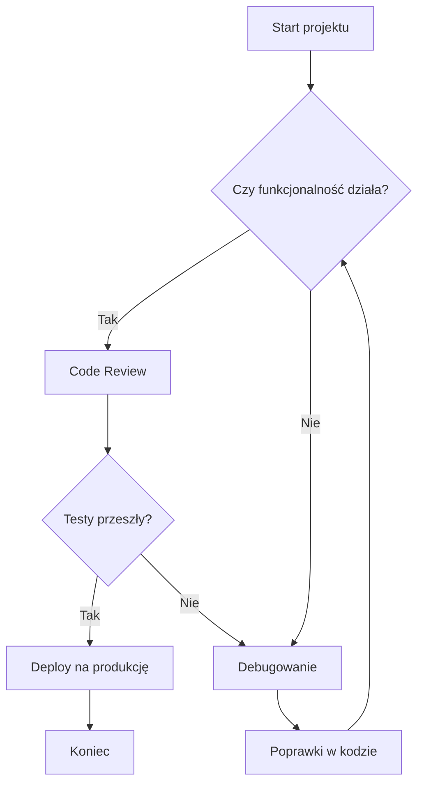
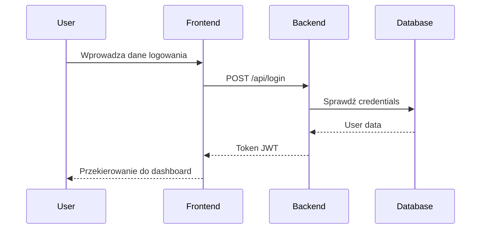
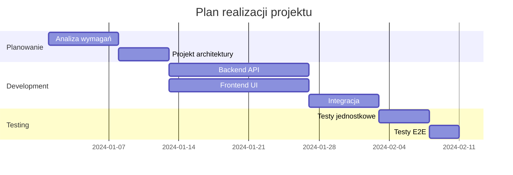

# Przykładowy Diagram Mermaid

## Schemat blokowy procesu developmentu

```mermaid
graph TD
    A[Start projektu] --> B{Czy funkcjonalność działa?}
    B -->|Tak| C[Code Review]
    B -->|Nie| D[Debugowanie]
    D --> E[Poprawki w kodzie]
    E --> B
    C --> F{Testy przeszły?}
    F -->|Tak| G[Deploy na produkcję]
    F -->|Nie| D
    G --> H[Koniec]
```

## Diagram sekwencji - logowanie użytkownika

```mermaid
sequenceDiagram
    participant U as User
    participant F as Frontend
    participant B as Backend
    participant DB as Database
    
    U->>F: Wprowadza dane logowania
    F->>B: POST /api/login
    B->>DB: Sprawdź credentials
    DB-->>B: User data
    B-->>F: Token JWT
    F-->>U: Przekierowanie do dashboard
```

## Diagram Gantt - harmonogram projektu

```mermaid
gantt
    title Plan realizacji projektu
    dateFormat  YYYY-MM-DD
    section Planowanie
    Analiza wymagań           :a1, 2024-01-01, 7d
    Projekt architektury      :a2, after a1, 5d
    section Development
    Backend API              :b1, after a2, 14d
    Frontend UI              :b2, after a2, 14d
    Integracja              :b3, after b1, 7d
    section Testing
    Testy jednostkowe       :t1, after b3, 5d
    Testy E2E               :t2, after t1, 3d
```
