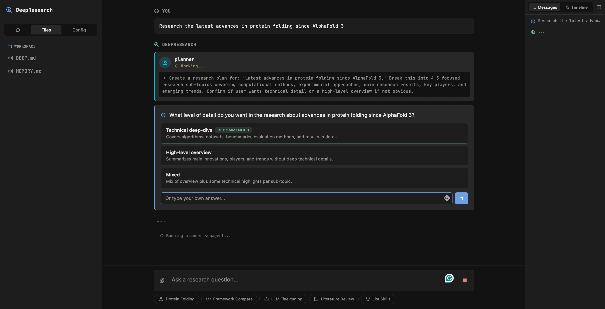
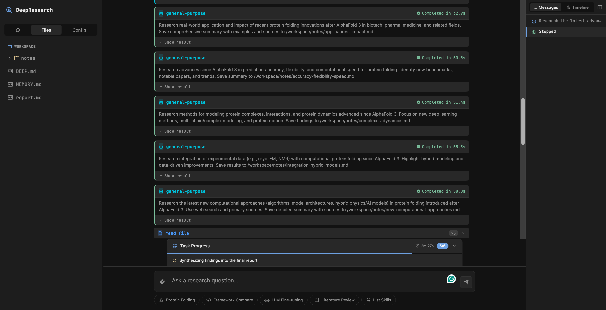
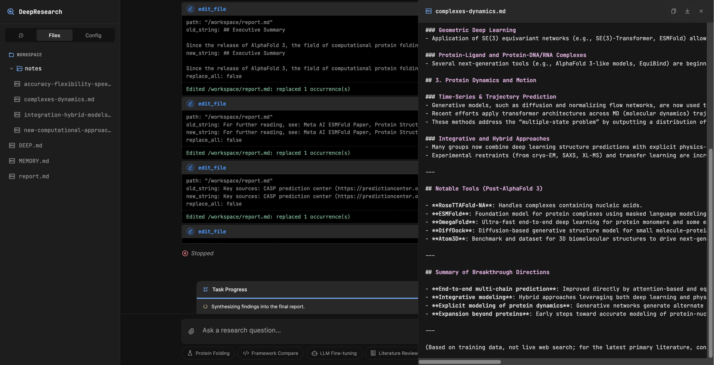

# DeepResearch

Autonomous research agent powered by **pydantic-deep** — web search, code execution, subagents, plan mode, Excalidraw diagrams, and more.

| | |
|:---:|:---:|
|  |  |
| **Plan Mode** — planner asks clarifying questions | **Parallel Subagents** — 5 agents researching simultaneously |
|  |  |
| **Excalidraw Canvas** — live diagrams synced with agent | **File Browser** — workspace files with inline preview |

## Prerequisites

- **Python 3.12+**
- **uv** — `curl -LsSf https://astral.sh/uv/install.sh | sh`
- **Node.js 20+** — for MCP servers (`npx`)
- **Docker** — for per-user sandbox containers (SessionManager)
- **OpenAI or Anthropic API key**

## Quick Start

### 1. Install

```bash
cd deepresearch
uv sync
```

For PDF/HTML export support:

```bash
uv sync --extra export
```

### 2. Configure

```bash
cp .env.example .env
# Edit .env — add OPENAI_API_KEY and at least one search API key
```

### 3. Start Docker + Excalidraw canvas

```bash
# Make sure Docker Desktop is running, then start the Excalidraw canvas:
docker compose up -d excalidraw-canvas
```

Or without Excalidraw:

```bash
# Just make sure Docker is running (needed for code execution sandbox)
EXCALIDRAW_ENABLED=0 uv run deepresearch
```

### 4. Run

```bash
uv run deepresearch
```

Open [http://localhost:8080](http://localhost:8080) in your browser.

## Features

| Feature | Description |
|---------|-------------|
| **Web Search** | Tavily, Brave Search, Jina URL reader, Firecrawl |
| **Browser Automation** | Playwright MCP for JS-heavy pages |
| **File Operations** | Read, write, edit, glob, grep in isolated Docker sandbox |
| **Code Execution** | Python with pandas, numpy, matplotlib, scikit-learn pre-installed |
| **Subagents** | code-reviewer, general-purpose, dynamic agent factory |
| **Plan Mode** | Planner subagent asks clarifying questions before complex research |
| **Excalidraw Diagrams** | Live canvas side panel for flowcharts, comparisons, architecture |
| **Report Export** | Markdown, HTML, and PDF export |
| **Skills** | research-methodology, report-writing, diagram-design, quick-reference |
| **Checkpointing** | Rewind to any turn, fork sessions from past state |
| **Task Tracking** | TODO-based planning with live progress bar |
| **Background Tasks** | Async subagent delegation with toast notifications |
| **Image Support** | Upload and analyze images inline |
| **Middleware** | Audit logging, permission blocking |
| **Hooks** | Safety gates for dangerous commands |

## Environment Variables

| Variable | Required | Description |
|----------|----------|-------------|
| `MODEL_NAME` | No | LLM model (default: `openai:gpt-4.1`) |
| `TAVILY_API_KEY` | Recommended | Tavily AI search |
| `BRAVE_API_KEY` | No | Brave Search |
| `JINA_API_KEY` | No | Jina URL reader |
| `FIRECRAWL_API_KEY` | No | Firecrawl web scraper |
| `PLAYWRIGHT_MCP` | No | Set to `1` to enable Playwright browser |
| `EXCALIDRAW_ENABLED` | No | Set to `0` to disable Excalidraw (default: `1`) |
| `EXCALIDRAW_SERVER_URL` | No | Canvas server URL for MCP sync (default: `http://localhost:3000`) |
| `EXCALIDRAW_CANVAS_URL` | No | Canvas URL for UI iframe (default: `http://localhost:3000`) |

At least one search provider (Tavily, Brave, or Jina) is recommended for web research capabilities.

## MCP Servers Setup

All MCP servers are **optional** — DeepResearch works without any of them, but search providers are highly recommended for actual research.

### Web Search — Tavily, Brave, Jina

These only need an API key. No extra installation required — they run via `npx` automatically.

```bash
# Tavily (recommended — best quality for research)
# Sign up at https://tavily.com — free tier available
TAVILY_API_KEY=tvly-xxxxx

# Brave Search
# Get a key at https://brave.com/search/api/
BRAVE_API_KEY=BSAxxxxx

# Jina AI Reader (converts any URL to clean markdown)
# Sign up at https://jina.ai — free tier available
JINA_API_KEY=jina_xxxxx
```

### Web Scraping — Firecrawl

Advanced web scraping with crawl support. Runs via `npx`, only needs an API key.

```bash
# Sign up at https://firecrawl.dev
FIRECRAWL_API_KEY=fc-xxxxx
```

### Browser Automation — Playwright

Headless browser for JavaScript-heavy pages that don't render well with URL readers. Runs via `npx`, no API key needed.

```bash
# Just enable it:
PLAYWRIGHT_MCP=1
```

> **Note:** First run will download Chromium (~150 MB) automatically via `npx @playwright/mcp@latest`.

### Diagrams — Excalidraw

Uses [mcp-excalidraw-server](https://github.com/yctimlin/mcp_excalidraw) for live canvas diagrams with real-time sync. **Enabled by default** — requires canvas server running.

```bash
# Start the canvas server (Docker):
docker run -d -p 3000:3000 ghcr.io/yctimlin/mcp_excalidraw-canvas:latest

# Or via npm:
npx mcp-excalidraw-server canvas
```

The MCP server starts automatically via `npx`. The canvas UI opens in a side panel at `http://localhost:3000`.

To disable: `EXCALIDRAW_ENABLED=0`

## Project Structure

```
deepresearch/
  src/deepresearch/
    app.py          # FastAPI server + WebSocket streaming
    agent.py        # Agent factory (hooks, subagents, skills, instructions)
    config.py       # MCP servers, model, paths
    prompts.py      # Research-specific system prompt
    middleware.py   # AuditMiddleware, PermissionMiddleware
    types.py        # Pydantic models
  static/
    index.html      # Single-page frontend
    app.js          # WebSocket client, tool rendering, file preview
    styles.css      # Dark theme UI
  skills/
    research-methodology/SKILL.md
    report-writing/SKILL.md
    diagram-design/SKILL.md
  workspace/
    DEEP.md         # Context file injected into every session
  Dockerfile
  docker-compose.yml
  pyproject.toml
  .env.example
```

## Architecture

```
Browser (index.html + app.js)
   │
   │  WebSocket /ws/chat
   ▼
FastAPI (app.py)
   │
   ├─ Agent (pydantic-ai + pydantic-deep)
   │    ├─ MCP Servers (Tavily, Brave, Jina, Excalidraw, Playwright, Firecrawl)
   │    ├─ Console Toolset (ls, read, write, edit, glob, grep, execute)
   │    ├─ Todo Toolset (read_todos, write_todos)
   │    ├─ Subagent Toolset (task, check_task, list_active_tasks)
   │    ├─ Agent Factory (create_agent, list_agents, remove_agent)
   │    ├─ Skills Toolset (list_skills, load_skill)
   │    ├─ Checkpoint Toolset (list_checkpoints, rewind, fork)
   │    └─ Teams Toolset (spawn_team, assign_task, check_teammates)
   │
   ├─ Middleware (AuditMiddleware, PermissionMiddleware)
   ├─ Hooks (audit_logger, safety_gate)
   └─ SessionManager (per-user Docker containers)
```

## Docker

A `Dockerfile` is provided for containerized deployment (requires packages published on PyPI).

The `docker-compose.yml` includes the Excalidraw canvas service:

```bash
# Start Excalidraw canvas only (run app natively)
docker compose up -d excalidraw-canvas

# Or start everything (when packages are on PyPI — uncomment deepresearch service in docker-compose.yml)
docker compose up -d
```

**Docker socket access** is required — the app spawns per-user Docker containers for sandboxed code execution via `SessionManager`.

## Development

The `deepresearch` package uses editable local dependencies from the pydantic-deep ecosystem:

- `pydantic-deep` — core agent framework
- `pydantic-ai-backend` — file storage + Docker sandbox
- `pydantic-ai-middleware` — middleware system
- `summarization-pydantic-ai` — context management
- `subagents-pydantic-ai` — multi-agent orchestration
- `pydantic-ai-todo` — task planning

All are linked via `[tool.uv.sources]` in `pyproject.toml` for local development.
