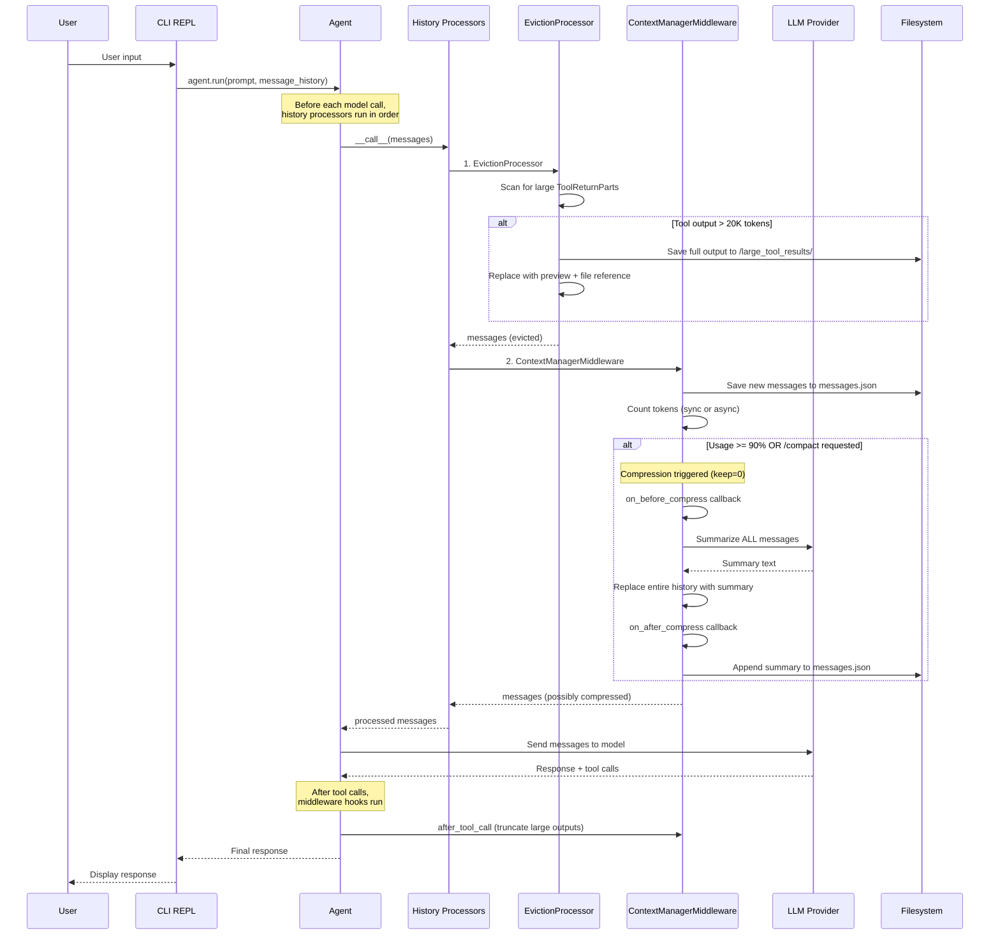
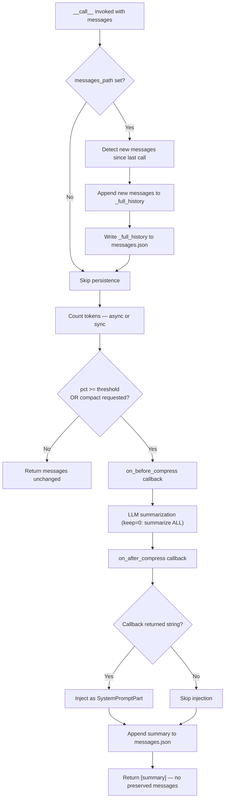
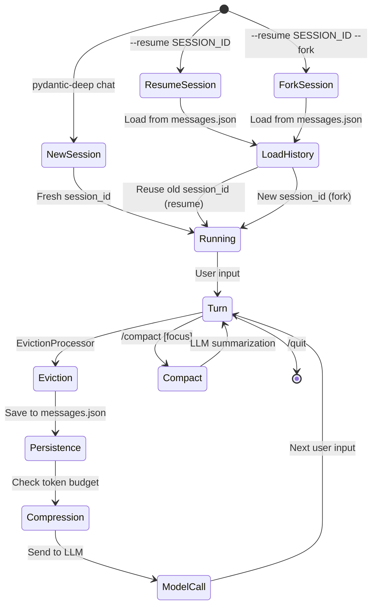
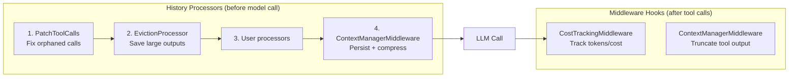

# Memory & Context Management Architecture

This document describes how conversation history, context compression, persistent memory,
and session management work across the **summarization-pydantic-ai** and **pydantic-deep** libraries.

---

## Components Overview

| Component | Library | Role |
|-----------|---------|------|
| **ContextManagerMiddleware** | summarization-pydantic-ai | Token tracking, auto-compression, continuous message persistence (`messages.json`) |
| **EvictionProcessor** | pydantic-deep | Saves large tool outputs to files before they consume context |
| **AgentMemoryToolset** | pydantic-deep | Persistent agent memory (`MEMORY.md`) across sessions |
| **HistoryArchiveSearch** | pydantic-deep | Search tool for pre-compression history (reads `messages.json`) |
| **CLI Commands** | cli | `/compact`, `/context`, `--resume`, `--fork` |

---

## Dependency Graph

```mermaid
graph TD
    subgraph "summarization-pydantic-ai"
        CMW[ContextManagerMiddleware]
    end

    subgraph "pydantic-deep"
        EP[EvictionProcessor]
        MEM[AgentMemoryToolset]
        HAS[HistoryArchiveSearch]
        AF[agent.py — create_deep_agent]
        DEPS[DeepAgentDeps]
    end

    subgraph CLI
        COMPACT["&#47;compact command"]
        CONTEXT["&#47;context command"]
        SESSION[Session Manager]
    end

    AF -->|creates & configures| CMW
    AF -->|creates| EP
    AF -->|creates| MEM
    AF -->|creates| HAS

    CMW -->|writes| MJ[messages.json]
    HAS -->|reads| MJ
    SESSION -->|reads| MJ
    EP -->|writes| LTR["large_tool_results/*"]
    MEM -->|reads/writes| MEMF[(MEMORY.md)]

    DEPS -->|holds ref| CMW

    COMPACT -->|calls compact| CMW
    CONTEXT -->|reads stats| CMW
    SESSION -->|resolves session_id| AF
```



---

## Data Flow — Full Scenario

Below is the complete lifecycle of a conversation turn, showing how each component
participates in processing, persistence, and compression.



---

## Component Details

### 1. ContextManagerMiddleware (summarization-pydantic-ai)

The central component. Dual-protocol — acts as both a **history processor** (`__call__`)
and an **AgentMiddleware** (`after_tool_call`).

**Configuration:**

| Field | Default | Description |
|-------|---------|-------------|
| `max_tokens` | `None` (auto) | Token budget. Auto-detected from `genai-prices` using `model_name`, falls back to 200,000 |
| `model_name` | `None` | Model identifier for auto-detecting `max_tokens` (e.g., `"openai:gpt-4.1"`) |
| `compress_threshold` | 0.9 | Fraction at which auto-compression triggers |
| `keep` | `("messages", 0)` | How much context to retain after compression. Default 0 = only summary survives |
| `summarization_model` | `"openai:gpt-4.1-mini"` | Model used for summary generation (passthrough from CLI/agent) |
| `token_counter` | `count_tokens_approximately` | Sync or async callable for counting tokens |
| `messages_path` | `None` | Path to `messages.json` for persistent history |
| `on_usage_update` | `None` | Callback: `(pct, current, max)` |
| `on_before_compress` | `None` | Callback: `(messages_to_discard, cutoff_index)` |
| `on_after_compress` | `None` | Callback: `(compressed_messages) -> str \| None` |

**Auto-detection of max_tokens:**

When `max_tokens=None` (default), the middleware resolves the context window
from the `genai-prices` package using `model_name`. The resolution:

1. Parse `"openai:gpt-4.1"` → `provider_id="openai"`, `model_ref="gpt-4.1"`
2. Call `calc_price()` with dummy usage to resolve the model
3. Read `result.model.context_window`
4. Fall back to 200,000 if model not found or genai-prices not installed

**Async token counting:**

The `token_counter` field accepts both sync and async callables:

```python
# Sync (default — approximate char/4 heuristic)
def count_tokens_approximately(messages) -> int: ...

# Async (model-based accurate counting)
async def model_counter(messages) -> int:
    usage = await model.count_tokens(list(messages), None, None)
    return usage.request_tokens or 0
```

The middleware uses `async_count_tokens()` internally which detects and awaits
async counters via `inspect.isawaitable()`.

**Continuous persistence flow:**



**Public API:**

- `request_compact(focus=None)` — schedule compression on next `__call__`
- `compact(messages, focus=None)` — compress immediately (for CLI `/compact`)

The optional `focus` parameter appends instructions to the summary prompt:
`"IMPORTANT: Focus the summary on: {focus}"`

**Session resume:** On init, if `messages_path` exists, loads `_full_history` from file.
The `_history_initialized` flag prevents re-saving already-persisted messages on first call.

---

### 2. EvictionProcessor (pydantic-deep)

Runs **before** ContextManagerMiddleware in the processor chain.
Prevents large tool outputs from bloating context.

**Trigger:** `ToolReturnPart` content exceeds `token_limit * 4` characters (~20K tokens = ~80KB).

**Action:**
1. Save full output to `{eviction_path}/{tool_call_id}` via backend
2. Replace content with a preview (5 head + 5 tail lines) and file reference
3. Agent can later `read_file` with `offset`/`limit` to access full output

This mirrors Claude Code's pattern of clearing tool outputs first, then summarizing.

---

### 3. AgentMemoryToolset (pydantic-deep)

Persistent cross-session memory stored in `MEMORY.md` files.

**File path:** `{memory_dir}/{agent_name}/MEMORY.md`
(e.g., `.pydantic-deep/main/MEMORY.md`)

**System prompt injection:** On each run, the first 200 lines of `MEMORY.md` are
injected into the system prompt as a `## Agent Memory` section.

**Tools:**

| Tool | Description |
|------|-------------|
| `read_memory()` | Read full memory content |
| `write_memory(content)` | Append to memory |
| `update_memory(old_text, new_text)` | Find and replace in memory |

Memory is independent from conversation history — it persists across sessions
and survives compression. The agent decides what to remember.

---

### 4. HistoryArchiveSearch (pydantic-deep)

Read-only search tool over the persistent `messages.json` file.

The middleware writes every message to `messages.json` continuously.
This tool reads that file and provides keyword search across the full
uncompressed history — even messages that were summarized away from context.

**Tool:** `search_conversation_history(query: str)`

- Case-insensitive substring search across all messages
- Returns up to 10 matching excerpts with 5 lines of context each
- Formats messages as readable text (User/Assistant/Tool labels)

---

## Session Architecture

### Directory Structure

```
.pydantic-deep/
├── main/
│   └── MEMORY.md                    # Persistent agent memory
├── sessions/
│   ├── abc123def456/                # Session 1
│   │   ├── messages.json            # Full uncompressed history (single source of truth)
│   │   └── plans/
│   │       └── plan-uuid.md
│   └── xyz789uvw012/                # Session 2 (e.g., fork of Session 1)
│       ├── messages.json
│       └── ...
└── large_tool_results/              # Evicted tool outputs (shared)
    └── tool_abc123
```

### Session Lifecycle



### Resume vs Fork

| Scenario | Session ID | History | messages.json |
|----------|-----------|---------|---------------|
| **New session** | Fresh UUID | Empty | New file |
| **Resume** (`--resume`) | Reused from old session | Loaded from messages.json | Continues same file |
| **Fork** (`--resume --fork`) | Fresh UUID | Copied from old session | New file (starts with copied history) |

---

## CLI Commands

### `/compact [focus]`

Triggers LLM-based summarization of conversation history.

```
/compact                    # Summarize entire history
/compact API changes        # Focus summary on API changes
/compact the database schema # Focus on database work
```

Uses `deps.context_middleware.compact(history, focus)`. Falls back to naive
truncation (last 10 messages) if no context middleware is available.

### `/context`

Shows context usage breakdown:

```
Context Usage
  ████████████░░░░░░░░░░░░░░░░░░  40%
  Tokens:       80,000 / 200,000
  Threshold:    90% (180,000 tokens)
  Messages:     47
  Compressions: 2
  History file:  /path/to/messages.json (156.3 KB)
```

---

## Processing Order

The order in which processors and middleware run is critical:



**Why this order matters:**

1. **PatchToolCalls** first — ensures clean message structure for all downstream processors
2. **Eviction** before **Context Manager** — large outputs are saved to files before
   the context manager counts tokens, preventing premature compression
3. **Context Manager** last — sees the true token count after eviction, makes accurate
   compression decisions, and persists the final state

---

## Key Design Decisions

1. **Single source of truth:** `messages.json` is the permanent, uncompressed record
   of the full conversation. Session resume, search, and the picker all read from this
   one file. No separate checkpoint files needed.

2. **Compression is lossy for context, lossless for persistence:** When the middleware
   compresses, the agent's working context loses detail. But the full history is always
   in `messages.json` and searchable via `search_conversation_history`.

3. **Full compression (keep=0):** Like Claude Code, compression replaces the entire
   message history with a single summary. No recent messages are preserved alongside
   the summary. This maximizes the context freed by compression. The full uncompressed
   history remains in `messages.json` for search.

4. **Auto-detect context window:** `max_tokens` is auto-detected from `genai-prices`
   based on the model name (e.g., `"openai:gpt-4.1"` → 1,047,576 tokens). Falls back
   to 200,000 if the model is not found. This eliminates hardcoded limits and adapts
   automatically when switching models.

5. **Async token counting:** The `token_counter` supports both sync and async callables.
   This enables accurate model-based token counting via pydantic-ai's
   `Model.count_tokens()` method (supported by Anthropic, Google, Bedrock) without
   blocking the event loop.

6. **Summarization model passthrough:** The model used for compression summaries
   (`summarization_model`) is configurable from the CLI/agent level, not hardcoded.
   This allows using the same provider as the main model or a cheaper alternative.

7. **Memory is separate from history:** `MEMORY.md` is the agent's long-term knowledge
   that it explicitly chooses to save. History is automatic. Memory survives across
   sessions; history is per-session.

8. **Callbacks for extensibility:** `on_before_compress` and `on_after_compress` allow
   custom archival and context re-injection without modifying the middleware itself.

9. **Backend abstraction:** All file operations go through `BackendProtocol`, meaning
   the same architecture works with local filesystem, in-memory state, or Docker sandbox.

10. **Optional checkpoints for library users:** The `CheckpointMiddleware` and
    `FileCheckpointStore` remain available in `pydantic_deep/toolsets/checkpointing.py`
    for library users who need discrete snapshots and rewind. The CLI does not use them —
    `messages.json` is sufficient for session persistence.
