# Architecture Overview

This document provides a comprehensive C4 architecture overview of the **pydantic-deepagents** system across three levels of abstraction: System Context, Container, and Component.

---

## System Context - C4 Level 1

The System Context diagram shows the pydantic-deepagents system in its entirety and its interactions with external actors and systems.

### External Actors

| Actor | Description | Interaction |
|-------|-------------|-------------|
| **Developer/User** | Software developer using the system | Interacts via CLI, ACP editor integration, or Python API |
| **LLM Provider** | Large Language Model API provider (Anthropic, OpenAI, OpenRouter, etc.) | Receives model requests, returns completions |
| **Filesystem** | Local disk or Docker sandbox | Reads/writes files, executes commands |
| **MCP Servers** | External tool servers (Tavily, Brave, Jina, Playwright, etc.) | Provides specialized tools for search, browsing, etc. |
| **Web** | Internet resources | WebSearch and WebFetch operations |

### System Context Diagram

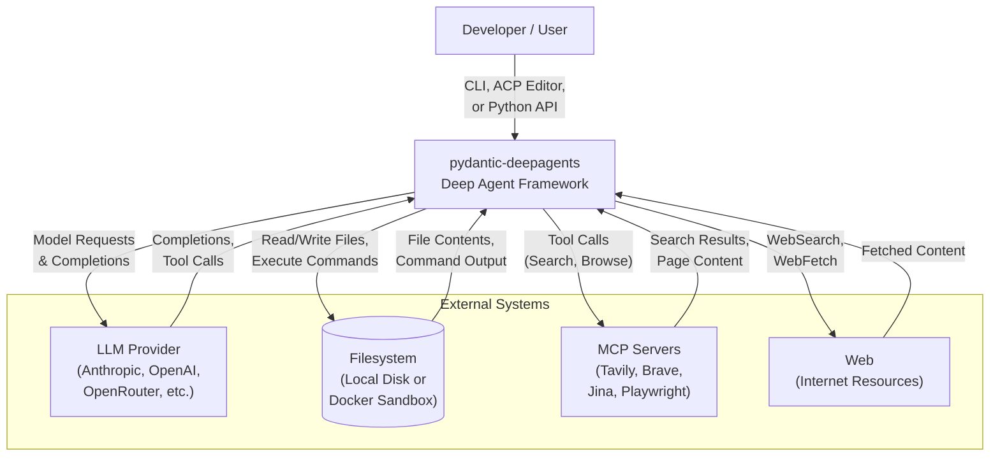

### Actor Details

#### Developer/User
The primary user of the system. Can interact through three distinct interfaces:
- **CLI App** - Terminal-based AI assistant with interactive chat
- **ACP Server** - Editor integration via Agent Client Protocol (e.g., Zed editor)
- **DeepResearch Web App** - Browser-based research agent interface
- **Python API** - Direct programmatic access for custom integrations

#### LLM Provider
Provides the core intelligence layer. The system supports multiple providers:
- **Anthropic** - Claude models
- **OpenAI** - GPT models
- **OpenRouter** - Multi-provider routing

#### Filesystem
The execution environment for file operations and command execution:
- **Local Backend** - Direct filesystem access
- **Docker Sandbox** - Isolated container execution
- **State Backend** - Abstract state management

#### MCP Servers
External tool servers that extend agent capabilities:
- **Tavily** - Web search
- **Brave** - Web search
- **Jina** - Content extraction
- **Playwright** - Browser automation

---

## Container Architecture - C4 Level 2

The Container diagram shows the high-level shape of the software architecture and how responsibilities are distributed across containers.

### Containers Overview

| Container | Technology | Description |
|-----------|------------|-------------|
| **CLI App** | Typer + Rich | Terminal AI assistant with interactive chat, streaming, slash commands |
| **ACP Server** | FastAPI + ACP | Editor integration via Agent Client Protocol for Zed |
| **DeepResearch Web App** | FastAPI + WebSocket + vanilla JS | Full research agent with web UI |
| **Core Framework** | `pydantic_deep` | Python library with agent factory, toolsets, capabilities, processors |
| **Component Packages** | External deps | Independent packages for specialized functionality |

### Container Diagram

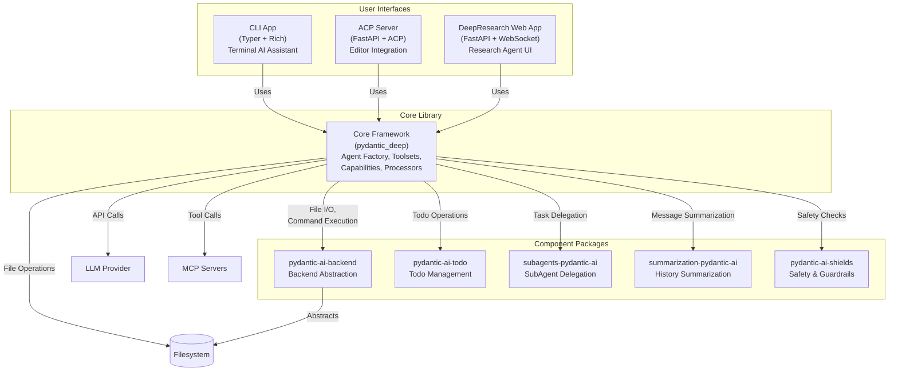

### Container Details

#### 1. CLI App
- **Technology**: Typer (CLI framework) + Rich (terminal formatting)
- **Responsibilities**:
  - Interactive chat with streaming responses
  - Slash commands for agent control
  - File context loading and management
  - Session persistence
- **Key Features**:
  - Real-time streaming output
  - Markdown rendering in terminal
  - Command completion
  - History navigation

#### 2. ACP Server
- **Technology**: FastAPI (web framework) + ACP (Agent Client Protocol)
- **Responsibilities**:
  - Editor integration (primarily Zed)
  - Agent Client Protocol implementation
  - Request routing and session management
- **Key Features**:
  - Standardized protocol for editor-agent communication
  - Concurrent session handling
  - Tool execution bridging

#### 3. DeepResearch Web App
- **Technology**: FastAPI (backend) + WebSocket (real-time) + vanilla JavaScript (frontend)
- **Responsibilities**:
  - Full research agent with web UI
  - Real-time progress visualization
  - Research plan management
- **Key Features**:
  - WebSocket-based streaming
  - Research tree visualization
  - Plan editing and approval

#### 4. Core Framework (`pydantic_deep`)
- **Technology**: Python library
- **Responsibilities**:
  - Agent factory and configuration
  - Tool management and registration
  - Capability composition
  - History processing pipeline
  - Dependency injection container
- **Key Modules**:
  - `agent.py` - Agent factory
  - `deps.py` - Dependencies container
  - `spec.py` - Declarative configuration
  - `toolsets/` - Tool collections
  - `capabilities/` - Feature adapters
  - `processors/` - History transformation

#### 5. Component Packages
Independent packages that provide specialized functionality:

| Package | Purpose |
|---------|---------|
| `pydantic-ai-backend` | Abstracts filesystem operations (Local, Docker, State backends) |
| `pydantic-ai-todo` | Todo list management with read/write operations |
| `subagents-pydantic-ai` | SubAgent creation, delegation, and monitoring |
| `summarization-pydantic-ai` | Message history summarization for context management |
| `pydantic-ai-shields` | Safety guardrails and output validation |

---

## Component Architecture - C4 Level 3

The Component diagram shows the internal structure of the Core Framework container.

### Core Framework Components

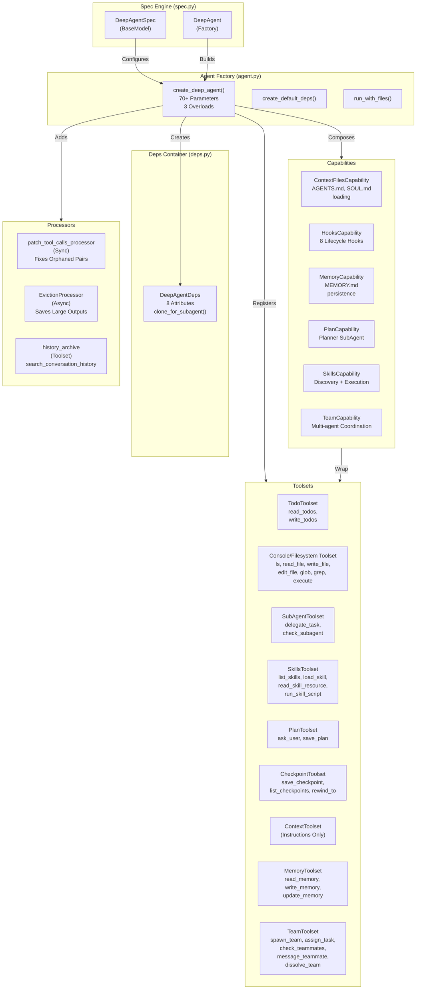

### Component Details

#### 1. Agent Factory (`agent.py`)

**Purpose**: Assemble configured agents from parameters

**Key Components**:
- `create_deep_agent()` - Main factory function with 70+ parameters and 3 overloads
  - Creates and configures toolsets
  - Composes capabilities
  - Sets up processors
  - Generates instructions
  - Registers dynamic_instructions callback for per-run system prompt injection
- `create_default_deps()` - Creates default dependency container
- `run_with_files()` - Convenience function for running agent with file context

**Dependencies**: All toolsets, capabilities, processors, prompts, styles, subagents

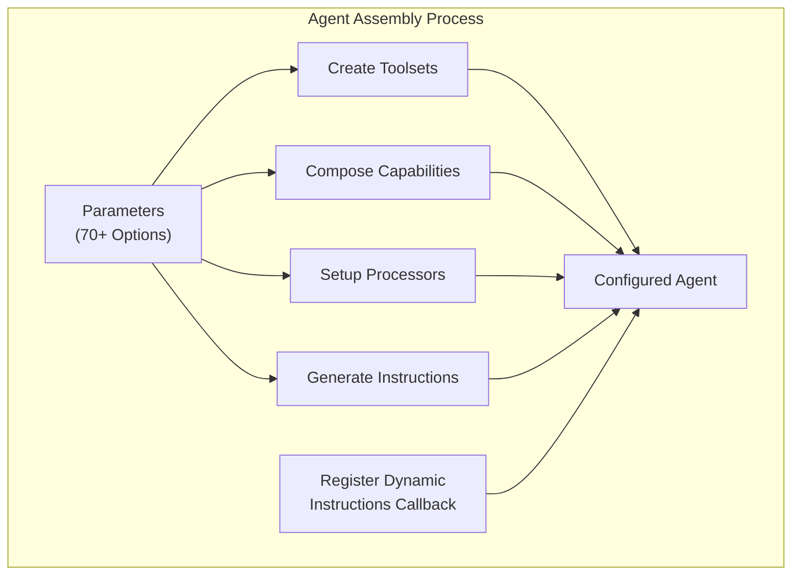

#### 2. Deps Container (`deps.py`)

**Purpose**: Hold all runtime state for agent execution

**Key Components**:
- `DeepAgentDeps` - Dataclass with 8 attributes:
  - `backend` - BackendProtocol for file I/O
  - `files` - List of uploaded files
  - `todos` - Todo list state
  - `subagents` - SubAgent instances
  - `uploads` - Uploaded file data
  - `context_middleware` - Context processing middleware
- `clone_for_subagent()` - Creates isolated copy for nested agents
- File upload methods for managing attachments

**Dependencies**: BackendProtocol, UploadedFile, FileData, Todo types

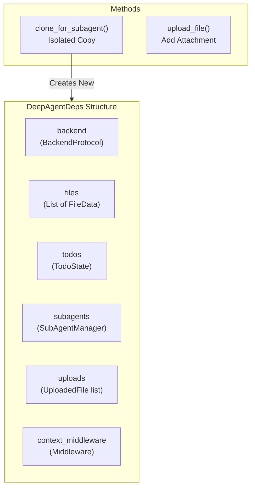

#### 3. Spec Engine (`spec.py`)

**Purpose**: Declarative agent configuration via YAML/JSON

**Key Components**:
- `DeepAgentSpec` - Pydantic BaseModel for configuration
- `DeepAgent` - Factory class that builds agents from specs

**Features**:
- YAML/JSON configuration files
- Version-controlled agent configs
- Reproducible agent setups

#### 4. Toolsets

**Purpose**: Provide tools the agent can call

| Toolset | Source | Tools |
|---------|--------|-------|
| **TodoToolset** | pydantic-ai-todo | `read_todos`, `write_todos` |
| **Console/Filesystem Toolset** | pydantic-ai-backend | `ls`, `read_file`, `write_file`, `edit_file`, `glob`, `grep`, `execute` |
| **SubAgentToolset** | subagents-pydantic-ai | `delegate_task`, `check_subagent` |
| **SkillsToolset** | Built-in | `list_skills`, `load_skill`, `read_skill_resource`, `run_skill_script` |
| **PlanToolset** | Built-in | `ask_user`, `save_plan` |
| **CheckpointToolset** | Built-in | `save_checkpoint`, `list_checkpoints`, `rewind_to` |
| **ContextToolset** | Built-in | No tools, just instructions injection |
| **MemoryToolset** | Built-in | `read_memory`, `write_memory`, `update_memory` |
| **TeamToolset** | Built-in | `spawn_team`, `assign_task`, `check_teammates`, `message_teammate`, `dissolve_team` |

**Dependencies**: pydantic-ai FunctionToolset, pydantic-ai-backend, pydantic-ai-todo, subagents-pydantic-ai

#### 5. Capabilities

**Purpose**: Wrap toolsets into pydantic-ai's capability interface

| Capability | Purpose | Related Toolset |
|------------|---------|-----------------|
| **ContextFilesCapability** | Loads AGENTS.md, SOUL.md into system prompt | ContextToolset |
| **HooksCapability** | 8 lifecycle hooks (pre/post tool, before/after run, model request) | None |
| **MemoryCapability** | Persistent memory via MEMORY.md | MemoryToolset |
| **PlanCapability** | Planner subagent with ask_user + save_plan | PlanToolset |
| **SkillsCapability** | Skill discovery + execution | SkillsToolset |
| **TeamCapability** | Multi-agent coordination | TeamToolset |

**Dependencies**: toolsets.*, pydantic-ai AbstractCapability

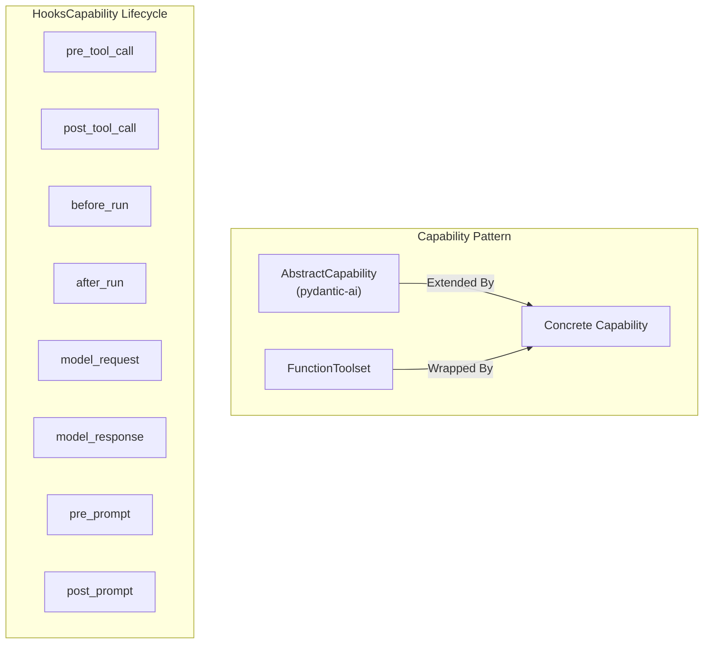

#### 6. Processors

**Purpose**: Transform message history before sending to LLM

| Processor | Type | Purpose |
|-----------|------|---------|
| **patch_tool_calls_processor** | Sync | Fixes orphaned tool call/result pairs |
| **EvictionProcessor** | Async | Saves large tool outputs to backend, replaces with preview |
| **history_archive** | Toolset | `search_conversation_history` tool |

**Dependencies**: pydantic-ai messages, pydantic-ai-backend BackendProtocol

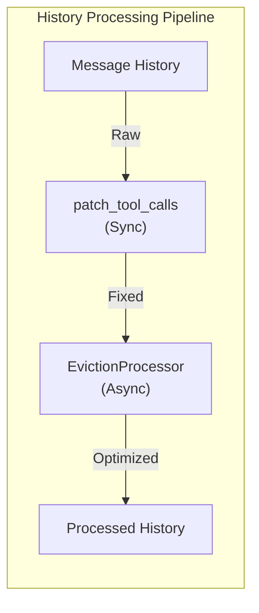

---

## Architectural Patterns

### Factory Pattern
`create_deep_agent()` assembles the entire agent from parameters. This centralizes configuration and ensures consistent agent construction.

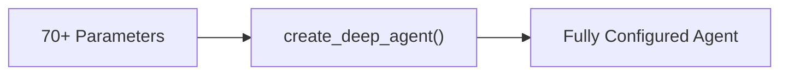

### Capability Pattern
All features are composable capabilities that implement `AbstractCapability`. Each capability wraps one or more toolsets and provides lifecycle hooks.

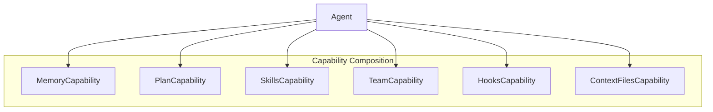

### Toolset Pattern
Tools are grouped into `FunctionToolset` collections. This provides logical organization and enables capability composition.

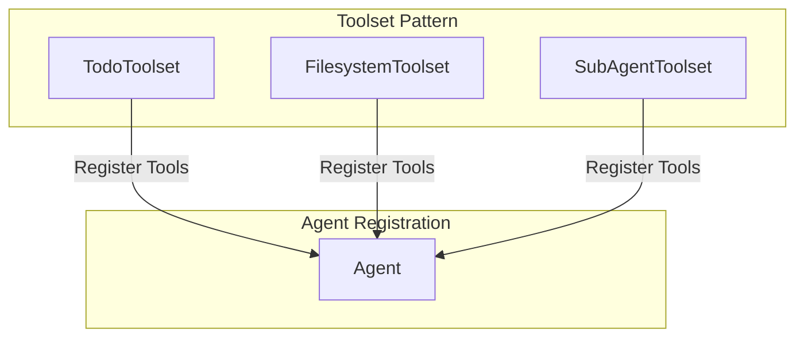

### Backend Abstraction
`BackendProtocol` abstracts filesystem operations, enabling Docker sandboxing without changing agent code.

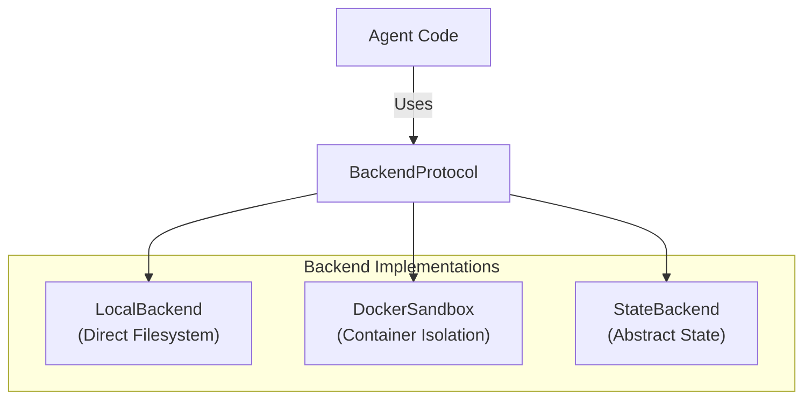

### Dependency Injection
All runtime state flows through `DeepAgentDeps`, enabling isolated execution contexts for subagents.

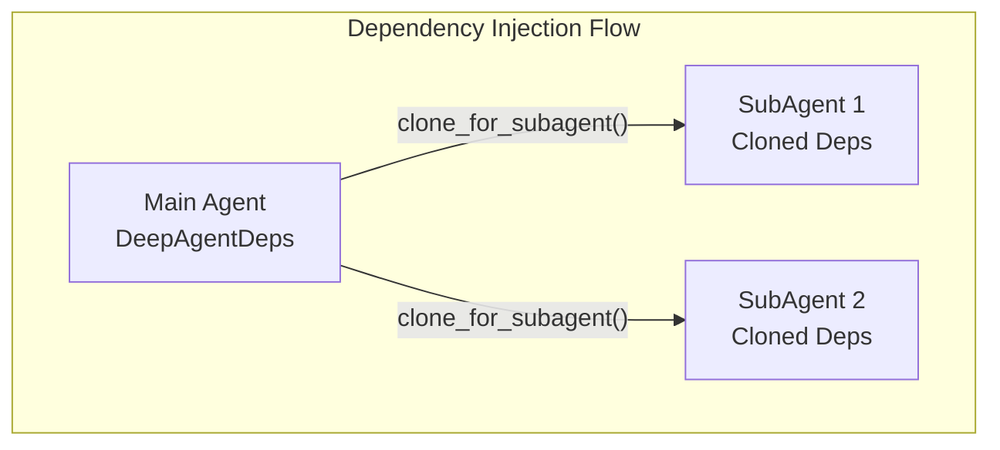

### History Processing Pipeline
Chain of responsibility for message history transformation ensures clean, optimized context for LLM calls.

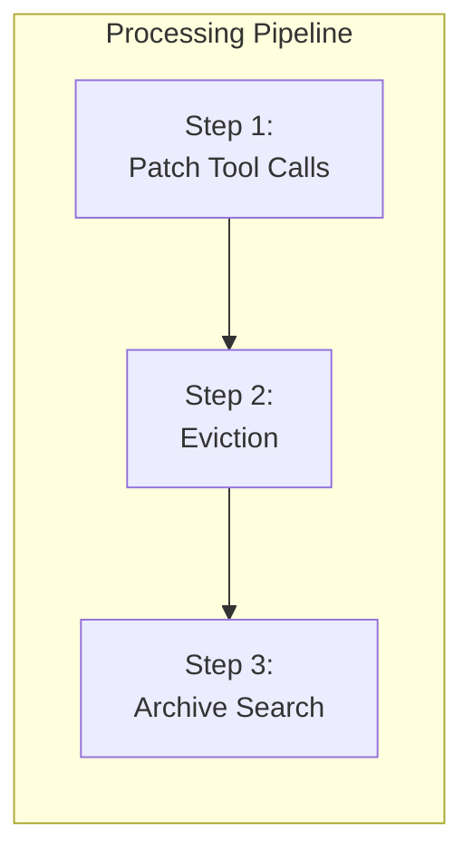

---

## Key Design Decisions

### Decision 1: Modular Component Packages

| Aspect | Details |
|--------|---------|
| **Decision** | Use independent packages for backend, todo, subagents, summarization, shields |
| **Rationale** | Each package can be used independently; promotes reuse and separation of concerns |
| **Trade-offs** | More packages to maintain, but better modularity and testability |

### Decision 2: Declarative Spec via YAML/JSON

| Aspect | Details |
|--------|---------|
| **Decision** | Support YAML/JSON configuration for agent specs |
| **Rationale** | Enables version-controlled agent configs, easier sharing and reproducibility |
| **Trade-offs** | Some features (callbacks, Python tools) cannot be fully serialized |

### Decision 3: Backend Abstraction for All File I/O

| Aspect | Details |
|--------|---------|
| **Decision** | Abstract all filesystem operations through BackendProtocol |
| **Rationale** | Enables Docker sandboxing without changing agent code; supports multiple execution environments |
| **Trade-offs** | Indirect access adds a layer of abstraction; slight performance overhead |

### Decision 4: Capability-Based Feature Composition

| Aspect | Details |
|--------|---------|
| **Decision** | Implement features as composable capabilities following pydantic-ai's AbstractCapability |
| **Rationale** | Enables modular feature addition/removal; consistent lifecycle management |
| **Trade-offs** | Requires capability adapter layer; adds indirection |

### Decision 5: History Processing Pipeline

| Aspect | Details |
|--------|---------|
| **Decision** | Chain processors for message history transformation |
| **Rationale** | Ensures clean context for LLM; handles edge cases like orphaned tool calls |
| **Trade-offs** | Processing adds latency; must handle sync/async processor differences |

---

## Module Breakdown

### Module: Agent Factory (`agent.py`)

| Attribute | Details |
|-----------|---------|
| **Purpose** | Assemble configured agents from parameters |
| **Key Components** | `create_deep_agent()` (70+ params, 3 overloads), `create_default_deps()`, `run_with_files()` |
| **Dependencies** | All toolsets, capabilities, processors, prompts, styles, subagents |
| **Location** | `pydantic_deep/agent.py` |

### Module: Deps Container (`deps.py`)

| Attribute | Details |
|-----------|---------|
| **Purpose** | Hold all runtime state for agent execution |
| **Key Components** | `DeepAgentDeps` dataclass with 8 attributes, file upload methods, subagent cloning |
| **Dependencies** | BackendProtocol, UploadedFile, FileData, Todo types |
| **Location** | `pydantic_deep/deps.py` |

### Module: Toolsets (`toolsets/`)

| Attribute | Details |
|-----------|---------|
| **Purpose** | Provide tools the agent can call |
| **Key Components** | 9 toolsets spanning planning, filesystem, subagents, skills, checkpoints, memory, teams |
| **Dependencies** | pydantic-ai FunctionToolset, pydantic-ai-backend, pydantic-ai-todo, subagents-pydantic-ai |
| **Location** | `pydantic_deep/toolsets/` |

### Module: Capabilities (`capabilities/`)

| Attribute | Details |
|-----------|---------|
| **Purpose** | Wrap toolsets into pydantic-ai's capability interface |
| **Key Components** | 6 capabilities, each a thin adapter layer |
| **Dependencies** | toolsets.*, pydantic-ai AbstractCapability |
| **Location** | `pydantic_deep/capabilities/` |

### Module: Processors (`processors/`)

| Attribute | Details |
|-----------|---------|
| **Purpose** | Transform message history before sending to LLM |
| **Key Components** | 2 processors + 1 search toolset |
| **Dependencies** | pydantic-ai messages, pydantic-ai-backend BackendProtocol |
| **Location** | `pydantic_deep/processors/` |

---

## Cross-Cutting Concerns

### Error Handling
- Graceful degradation when optional components are unavailable
- Comprehensive error messages with context
- Automatic retry for transient failures (LLM API calls)

### Logging and Observability
- Structured logging throughout the pipeline
- Tool call tracing for debugging
- Performance metrics collection

### Security
- Docker sandbox isolation for untrusted code execution
- Input validation via Pydantic models
- Guardrails via pydantic-ai-shields

### Testing Strategy
- Unit tests for individual components
- Integration tests for agent assembly
- End-to-end tests for full agent workflows

---

*This architecture documentation follows the C4 model for visualizing software architecture. For implementation details, refer to the source code and API documentation.*