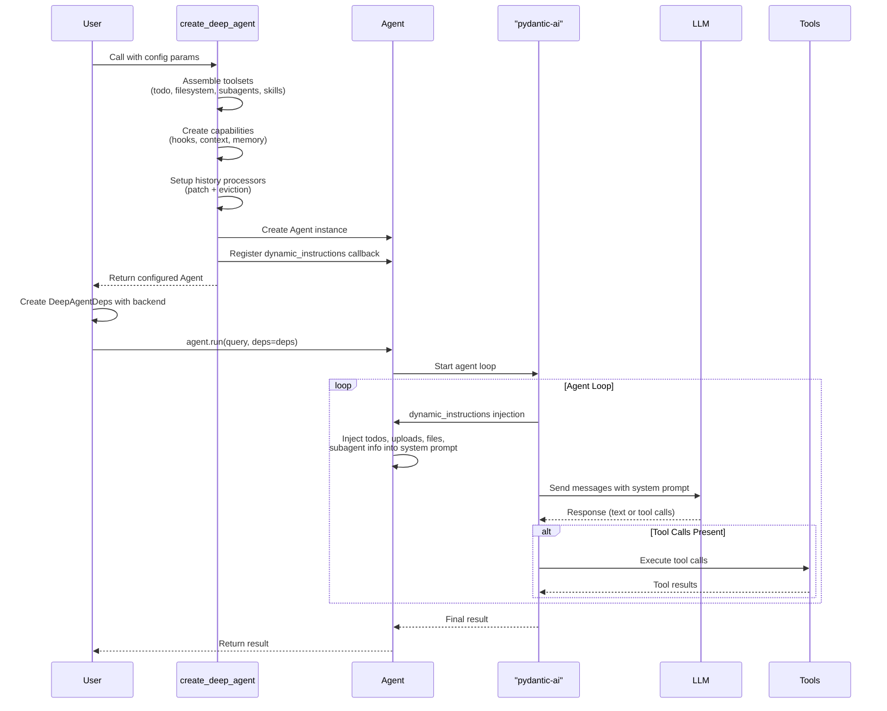
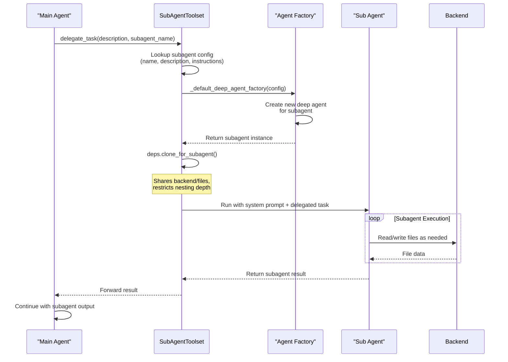
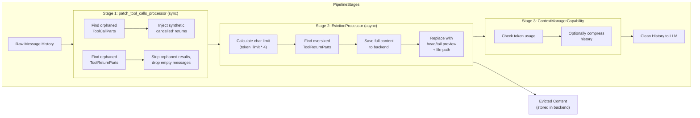
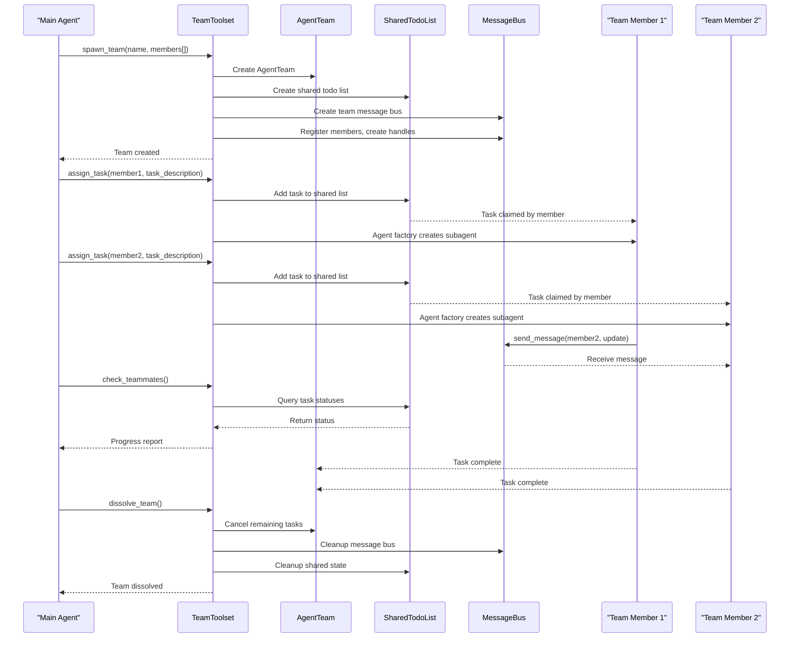
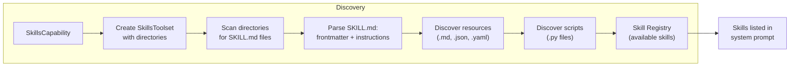
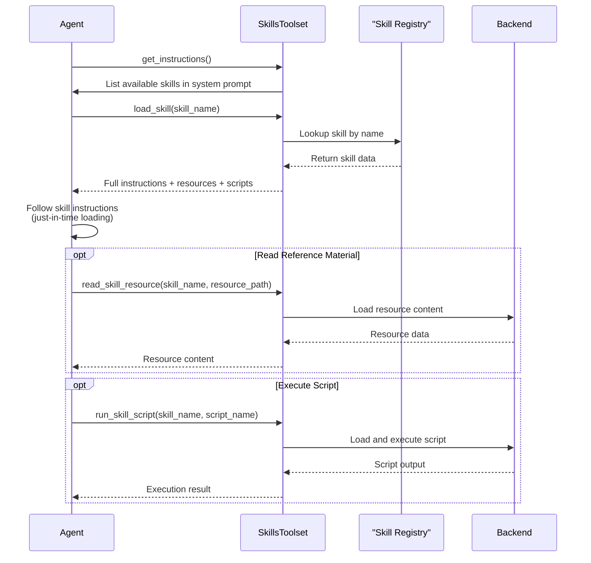
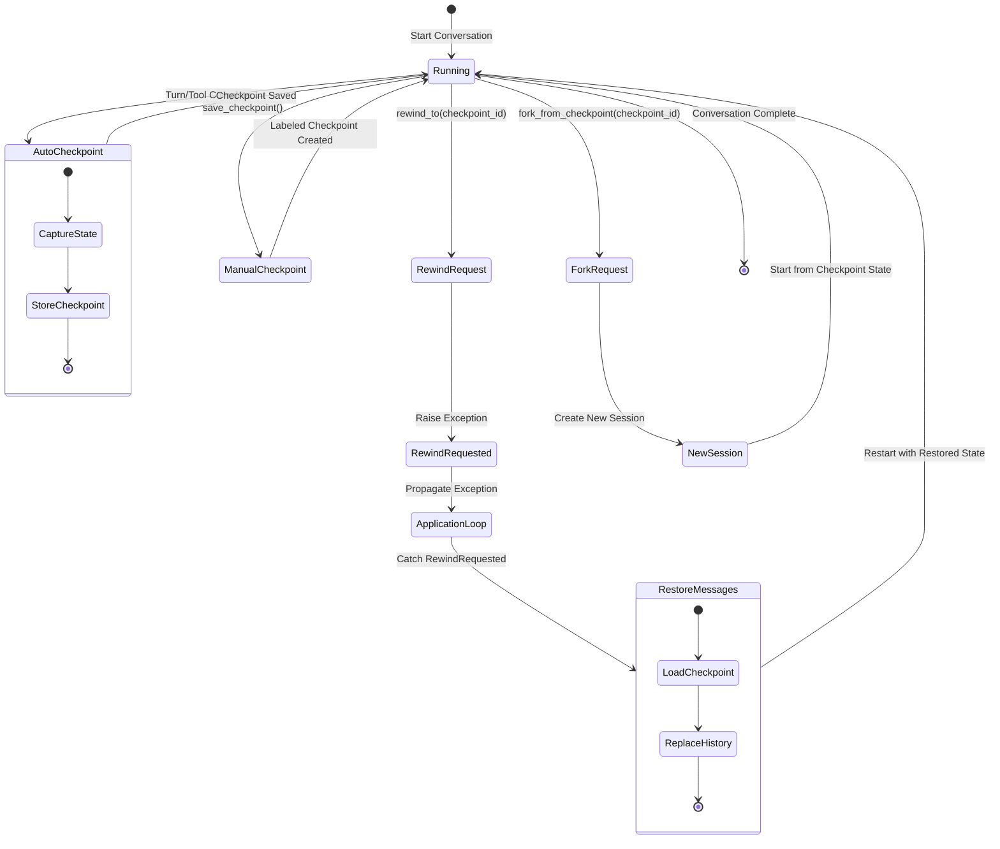
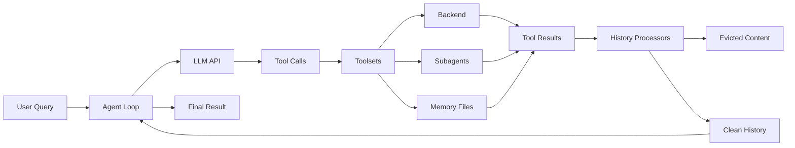
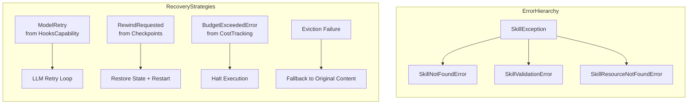

# Workflow Overview

This document describes the core workflows in pydantic-deepagents, illustrating how components interact during agent creation, execution, delegation, and state management.

---

## Core Workflows

### Workflow 1: Agent Creation and Execution

The main workflow: user creates an agent, the agent runs a query, and returns a result. This is the primary entry point for interacting with the system.

**Steps:**

1. User calls `create_deep_agent()` with config params (model, toolsets, capabilities, etc.)
2. Factory assembles toolsets (todo, filesystem, subagents, skills, etc.)
3. Factory creates capabilities (hooks, context, memory, etc.)
4. Factory sets up history processors (patch + eviction)
5. Factory creates `Agent` instance with assembled config
6. Factory registers `dynamic_instructions` callback for per-run prompt injection
7. User creates `DeepAgentDeps` with backend
8. User calls `agent.run(query, deps=deps)`
9. pydantic-ai runs the agent loop (LLM -> tool calls -> LLM -> ...)
10. Dynamic instructions inject todos, uploads, files summary, subagent info into system prompt
11. Result returned to user

---

### Workflow 2: Subagent Delegation

The main agent delegates work to subagents for specialized tasks. Subagents run with isolated context but can share backend and filesystem access.

**Steps:**

1. Main agent calls `delegate_task` tool with description and subagent name
2. SubAgentToolset looks up subagent config (name, description, instructions)
3. `_default_deep_agent_factory` creates a new deep agent for the subagent
4. `deps.clone_for_subagent()` creates isolated deps (shares backend/files, restricts nesting)
5. Subagent runs with its own system prompt + delegated task
6. Result returned to main agent
7. Main agent continues with subagent's output

---

### Workflow 3: History Processing Pipeline

Messages are processed before each LLM call to ensure clean, size-bounded history. This pipeline repairs orphaned tool calls and evicts oversized content.

**Steps:**

1. pydantic-ai prepares message history for next LLM request
2. `patch_tool_calls_processor` (sync) runs first:
   - Finds orphaned ToolCallParts with no matching ToolReturnParts
   - Injects synthetic "cancelled" ToolReturnParts
   - Finds orphaned ToolReturnParts with no matching ToolCallParts
   - Strips orphaned results, drops empty messages
3. `EvictionProcessor` (async) runs second:
   - Resolves backend from RunContext.deps
   - Calculates char limit from token_limit * 4
   - Finds ToolReturnParts exceeding limit
   - Saves full content to backend via write()
   - Replaces with head/tail preview + file path reference
   - Tracks evicted IDs to prevent re-processing
4. `ContextManagerCapability` checks token usage and optionally compresses history
5. Clean, size-bounded message history sent to LLM

---

### Workflow 4: Team Coordination

Multi-agent teams coordinate through shared todo lists and a message bus, enabling parallel task execution with communication.

**Steps:**

1. Main agent calls `spawn_team` with team name and member definitions
2. `AgentTeam` created with SharedTodoList and TeamMessageBus
3. Members registered on message bus, handles created
4. Main agent calls `assign_task` for specific member
5. Task added to shared todo list, claimed by member
6. Agent factory creates subagent for member execution
7. Member runs task, can check teammates, send messages
8. Main agent calls `check_teammates` to monitor progress
9. When done, `dissolve_team` cancels remaining tasks and cleans up

---

### Workflow 5: Skill Discovery and Execution

Skills are discovered from directories or backends, then loaded on-demand when the agent needs them.

**Discovery Flow:**

1. SkillsCapability creates SkillsToolset with directories
2. SkillsDirectory or BackendSkillsDirectory discovers SKILL.md files
3. Each SKILL.md parsed: frontmatter (name, description) + instructions
4. Resources (.md, .json, .yaml, etc.) and scripts (.py) discovered alongside

**Execution Flow:**

1. Agent sees available skills in system prompt via `get_instructions()`
2. Agent calls `load_skill` to get full instructions, resources, scripts
3. Agent follows skill instructions (just-in-time loading)
4. Agent can `read_skill_resource` for reference material
5. Agent can `run_skill_script` for executable scripts

---

### Workflow 6: Checkpoint and Rewind

Conversation state is saved at configurable intervals and can be restored to rewind or fork conversations.

**Steps:**

1. CheckpointMiddleware auto-saves checkpoints (every_turn or every_tool frequency)
2. Each checkpoint captures: ID, label, turn number, messages snapshot, metadata
3. Checkpoints stored in CheckpointStore (InMemory or File-based)
4. Agent can call `save_checkpoint` to label current state
5. Agent can call `list_checkpoints` to see available snapshots
6. Agent can call `rewind_to` to restore a previous state
7. `RewindRequested` exception propagates to application run loop
8. Application catches exception, restores messages, restarts agent run
9. `fork_from_checkpoint` allows starting a new session from a checkpoint

---

## Data Flow

The following diagram illustrates how data flows through the system during agent execution:

---

## State Management

The system manages state across multiple dimensions:

| Component | Purpose | Scope |
|-----------|---------|-------|
| **DeepAgentDeps** | Holds all runtime state (backend, files, todos, subagents, uploads) | Per-run |
| **ContextManagerCapability** | Tracks token usage and triggers compression | Per-agent |
| **Memory files** | Persist across sessions in the backend | Cross-session |
| **CheckpointStore** | Persists conversation snapshots | Cross-session |
| **SharedTodoList** | Provides asyncio-safe shared state for teams | Per-team |

---

## Error Handling

The system handles errors at multiple levels with specific exception types:

| Error Type | Source | Behavior |
|------------|--------|----------|
| **ModelRetry** | HooksCapability | Raised when a pre-tool hook denies a call; triggers LLM retry |
| **RewindRequested** | Checkpoint system | Propagates from checkpoint rewind to application layer for state restoration |
| **BudgetExceededError** | CostTracking | Raised when USD budget is exceeded during execution |
| **SkillException hierarchy** | SkillsToolset | Includes SkillNotFoundError, SkillValidationError, SkillResourceNotFoundError |
| **Orphaned tool calls** | patch_tool_calls_processor | Auto-repairs broken history by injecting synthetic returns |
| **Eviction failures** | EvictionProcessor | Gracefully falls back to original content if backend write fails |

