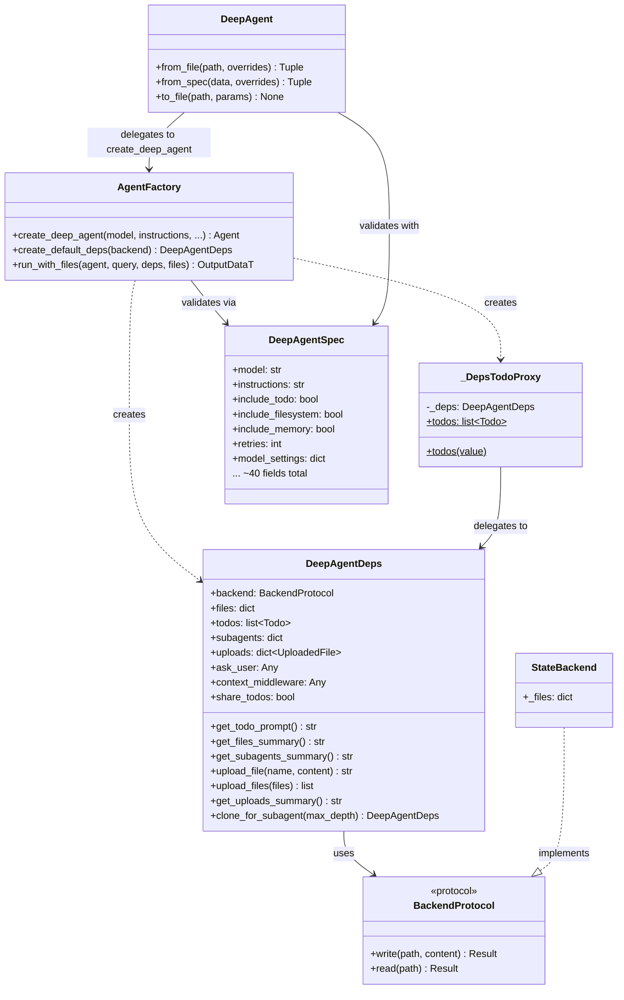

# 4A - Deep Dive: Agent Factory, Deps Container & Spec Engine

This document provides an in-depth look at the three foundational pillars of pydantic-deepagents:

1. **Agent Factory** (`agent.py`) — The main entry point for creating fully-configured deep agents
2. **Deps Container** (`deps.py`) — The dependency injection container holding runtime state
3. **Spec Engine** (`spec.py`) — Declarative agent configuration via YAML/JSON

---

## Agent Factory (`agent.py`)

The agent factory is the central orchestrator that wires together toolsets, capabilities, processors, and dynamic instructions into a fully-functional pydantic-ai Agent.

### `create_deep_agent()` — Main Entry Point

The primary function with **70+ parameters** and **3 overloads** for type discrimination:

```pydantic_deep/agent.py#L69-130
@overload
def create_deep_agent(
    model: str | Model | None = None,
    ...
    output_type: None = None,
    ...
) -> Agent[DeepAgentDeps, str]: ...
```

The three overloads provide type-level discrimination based on `output_type`:

| Overload | `output_type` | Return Type |
|----------|---------------|-------------|
| 1st | `None` (default) | `Agent[DeepAgentDeps, str]` |
| 2nd | `OutputSpec[OutputDataT]` | `Agent[DeepAgentDeps, OutputDataT]` |
| 3rd (actual impl) | `OutputSpec[OutputDataT] \| None` | `Agent[DeepAgentDeps, OutputDataT] \| Agent[DeepAgentDeps, str]` |

#### Parameter Groups

The 70+ parameters are organized into these logical groups:

**Core Configuration:**
- `model` — LLM model identifier (default: `"anthropic:claude-opus-4-6"`)
- `instructions` — Custom system prompt appended to `BASE_PROMPT`
- `output_style` — Named style or custom OutputStyle instance
- `styles_dir` — Directory for discovering custom output styles
- `retries` — Max retries for tool calls (default: 3)
- `model_settings` — Provider-specific settings (temperature, thinking, etc.)

**Include Flags (toggle toolsets):**
- `include_todo` — Todo planning toolset (default: True)
- `include_filesystem` — Console/filesystem toolset (default: True)
- `include_subagents` — Task delegation toolset (default: True)
- `include_skills` — Skill discovery/execution (default: True)
- `include_builtin_subagents` — Research subagent (default: True)
- `include_plan` — Planner subagent (default: True)
- `include_memory` — Persistent MEMORY.md (default: True)
- `include_checkpoints` — Conversation snapshots (default: False)
- `include_teams` — Multi-agent coordination (default: False)
- `include_history_archive` — Search compressed history (default: True)
- `include_execute` — Shell execution (auto-detected from backend type)

**Processing & Context:**
- `patch_tool_calls` — Fix orphaned tool call/result pairs (default: True)
- `eviction_token_limit` — Large output eviction threshold (default: 20,000)
- `context_manager` — Token tracking + auto-compression (default: True)
- `context_manager_max_tokens` — Token budget (auto-detected from model)
- `summarization_model` — Model for LLM-based compression

**Advanced:**
- `hooks` — Claude Code-style lifecycle hooks
- `interrupt_on` — Tool approval requirements map
- `cost_tracking` / `cost_budget_usd` — USD budget enforcement
- `instrument` — OpenTelemetry/Logfire instrumentation
- `middleware` — Additional AbstractCapability instances

### Construction Flow

The factory follows a strict ordering to wire components together:

```
set defaults → build subagents → create toolsets → create capabilities
    → build instructions → setup processors → create Agent → register dynamic_instructions
```

#### Step 1: Set Defaults

```pydantic_deep/agent.py#L530-532
model = model or DEFAULT_MODEL
backend = backend or StateBackend()
interrupt_on = interrupt_on or {}
```

#### Step 2: Build Subagents

Effective subagents are assembled from user-provided configs plus built-ins:

```pydantic_deep/agent.py#L534-564
effective_subagents: list[SubAgentConfig] = list(subagents or [])
if include_plan and include_subagents:
    plan_toolset = create_plan_toolset(plans_dir=_plans_dir)
    planner_config: SubAgentConfig = {
        "name": "planner",
        "description": PLANNER_DESCRIPTION,
        "instructions": PLANNER_INSTRUCTIONS,
        "toolsets": [plan_toolset],
    }
    effective_subagents.append(planner_config)
```

Each subagent without an existing `agent_factory` gets injected with `_default_deep_agent_factory`, creating recursive deep agents.

#### Step 3: Create Toolsets

Toolsets are assembled in order into `all_toolsets`:

1. **TodoToolset** — `create_todo_toolset(storage=_todo_proxy)`
2. **ConsoleToolset** — `create_console_toolset(...)` with approval config
3. **SubAgentToolset** — `create_subagent_toolset(...)` with nesting depth
4. **SkillsToolset** — `SkillsToolset(directories=...)`
5. **ContextToolset** — If `context_files` or `context_discovery` set
6. **AgentMemoryToolset** — For each agent (main + subagents)
7. **CheckpointToolset** — If `include_checkpoints` is True
8. **TeamToolset** — If `include_teams` is True
9. **HistorySearchToolset** — If `include_history_archive` + `context_manager`

#### Step 4: Create Capabilities

Capabilities are appended to `all_capabilities`:

1. `HooksCapability` — If `hooks` provided
2. `CheckpointMiddleware` — If `include_checkpoints` (auto-saves snapshots)
3. User-provided `middleware`
4. `ContextManagerCapability` — Token tracking + compression
5. `CostTracking` — USD budget enforcement
6. `WebSearch` / `WebFetch` — Web capabilities
7. `Thinking` — Reasoning effort control

#### Step 5: Build Instructions

```pydantic_deep/agent.py#L748-754
base_instructions = DEFAULT_INSTRUCTIONS
if instructions:
    base_instructions = base_instructions + "\n\n" + instructions
if output_style is not None:
    resolved = resolve_style(output_style, styles_dir)
    base_instructions = base_instructions + "\n\n" + format_style_prompt(resolved)
```

#### Step 6: Setup Processors

History processors are ordered: eviction → patch → user-provided

```pydantic_deep/agent.py#L775-783
if patch_tool_calls:
    from pydantic_deep.processors.patch import patch_tool_calls_processor
    all_processors.insert(0, patch_tool_calls_processor)

if eviction_token_limit is not None:
    eviction = EvictionProcessor(backend=backend, token_limit=eviction_token_limit, ...)
    all_processors.insert(0, eviction)
```

#### Step 7: Create Agent + Dynamic Instructions

```pydantic_deep/agent.py#L863-866
agent: Agent[DeepAgentDeps, Any] = Agent(
    model,
    **agent_create_kwargs,
)
```

Dynamic instructions are registered via `@agent.instructions` to inject runtime state:

```pydantic_deep/agent.py#L924-955
@agent.instructions
def dynamic_instructions(ctx: Any) -> str:
    """Generate dynamic instructions based on current state."""
    parts = []
    uploads_prompt = ctx.deps.get_uploads_summary()
    if uploads_prompt:
        parts.append(uploads_prompt)
    if include_todo and _todo_proxy is not None:
        _todo_proxy._deps = ctx.deps
        todo_prompt = get_todo_system_prompt(_todo_proxy)
        ...
```

### Internal: `_DepsTodoProxy`

A lightweight proxy implementing `TodoStorageProtocol` that delegates to the current run's `DeepAgentDeps`:

```pydantic_deep/agent.py#L43-65
class _DepsTodoProxy:
    """Proxy that delegates todo reads/writes to the current run's DeepAgentDeps."""

    def __init__(self) -> None:
        self._deps: DeepAgentDeps | None = None

    @property
    def todos(self) -> list[Any]:
        if self._deps is None:
            return []
        return self._deps.todos

    @todos.setter
    def todos(self, value: list[Any]) -> None:
        if self._deps is not None:
            self._deps.todos = list(value)
```

The proxy is bound to the current deps inside `dynamic_instructions()` on each model turn, ensuring the toolset operates on the correct deps instance.

### Internal: `_default_deep_agent_factory()`

Creates deep agents for subagent execution (recursive). Subagents get a reduced feature set:

```pydantic_deep/agent.py#L555-579
def _default_deep_agent_factory(cfg: dict[str, Any]) -> Any:
    """Create a deep agent for subagent execution."""
    return create_deep_agent(
        model=cfg.get("model", _sub_model),
        instructions=cfg["instructions"],
        include_filesystem=True,
        include_execute=True,
        include_todo=True,
        web_search=True,
        web_fetch=True,
        thinking=False,          # Save tokens
        include_subagents=False, # No nesting by default
        include_skills=False,
        include_plan=False,
        include_teams=False,
        include_builtin_subagents=False,
        context_manager=False,
        cost_tracking=False,
        include_memory=_sub_memory,
        memory_dir=_sub_memory_dir,
        context_files=_sub_context_files,
        context_discovery=_sub_context_discovery,
        edit_format=_sub_edit_fmt,
    )
```

### `create_default_deps()`

Creates a default `DeepAgentDeps` with optional backend:

```pydantic_deep/agent.py#L971-983
def create_default_deps(
    backend: BackendProtocol | None = None,
) -> DeepAgentDeps:
    resolved_backend: BackendProtocol = backend or StateBackend()
    return DeepAgentDeps(backend=resolved_backend)
```

### `run_with_files()`

Convenience function that uploads files then runs the agent:

```pydantic_deep/agent.py#L986-1033
async def run_with_files(
    agent: Agent[DeepAgentDeps, OutputDataT],
    query: str,
    deps: DeepAgentDeps,
    files: list[tuple[str, bytes]] | None = None,
    *,
    upload_dir: str = "/uploads",
) -> OutputDataT:
    if files:
        deps.upload_files(files, upload_dir=upload_dir)
    result = await agent.run(query, deps=deps)
    return result.output
```

---

## Deps Container (`deps.py`)

`DeepAgentDeps` is the runtime state container injected into every tool call and system prompt generation.

### Class Definition

```pydantic_deep/deps.py#L14-28
@dataclass
class DeepAgentDeps:
    """Dependencies for deep agents."""
    backend: BackendProtocol = field(default_factory=StateBackend)
    files: dict[str, FileData] = field(default_factory=dict)
    todos: list[Todo] = field(default_factory=list)
    subagents: dict[str, Any] = field(default_factory=dict)
    uploads: dict[str, UploadedFile] = field(default_factory=dict)
    ask_user: Any = field(default=None, repr=False)
    context_middleware: Any = field(default=None, repr=False)
    share_todos: bool = False
```

### 8 Attributes

| Attribute | Type | Purpose |
|-----------|------|---------|
| `backend` | `BackendProtocol` | File storage backend (StateBackend, FilesystemBackend, etc.) |
| `files` | `dict[str, FileData]` | In-memory file cache |
| `todos` | `list[Todo]` | Task list for planning |
| `subagents` | `dict[str, Any]` | Pre-configured subagent Agent instances |
| `uploads` | `dict[str, UploadedFile]` | Uploaded files metadata |
| `ask_user` | `Any` | Callback for interactive questions |
| `context_middleware` | `Any` | ContextManagerCapability reference |
| `share_todos` | `bool` | When True, subagents share parent's todo list |

### `__post_init__()` — Backend Sync

When using `StateBackend`, files are synced bidirectionally:

```pydantic_deep/deps.py#L30-38
def __post_init__(self) -> None:
    if isinstance(self.backend, StateBackend):
        if self.files:
            self.backend._files = self.files
        else:
            object.__setattr__(self, "files", self.backend._files)
```

### Methods

#### `get_todo_prompt()`

Generates a system prompt section from the current todo list:

```pydantic_deep/deps.py#L40-53
def get_todo_prompt(self) -> str:
    if not self.todos:
        return ""
    lines = ["## Current Todos"]
    for todo in self.todos:
        status_icon = {
            "pending": "[ ]",
            "in_progress": "[*]",
            "completed": "[x]",
        }.get(todo.status, "[ ]")
        lines.append(f"- {status_icon} {todo.content}")
    return "\n".join(lines)
```

#### `get_files_summary()`

Lists files in memory with line counts:

```pydantic_deep/deps.py#L55-65
def get_files_summary(self) -> str:
    if not self.files:
        return ""
    lines = ["## Files in Memory"]
    for path, data in sorted(self.files.items()):
        line_count = len(data["content"])
        lines.append(f"- {path} ({line_count} lines)")
    return "\n".join(lines)
```

#### `get_subagents_summary()`

Lists available subagents:

```pydantic_deep/deps.py#L67-77
def get_subagents_summary(self) -> str:
    if not self.subagents:
        return ""
    lines = ["## Available Subagents"]
    for name in sorted(self.subagents.keys()):
        lines.append(f"- {name}")
    return "\n".join(lines)
```

#### `upload_file()` / `upload_files()`

Uploads files to backend with encoding detection and metadata tracking:

```pydantic_deep/deps.py#L79-127
def upload_file(self, name: str, content: bytes, *, upload_dir: str = "/uploads") -> str:
    path = f"{upload_dir}/{name}"
    res = self.backend.write(path, content)
    if res.error:
        raise RuntimeError(f"Failed to upload file: {res.error}")
    detection = chardet.detect(content)
    encoding = detection.get("encoding")
    ...
    self.uploads[path] = UploadedFile(name=name, path=path, size=len(content), ...)
    return path
```

#### `get_uploads_summary()`

Generates prompt section listing uploaded files with size and line info:

```pydantic_deep/deps.py#L149-168
def get_uploads_summary(self) -> str:
    if not self.uploads:
        return ""
    lines = ["## Uploaded Files", "", "Files uploaded by the user:"]
    for path, info in sorted(self.uploads.items()):
        size_str = _format_size(info["size"])
        if info["line_count"] is not None:
            lines.append(f"- `{path}` ({size_str}, {info['line_count']} lines)")
        else:
            lines.append(f"- `{path}` ({size_str})")
    lines.append("")
    lines.append("Use `read_file`, `grep`, `glob` or `execute` to work with these files.")
    return "\n".join(lines)
```

#### `clone_for_subagent()` — Isolation Strategy

Creates a new deps instance for subagent execution with controlled sharing:

```pydantic_deep/deps.py#L196-217
def clone_for_subagent(self, max_depth: int = 0) -> DeepAgentDeps:
    return DeepAgentDeps(
        backend=self.backend,                              # Shared reference
        files=self.files,                                  # Shared reference
        todos=self.todos if self.share_todos else [],      # Shared or isolated
        subagents=self.subagents.copy() if max_depth > 0 else {},  # Nesting control
        uploads=self.uploads,                              # Shared reference
        ask_user=self.ask_user,                            # Propagated
        share_todos=self.share_todos,                      # Propagated
    )
```

**Sharing semantics:**

| Resource | Shared? | Rationale |
|----------|---------|-----------|
| `backend` | Yes | Same filesystem |
| `files` | Yes | Subagents need to read/write same files |
| `uploads` | Yes | Subagents need access to user uploads |
| `todos` | Configurable | `share_todos=True` for collaborative planning |
| `subagents` | Conditional | Only when `max_depth > 0` (prevents infinite nesting) |
| `ask_user` | Yes | Subagents can ask questions too |

---

## Spec Engine (`spec.py`)

The spec engine enables declarative agent configuration via YAML or JSON files, mirroring `create_deep_agent()` parameters.

### `DeepAgentSpec` — Pydantic Model

```pydantic_deep/spec.py#L57-60
class DeepAgentSpec(BaseModel):
    model_config = ConfigDict(extra="forbid")
```

With `extra="forbid"`, any unknown field raises a validation error. The model has approximately **40 fields** organized into groups:

**Core:**
- `model`, `instructions`, `output_style`, `styles_dir`, `retries`

**Include Flags:**
- `include_todo`, `include_filesystem`, `include_subagents`, `include_skills`, `include_builtin_subagents`, `include_plan`, `include_execute`, `include_memory`, `include_checkpoints`, `include_teams`, `web_search`, `web_fetch`, `thinking`, `include_history_archive`

**Subagent Config:**
- `subagents`, `skill_directories`, `max_nesting_depth`

**Processing:**
- `eviction_token_limit`, `patch_tool_calls`, `context_manager`, `context_manager_max_tokens`, `summarization_model`

**Filesystem:**
- `edit_format`

**Context:**
- `context_files`, `context_discovery`

**Memory:**
- `memory_dir`

**Checkpointing:**
- `checkpoint_frequency`, `max_checkpoints`

**History:**
- `history_messages_path`

**Cost:**
- `cost_tracking`, `cost_budget_usd`

**Plans:**
- `plans_dir`

**Model Settings:**
- `model_settings`

**Instrumentation:**
- `instrument`

### `DeepAgent` — Factory Class

```pydantic_deep/spec.py#L133-136
class DeepAgent:
    """Factory for creating deep agents from declarative specs."""
```

Three class methods:

#### `from_file(path, **overrides)` → `(agent, deps)`

```pydantic_deep/spec.py#L138-176
@classmethod
def from_file(cls, path: str | Path, **overrides: Any) -> tuple[Any, DeepAgentDeps]:
    file_path = Path(path)
    text = file_path.read_text(encoding="utf-8")
    if file_path.suffix in (".yaml", ".yml"):
        data = _load_yaml(text)
    elif file_path.suffix == ".json":
        data = json.loads(text)
    ...
    return cls.from_spec(data, **overrides)
```

#### `from_spec(data, **overrides)` → `(agent, deps)`

Separates serializable overrides from non-serializable passthrough:

```pydantic_deep/spec.py#L178-229
@classmethod
def from_spec(cls, data: dict[str, Any], **overrides: Any) -> tuple[Any, DeepAgentDeps]:
    non_spec_keys = {
        "backend", "tools", "toolsets", "hooks", "on_context_update",
        "on_before_compress", "on_after_compress", "on_eviction",
        "on_cost_update", "middleware", "checkpoint_store",
        "subagent_registry", "subagent_extra_toolsets",
        "history_processors", "output_type",
    }

    spec_fields = set(DeepAgentSpec.model_fields)
    spec_overrides: dict[str, Any] = {}
    passthrough: dict[str, Any] = {}
    for k, v in overrides.items():
        if k in non_spec_keys or k not in spec_fields:
            passthrough[k] = v
        elif k in spec_fields and not isinstance(
            v, (str, int, float, bool, list, dict, type(None))
        ):
            passthrough[k] = v
        else:
            spec_overrides[k] = v

    merged = {**data, **spec_overrides}
    spec = DeepAgentSpec(**merged)
    kwargs = spec.model_dump(exclude_none=True)
    kwargs.update(passthrough)
    agent = create_deep_agent(**kwargs)
    deps = DeepAgentDeps(backend=passthrough.get("backend") or _default_backend())
    return agent, deps
```

**Key insight:** Non-serializable values (callbacks, Python objects like `TestModel()`) are automatically routed to passthrough, bypassing Pydantic validation.

#### `to_file(path, **params)` → `None`

```pydantic_deep/spec.py#L231-261
@classmethod
def to_file(cls, path: str | Path, **params: Any) -> None:
    spec = DeepAgentSpec(**{k: v for k, v in params.items() if k in DeepAgentSpec.model_fields})
    data = spec.model_dump(exclude_defaults=True)
    content = json.dumps(data, indent=2) if file_path.suffix == ".json" else _dump_yaml(data)
    file_path.write_text(content, encoding="utf-8")
```

### YAML Example

```yaml
model: anthropic:claude-opus-4-6
instructions: You are a helpful coding assistant.
include_todo: true
include_filesystem: true
include_memory: true
memory_dir: .pydantic-deep
retries: 3
model_settings:
  temperature: 0.7
```

---

## Class Diagram



### Flow: Agent Creation via Spec

```
┌─────────────┐     ┌──────────────┐     ┌──────────────┐     ┌────────────┐
│  YAML/JSON   │────▶│  DeepAgent   │────▶│DeepAgentSpec │────▶│ Pydantic   │
│  File        │     │  .from_file()│     │  validation  │     │ validated  │
└─────────────┘     └──────────────┘     └──────────────┘     └─────┬──────┘
                                                                      │
                          ┌───────────────────────────────────────────┘
                          ▼
                  ┌──────────────┐     ┌──────────────┐     ┌────────────┐
                  │  Separate    │────▶│  create_     │────▶│  Agent     │
                  │  passthrough │     │  deep_agent()│     │  instance  │
                  └──────────────┘     └──────────────┘     └─────┬──────┘
                                                                      │
                          ┌───────────────────────────────────────────┘
                          ▼
                  ┌──────────────┐     ┌──────────────┐
                  │DeepAgentDeps │────▶│  Return      │
                  │  created     │     │  (agent,deps)│
                  └──────────────┘     └──────────────┘
```

### Flow: Dynamic Instructions Per-Run

```
Each model turn:
    ┌─────────────────────────────────────────────────────────┐
    │  dynamic_instructions(ctx)                              │
    │                                                         │
    │  1. Bind _todo_proxy._deps = ctx.deps                   │
    │  2. Collect parts:                                      │
    │     ├── get_uploads_summary()  (uploaded files)         │
    │     ├── get_todo_system_prompt() (todos via proxy)      │
    │     ├── get_console_system_prompt() (edit format)       │
    │     └── get_subagent_system_prompt() (subagent list)    │
    │  3. Return joined parts as dynamic instructions         │
    └─────────────────────────────────────────────────────────┘