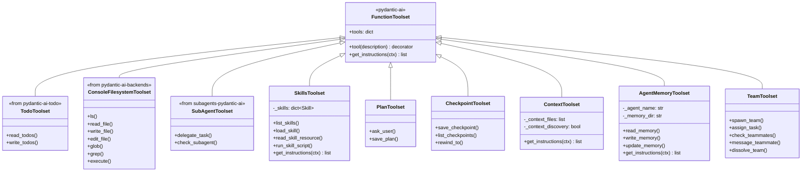
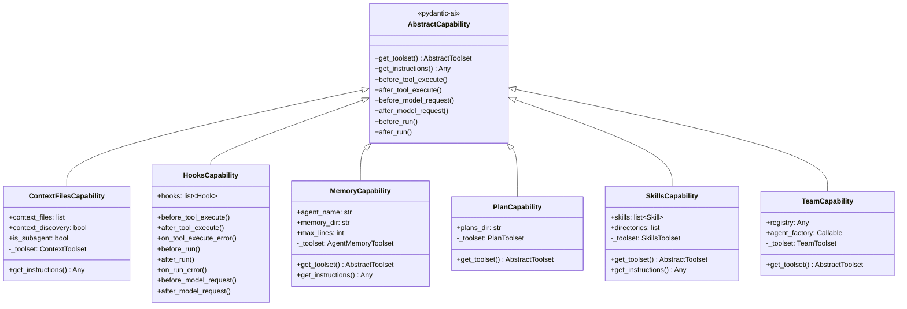
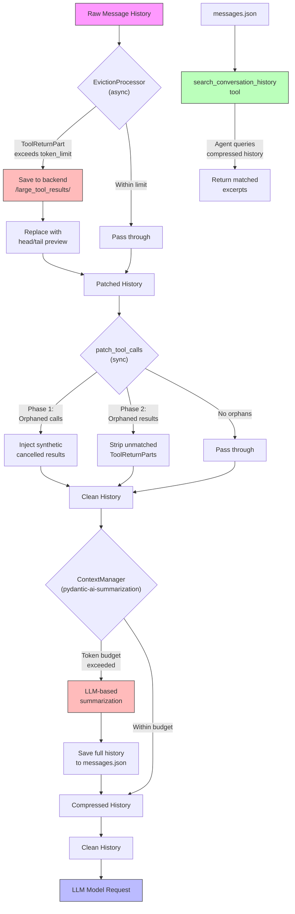

# 4B - Deep Dive: Toolsets, Capabilities & Processors

This document covers the three extension layers of pydantic-deepagents:

1. **Toolsets** (9 total) — Provide tools the agent can call during execution
2. **Capabilities** (6 total) — Lifecycle hooks and instruction injection
3. **Processors** (3 components) — Message history transformation pipeline

---

## Toolsets

Toolsets are `FunctionToolset` or `AbstractToolset` instances registered on the agent. They provide both tools (callable functions) and optional instructions (system prompt sections).

### 1. TodoToolset

**Source:** `pydantic-ai-todo` package

**Tools:**
- `read_todos` — List all todos with status
- `write_todos` — Update the todo list

**Integration:** Created via `create_todo_toolset(storage=_todo_proxy)`. The `_DepsTodoProxy` delegates reads/writes to `DeepAgentDeps.todos`.

**System Prompt:** Generated by `get_todo_system_prompt()` showing current todo state.

### 2. Console/Filesystem Toolset

**Source:** `pydantic-ai-backends` package

**Tools:**
- `ls` — List directory contents
- `read_file` — Read file content (supports offset/limit, image support)
- `write_file` — Create or overwrite files
- `edit_file` — Surgical edits (hashline format)
- `glob` — Pattern-based file search
- `grep` — Content search with regex
- `execute` — Shell command execution (requires `SandboxProtocol`)

**Configuration:**
- `require_write_approval` — From `interrupt_on["write_file"]`
- `require_execute_approval` — From `interrupt_on["execute"]` (default: True)
- `image_support` — Always True (returns `BinaryContent` for images)
- `edit_format` — Default: `"hashline"`

**Auto-detection:** `include_execute` defaults to `isinstance(backend, SandboxProtocol)`.

### 3. SubAgentToolset

**Source:** `subagents-pydantic-ai` package

**Tools:**
- `delegate_task` (aka `task`) — Delegate work to a named subagent
- `check_subagent` — Check subagent task status

**Configuration:**
- `max_nesting_depth` — Controls recursive delegation (default: 1)
- `subagent_registry` — Optional `DynamicAgentRegistry` for runtime registration
- `default_model` — Inherits from main agent model

**Per-subagent injection:**
- Each subagent gets its own `ContextToolset` if `context_files` is set
- Each subagent gets its own `AgentMemoryToolset` if `include_memory=True`
- Each subagent gets `_default_deep_agent_factory` for recursive deep agent creation

### 4. SkillsToolset

**Source:** `pydantic_deep/toolsets/skills/`

**Tools:**
- `list_skills` — List all discovered skills
- `load_skill` — Load a skill's instructions and metadata
- `read_skill_resource` — Read a named resource from a skill
- `run_skill_script` — Execute a skill script

#### Skill System Data Classes

```
Skill
├── name: str
├── description: str
├── content: str                    # Main instructions
├── resources: list[SkillResource]  # Static/dynamic content files
├── scripts: list[SkillScript]      # Executable scripts
└── metadata: dict

SkillResource
├── name: str
├── description: str | None
├── content: str | None             # Static content
├── function: Callable | None       # Dynamic generator
├── uri: str | None                 # File path
└── load(ctx, args) -> Any

SkillScript
├── name: str
├── description: str | None
├── function: Callable | None       # Programmatic
├── uri: str | None                 # File-based
└── run(ctx, args) -> Any

SkillWrapper                       # Generic decorator wrapper
├── wraps any callable into Skill
├── .resource() decorator
├── .script() decorator
└── .to_skill() -> Skill
```

#### Skill Discovery

**SkillsDirectory** (local filesystem):
```python
class SkillsDirectory:
    """Discovers skills from local filesystem directories."""
    root_dir: Path
    validate: bool = True
    max_depth: int | None = 3

    def get_skills() -> list[Skill]
    def load_skill(name) -> Skill
```

Discovers skills by scanning for `.md` files with YAML frontmatter:

```
skills/
├── my-skill/
│   ├── SKILL.md          # Required: name, description, content
│   ├── FORMS.md          # Resource file
│   └── analyze.py        # Script file
└── another-skill/
    └── SKILL.md
```

**BackendSkillsDirectory** (backend storage):
```python
class BackendSkillsDirectory:
    """Discovers skills from a BackendProtocol storage."""
    backend: BackendProtocol
    root_path: str = "/skills"

    def get_skills() -> list[Skill]
    def load_skill(name) -> Skill
```

#### Script Execution

**LocalSkillScriptExecutor** — Subprocess execution:
```python
class LocalSkillScriptExecutor:
    """Execute skill scripts via local Python subprocess."""
    _python_executable: str  # sys.executable by default
    timeout: int = 30

    async def run(script_path, args) -> str
```

**BackendSkillScriptExecutor** — Sandbox execution:
```python
class BackendSkillScriptExecutor:
    """Execute skill scripts via SandboxProtocol.execute()."""
    backend: SandboxProtocol
    timeout: int = 30

    async def run(script_path, args) -> str
```

### 5. PlanToolset

**Source:** `pydantic_deep/toolsets/plan/`

**Tools:**
- `ask_user` — Ask questions with predefined options (2-4 required)
- `save_plan` — Save implementation plan to markdown file

**`ask_user` Behavior:**
- Interactive mode: Calls `ctx.deps.ask_user(question, options)`
- Headless mode: Auto-selects the `recommended` option or first option

**Plan format:**
```markdown
# Plan: [Title]

## Context
## Decisions Made
## Implementation Steps
### Step 1: [Title]
- **Files**: `path/to/file.py`
- **Action**: create | modify | delete
## Files Summary
## Notes
```

**Planner subagent:** Built-in subagent with specialized instructions for planning-only workflow (never implements, only plans).

### 6. CheckpointToolset

**Source:** `pydantic_deep/toolsets/checkpointing.py`

**Tools:**
- `save_checkpoint` — Save a named checkpoint of conversation state
- `list_checkpoints` — List all saved checkpoints
- `rewind_to` — Rewind to a previous checkpoint

#### Checkpoint Data Model

```python
@dataclass
class Checkpoint:
    """Immutable snapshot of conversation state."""
    id: str                          # uuid4
    label: str                       # "auto-3", "before-refactor"
    turn: int                        # Model-request counter
    messages: list[ModelMessage]     # Shallow copy
    message_count: int
    created_at: datetime
    metadata: dict[str, Any]         # {"last_tool": "write_file"}
```

#### CheckpointStore Protocol

```python
@runtime_checkable
class CheckpointStore(Protocol):
    async def save(checkpoint: Checkpoint) -> None
    async def get(checkpoint_id: str) -> Checkpoint | None
    async def get_by_label(label: str) -> Checkpoint | None
    async def list_all() -> list[Checkpoint]
    async def remove(checkpoint_id: str) -> None
    async def remove_oldest() -> Checkpoint | None
    async def count() -> int
    async def clear() -> None
```

**Implementations:**
- `InMemoryCheckpointStore` — Dict-based, default
- `FileCheckpointStore` — JSON file-based persistence

#### CheckpointMiddleware (Capability)

Auto-saves checkpoints at configurable frequency:

```python
class CheckpointMiddleware(AbstractCapability[Any]):
    store: CheckpointStore | None
    frequency: str = "every_tool"  # "every_tool" | "every_turn" | "manual_only"
    max_checkpoints: int = 20

    async def before_model_request(ctx, request_context)  # "every_turn" mode
    async def after_tool_execute(ctx, call, ...)           # "every_tool" mode
```

Pruning: Oldest checkpoints are removed when `max_checkpoints` is exceeded.

#### RewindRequested Exception

```python
class RewindRequested(Exception):
    """Raised by rewind_to tool for application-level rewind."""
    checkpoint_id: str
    label: str
    messages: list[ModelMessage]
```

This exception propagates out of `agent.run()` because pydantic-ai only catches `ModelRetry` and `UnexpectedModelBehavior`. The caller catches it, restores `session.message_history`, and restarts.

### 7. ContextToolset

**Source:** `pydantic_deep/toolsets/context.py`

**Tools:** None — instruction injection only

**Purpose:** Loads project context files (`AGENTS.md`, `SOUL.md`) from the backend and injects into the system prompt.

**Default filenames:**
- `AGENTS.md` — Project instructions, conventions, architecture (visible to all)
- `SOUL.md` — Agent personality, style, user preferences (main agent only)

**Filtering:** Subagents only see `AGENTS.md` (via `SUBAGENT_CONTEXT_ALLOWLIST`).

**Truncation:** Files exceeding `DEFAULT_MAX_CONTEXT_CHARS` (20,000) are truncated with 70% head / 30% tail preserved.

```python
class ContextToolset(FunctionToolset[Any]):
    async def get_instructions(ctx) -> list[str] | None:
        # Load from ctx.deps.backend
        # Apply subagent filtering
        # Truncate if needed
```

### 8. MemoryToolset

**Source:** `pydantic_deep/toolsets/memory.py`

**Tools:**
- `read_memory` — Read full MEMORY.md content
- `write_memory` — Append new content to memory
- `update_memory` — Find and replace text in memory

**Storage:** Each agent gets `{memory_dir}/{agent_name}/MEMORY.md`

**Defaults:**
- `memory_dir` = `/.deep/memory`
- `max_lines` = 200 (injected into system prompt)

**Instruction injection:** First N lines of memory are auto-loaded into the system prompt via `get_instructions()`.

```python
class AgentMemoryToolset(FunctionToolset[Any]):
    agent_name: str           # "main", "code-reviewer", etc.
    memory_dir: str           # "/.deep/memory"
    max_lines: int            # 200

    async def get_instructions(ctx) -> list[str] | None
```

### 9. TeamToolset

**Source:** `pydantic_deep/toolsets/teams.py`

**Tools:**
- `spawn_team` — Create and start an agent team
- `assign_task` — Assign a task to a team member
- `check_teammates` — Check status of all team members
- `message_teammate` — Send a message to a teammate
- `dissolve_team` — Stop all members and dissolve the team

#### Shared Infrastructure

**SharedTodoList** — Asyncio-safe shared task list:

```python
class SharedTodoList:
    """Asyncio-safe shared TODO list for agent teams."""
    _items: dict[str, SharedTodoItem]
    _lock: asyncio.Lock

    async def add(content, blocked_by, created_by) -> str
    async def claim(item_id, agent_name) -> bool
    async def complete(item_id) -> None
    async def get_available() -> list[SharedTodoItem]
```

**SharedTodoItem** extends regular todos with:
- `assigned_to: str | None`
- `blocked_by: list[str]` — Dependency IDs
- `created_by: str | None`

**TeamMessageBus** — Peer-to-peer messaging:

```python
class TeamMessageBus:
    """Peer-to-peer message bus using asyncio.Queue."""
    _queues: dict[str, asyncio.Queue[TeamMessage]]

    def register(agent_name) -> None
    def unregister(agent_name) -> None
    async def send(sender, receiver, content) -> None
    async def broadcast(sender, content) -> None
    async def receive(agent_name, timeout) -> list[TeamMessage]
```

**AgentTeam** — Team coordinator:

```python
class AgentTeam:
    """Multi-agent team with shared state."""
    name: str
    members: list[TeamMember]
    shared_todos: SharedTodoList
    message_bus: TeamMessageBus
    shared_backend: BackendProtocol

    async def spawn() -> dict[str, TeamMemberHandle]
    async def assign(member_name, task_content) -> str
    async def broadcast(message) -> None
    async def wait_all() -> dict[str, str]
    async def dissolve() -> None
```

**Execution integration:** When `task_fn` is provided (from SubAgentToolset), `assign_task` delegates to the subagent execution engine.

---

## Capabilities

Capabilities extend `AbstractCapability[Any]` and provide lifecycle hooks and/or instruction injection. All 6 follow the same pattern:

```python
@dataclass
class XxxCapability(AbstractCapability[Any]):
    _toolset: XxxToolset | None = field(default=None, init=False, repr=False)

    def __post_init__(self) -> None:
        self._toolset = XxxToolset(...)

    def get_toolset(self) -> AbstractToolset[Any] | None:
        return self._toolset

    def get_instructions(self) -> Any:  # Optional
        ...
```

### 1. ContextFilesCapability

**Source:** `pydantic_deep/capabilities/context.py`

Wraps `ContextToolset` as a capability with automatic instruction injection.

**Parameters:**
- `context_files: list[str] | None` — Explicit file paths
- `context_discovery: bool` — Auto-discover AGENTS.md/SOUL.md
- `is_subagent: bool` — Apply subagent filtering
- `max_chars: int` — Truncation limit (20,000)

**Provides:** `get_instructions()` only (no tools)

### 2. HooksCapability

**Source:** `pydantic_deep/capabilities/hooks.py`

Claude Code-style lifecycle hooks with 8 events:

| Event | Trigger | Can Deny? |
|-------|---------|-----------|
| `PRE_TOOL_USE` | Before tool execution | Yes (raises `ModelRetry`) |
| `POST_TOOL_USE` | After successful tool | No (can modify result) |
| `POST_TOOL_USE_FAILURE` | After failed tool | No |
| `BEFORE_RUN` | Start of `agent.run()` | No |
| `AFTER_RUN` | End of `agent.run()` | No |
| `RUN_ERROR` | `agent.run()` failure | No |
| `BEFORE_MODEL_REQUEST` | Before each LLM call | No |
| `AFTER_MODEL_REQUEST` | After each LLM response | No |

#### Hook Data Classes

```python
@dataclass
class Hook:
    event: HookEvent
    command: str | None = None       # Shell command (via SandboxProtocol)
    handler: Callable | None = None  # Async Python function
    matcher: str | None = None       # Regex for tool_name
    timeout: int = 30
    background: bool = False         # Fire-and-forget

@dataclass
class HookInput:
    event: str
    tool_name: str
    tool_input: dict[str, Any]
    tool_result: str | None
    tool_error: str | None

@dataclass
class HookResult:
    allow: bool = True
    reason: str | None
    modified_args: dict[str, Any] | None
    modified_result: str | None
```

**Execution modes:**
- **Command hooks:** JSON piped via stdin to shell command, exit code 0 = allow, 2 = deny
- **Handler hooks:** Async Python function `(HookInput) -> HookResult`
- **Background hooks:** Fire-and-forget via `asyncio.create_task()`

### 3. MemoryCapability

**Source:** `pydantic_deep/capabilities/memory.py`

Wraps `AgentMemoryToolset` with both tools and instruction injection.

**Parameters:**
- `agent_name: str` — Default: `"main"`
- `memory_dir: str` — Default: `/.deep/memory`
- `max_lines: int` — Default: 200

**Provides:** `get_toolset()` + `get_instructions()`

### 4. PlanCapability

**Source:** `pydantic_deep/capabilities/plan.py`

Wraps `create_plan_toolset()` providing `ask_user` and `save_plan` tools.

**Parameters:**
- `plans_dir: str` — Default: `/plans`

**Provides:** `get_toolset()` only

### 5. SkillsCapability

**Source:** `pydantic_deep/capabilities/skills.py`

Wraps `SkillsToolset` with skill discovery, loading, and instruction injection.

**Parameters:**
- `skills: list[Skill] | None` — Pre-loaded skills
- `directories: list[str | Path | SkillsDirectory | BackendSkillsDirectory] | None`
- `validate: bool` — Default: True
- `max_depth: int | None` — Default: 3
- `instruction_template: str | None` — Custom prompt template
- `exclude_tools: set[str] | list[str] | None` — Tool exclusion

**Provides:** `get_toolset()` + `get_instructions()`

### 6. TeamCapability

**Source:** `pydantic_deep/capabilities/teams.py`

Wraps `create_team_toolset()` for multi-agent coordination.

**Parameters:**
- `registry: Any | None` — DynamicAgentRegistry
- `agent_factory: Callable | None` — Agent creation function
- `task_fn: Any | None` — Subagent task function
- `task_manager: Any | None` — Task status manager

**Provides:** `get_toolset()` only

---

## Processors

Processors transform message history before it reaches the LLM. They implement the `HistoryProcessor` protocol.

### Processing Pipeline

```
Raw History
    │
    ▼
┌─────────────────────────┐
│  EvictionProcessor      │  Saves large tool outputs to backend,
│  (async)                │  replaces with head/tail preview + file path
└───────────┬─────────────┘
            │
            ▼
┌─────────────────────────┐
│  patch_tool_calls       │  Fixes orphaned tool call/result pairs
│  (sync)                 │  Phase 1: inject synthetic cancelled results
│                         │  Phase 2: strip orphaned results
└───────────┬─────────────┘
            │
            ▼
┌─────────────────────────┐
│  ContextManager         │  Token tracking + auto-compression
│  (pydantic-ai-summariz.)│  Summarizes old messages when approaching budget
└───────────┬─────────────┘
            │
            ▼
┌─────────────────────────┐
│  History Search Toolset │  Provides search_conversation_history tool
│  (toolset, not proc.)   │  Reads messages.json for post-compression lookup
└───────────┬─────────────┘
            │
            ▼
        Clean History
            │
            ▼
           LLM
```

### 1. `patch_tool_calls_processor` (sync)

**Source:** `pydantic_deep/processors/patch.py`

Fixes broken message history from interrupted conversations.

#### Phase 1: Inject Synthetic Cancelled Results

Scans `ModelResponse` messages for `ToolCallPart`s without corresponding `ToolReturnPart`s:

```python
def _find_orphaned_calls(messages) -> dict[int, list[ToolReturnPart]]:
    for i, msg in enumerate(messages):
        if isinstance(msg, ModelResponse):
            tool_calls = {part.tool_call_id: part for part in msg.parts
                         if isinstance(part, ToolCallPart)}
            # Check next message for matching ToolReturnParts
            answered_ids = set(...)
            orphaned_ids = tool_calls.keys() - answered_ids
            # Create synthetic ToolReturnPart(content="Tool call was cancelled.")
```

#### Phase 2: Strip Orphaned Results

Removes `ToolReturnPart`s that have no matching `ToolCallPart`:

```python
def _find_orphaned_results(messages) -> set[tuple[int, str]]:
    for i, msg in enumerate(messages):
        if isinstance(msg, ModelRequest):
            return_ids = {part.tool_call_id: part for part in msg.parts
                         if isinstance(part, ToolReturnPart)}
            # Check preceding message for matching ToolCallParts
            called_ids = set(...)
            orphaned = return_ids.keys() - called_ids
```

**Signature:** `(messages: list[ModelMessage]) -> list[ModelMessage]` (sync, no RunContext)

### 2. `EvictionProcessor` (async)

**Source:** `pydantic_deep/processors/eviction.py`

Saves large tool outputs to the backend and replaces them with a preview.

**Configuration:**
- `token_limit: int` — Default: 20,000 (estimated via `NUM_CHARS_PER_TOKEN = 4`)
- `eviction_path: str` — Default: `/large_tool_results`
- `head_lines: int` — Default: 5
- `tail_lines: int` — Default: 5

**Process:**
1. Scan each `ModelRequest` for `ToolReturnPart`s
2. Estimate tokens: `len(content) / 4`
3. If exceeds limit:
   - Write full content to backend at `/large_tool_results/{sanitized_id}`
   - Replace with preview template
4. Track evicted IDs in `_evicted_ids` set (prevents re-processing)

**Replacement template:**
```
Tool result too large, saved to: {file_path}

Read the result using read_file with offset and limit parameters.
Example: read_file(path="{file_path}", offset=0, limit=100)

Preview (head/tail):
{content_sample}
```

**Backend resolution:** Prefers `ctx.deps.backend` (same as console tools), falls back to `self.backend`.

**Callback:** `on_eviction(tool_name, file_path, original_chars, preview_chars)` supports sync/async.

**Signature:** `async (ctx: RunContext, messages: list[ModelMessage]) -> list[ModelMessage]`

### 3. `create_history_search_toolset` (toolset)

**Source:** `pydantic_deep/processors/history_archive.py`

Provides the `search_conversation_history` tool for finding details in compressed-away messages.

**Tool:** `search_conversation_history(query: str) -> str`

**Process:**
1. Reads `messages.json` from disk (written by `ContextManagerMiddleware`)
2. Formats each message into readable text: `[0] User: ...`, `[1] Assistant: ...`
3. Case-insensitive search across formatted lines
4. Returns up to 10 matches with 5 context lines each

**Message formatting:**
- `UserPromptPart` → `User: {content}`
- `SystemPromptPart` → `System: {content[:200]}` or `[Compression summary]`
- `ToolReturnPart` → `Tool [{tool_name}]: {content[:500]}`
- `TextPart` → `Assistant: {content}`
- `ToolCallPart` → `Tool Call [{tool_name}]: {args[:200]}`

**Configuration:**
- `messages_path: str` — Absolute path to messages.json
- `_CONTEXT_LINES = 5` — Lines around each match
- `_MAX_MATCHES = 10` — Maximum results

---

## Class Diagram: Toolsets



## Class Diagram: Capabilities



## Flowchart: Processing Pipeline



## Common Capability Pattern

All capabilities follow this consistent pattern:

```python
@dataclass
class XxxCapability(AbstractCapability[Any]):
    """Capability description."""

    # Public configuration parameters
    param1: type = default_value
    param2: type = default_value

    # Private toolset (created in __post_init__)
    _toolset: XxxToolset | None = field(default=None, init=False, repr=False)

    def __post_init__(self) -> None:
        """Create the internal toolset."""
        self._toolset = XxxToolset(
            param1=self.param1,
            param2=self.param2,
        )

    def get_toolset(self) -> AbstractToolset[Any] | None:
        """Return the toolset for agent registration."""
        return self._toolset

    def get_instructions(self) -> Any:
        """Optional: Return async instruction injector."""
        toolset = self._toolset

        async def _instructions(ctx: RunContext[Any]) -> str | None:
            if toolset is None or not hasattr(ctx.deps, "backend"):
                return None
            parts = await toolset.get_instructions(ctx)
            return "\n\n".join(parts) if parts else None

        return _instructions
```

**Summary of which capabilities provide what:**

| Capability | `get_toolset()` | `get_instructions()` |
|------------|:---:|:---:|
| ContextFilesCapability | No | Yes |
| HooksCapability | No | No (lifecycle hooks instead) |
| MemoryCapability | Yes | Yes |
| PlanCapability | Yes | No |
| SkillsCapability | Yes | Yes |
| TeamCapability | Yes | No |