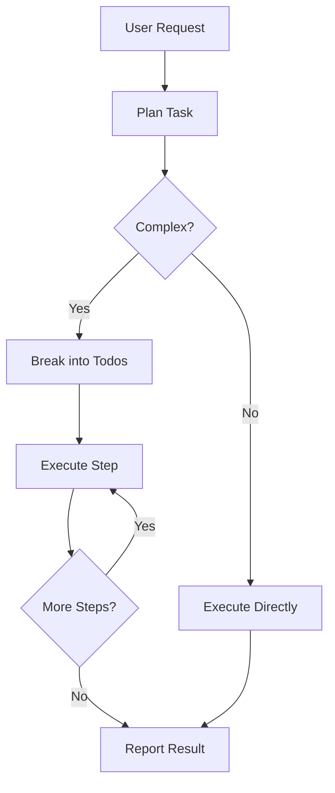

# Core Concepts

pydantic-deep provides a deep agent framework with four main pillars:

<div class="feature-grid">
<div class="feature-card">
<h3>🤖 Agents</h3>
<p>Autonomous LLM-powered agents that plan, execute, and iterate.</p>
<a href="agents/">Learn about Agents →</a>
</div>

<div class="feature-card">
<h3>💾 Backends</h3>
<p>Pluggable storage for files - in-memory, filesystem, or Docker.</p>
<a href="backends/">Learn about Backends →</a>
</div>

<div class="feature-card">
<h3>🔧 Toolsets</h3>
<p>Collections of tools that extend agent capabilities.</p>
<a href="toolsets/">Learn about Toolsets →</a>
</div>

<div class="feature-card">
<h3>🎯 Skills</h3>
<p>Modular packages with instructions loaded on-demand.</p>
<a href="skills/">Learn about Skills →</a>
</div>
</div>

## Architecture Overview

```
┌─────────────────────────────────────────────────────────────────┐
│                        create_deep_agent()                       │
├─────────────────────────────────────────────────────────────────┤
│                                                                  │
│  ┌──────────────┐  ┌──────────────┐  ┌──────────────┐           │
│  │ TodoToolset  │  │  Filesystem  │  │  SubAgent    │           │
│  │              │  │   Toolset    │  │   Toolset    │           │
│  │ write_todos  │  │ ls, read,    │  │    task      │           │
│  │              │  │ write, edit  │  │              │           │
│  └──────────────┘  └──────────────┘  └──────────────┘           │
│                                                                  │
│  ┌──────────────┐                                               │
│  │   Skills     │                                               │
│  │   Toolset    │                                               │
│  │ list_skills  │                                               │
│  │ load_skill   │                                               │
│  └──────────────┘                                               │
│                                                                  │
├─────────────────────────────────────────────────────────────────┤
│                       DeepAgentDeps                              │
│  ┌──────────────┐  ┌──────────────┐  ┌──────────────┐           │
│  │   Backend    │  │    Todos     │  │  Subagents   │           │
│  │  (storage)   │  │   (list)     │  │   (dict)     │           │
│  └──────────────┘  └──────────────┘  └──────────────┘           │
└─────────────────────────────────────────────────────────────────┘
```

## The Deep Agent Pattern

A "deep agent" is an autonomous agent that can:

1. **Plan** - Break down complex tasks into smaller steps
2. **Execute** - Perform actions using tools
3. **Iterate** - Check results and adjust approach
4. **Delegate** - Spawn subagents for specialized work

### Example Flow



## Quick Reference

### Creating an Agent

```python
from pydantic_deep import create_deep_agent

agent = create_deep_agent(
    model="openai:gpt-4.1",  # LLM to use
    instructions="You are a coding assistant.",   # System prompt
    include_todo=True,                            # Planning tools
    include_filesystem=True,                      # File operations
    include_subagents=True,                       # Task delegation
    include_skills=True,                          # Skill packages
)
```

### Creating Dependencies

```python
from pydantic_deep import DeepAgentDeps, StateBackend

deps = DeepAgentDeps(
    backend=StateBackend(),  # File storage
    todos=[],                # Task list
    subagents={},            # Preconfigured agents
)
```

### Running the Agent

```python
result = await agent.run(
    "Create a Python module with utility functions",
    deps=deps,
)

print(result.output)  # Agent's response
```

## Key Design Principles

### 1. Pydantic AI Native

Built entirely on Pydantic AI, leveraging:

- Type-safe agents and tools
- RunContext for dependency injection
- Structured output support
- Model-agnostic design

### 2. Protocol-Based Backends

Storage is abstracted through protocols:

```python
from typing import Protocol

class BackendProtocol(Protocol):
    def read(self, path: str) -> str: ...
    def write(self, path: str, content: str) -> WriteResult: ...
    # ... more methods
```

This allows easy extension for new storage backends.

### 3. Progressive Disclosure

Skills use progressive disclosure to optimize token usage:

- **Discovery**: Only metadata (name, description, tags)
- **Loading**: Full instructions loaded on-demand
- **Resources**: Additional files accessible when needed

### 4. Context Isolation

Subagents run in isolated contexts:

- Fresh todo list
- No nested subagent delegation
- Shared file storage (by reference)

This prevents context bloat and infinite recursion.

## Next Steps

- [Agents](agents.md) - Deep dive into agent creation
- [Backends](backends.md) - Understanding storage options
- [Toolsets](toolsets.md) - Available tools and customization
- [Skills](skills.md) - Creating and using skills
