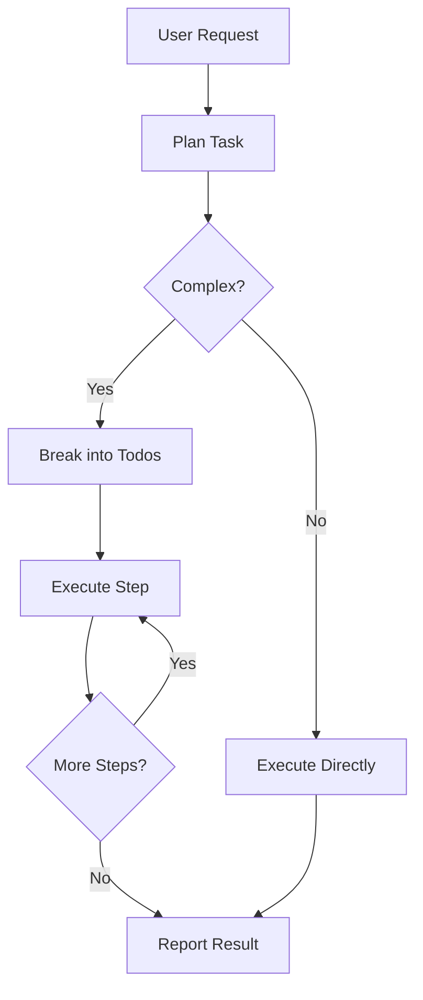

# Core Concepts

Once you've run [your first agent](../learn/first-agent.md), it helps to know the
few moving parts behind `create_deep_agent()`. There are only four, and they
compose cleanly — learn these and the rest of the docs will feel obvious.

!!! tip "Prefer to learn by doing?"
    The [Tutorial — User Guide](../learn/index.md) builds these ideas up one
    runnable step at a time. This section is the conceptual companion to it.

pydantic-deep rests on four pillars:

<div class="feature-grid">
<div class="feature-card">
<h3>🤖 Agents</h3>
<p>Autonomous LLM-powered agents that plan, execute, and iterate.</p>
<a href="agents/">Learn about Agents →</a>
</div>

<div class="feature-card">
<h3>💾 Workspaces</h3>
<p>Where a run works - in memory, a local directory, or a sandbox.</p>
<a href="workspaces/">Learn about Workspaces →</a>
</div>

<div class="feature-card">
<h3>🔧 Toolsets</h3>
<p>Collections of tools that extend agent capabilities.</p>
<a href="toolsets/">Learn about Toolsets →</a>
</div>

<div class="feature-card">
<h3>🎯 Skills</h3>
<p>Modular packages with instructions loaded on-demand.</p>
<a href="skills/">Learn about Skills →</a>
</div>
</div>

## Architecture Overview

```
┌─────────────────────────────────────────────────────────────────┐
│                        create_deep_agent()                       │
├─────────────────────────────────────────────────────────────────┤
│                                                                  │
│  ┌──────────────┐  ┌──────────────┐  ┌──────────────┐           │
│  │ TodoToolset  │  │  Filesystem  │  │  SubAgent    │           │
│  │              │  │   Toolset    │  │   Toolset    │           │
│  │ write_todos  │  │ ls, read,    │  │    task      │           │
│  │              │  │ write, edit  │  │              │           │
│  └──────────────┘  └──────────────┘  └──────────────┘           │
│                                                                  │
│  ┌──────────────┐                                               │
│  │   Skills     │                                               │
│  │   Toolset    │                                               │
│  │ list_skills  │                                               │
│  │ load_skill   │                                               │
│  └──────────────┘                                               │
│                                                                  │
├─────────────────────────────────────────────────────────────────┤
│              Workspace  +  DeepAgentDeps                         │
│  ┌──────────────┐  ┌──────────────┐  ┌──────────────┐           │
│  │  Workspace   │  │    Todos     │  │  Subagents   │           │
│  │(files, shell)│  │   (list)     │  │   (dict)     │           │
│  └──────────────┘  └──────────────┘  └──────────────┘           │
└─────────────────────────────────────────────────────────────────┘
```

## The Deep Agent Pattern

So what makes an agent "deep"? A shallow agent answers in one turn. A *deep*
agent keeps working until the job is actually done — it plans, acts, checks its
own results, and delegates. Concretely, it can:

1. **Plan** — break a complex task into smaller steps
2. **Execute** — perform actions using tools
3. **Iterate** — check results and adjust its approach
4. **Delegate** — spawn sub-agents for specialized work

!!! tip "You rarely orchestrate this yourself"
    The loop above is what the model *does* with the tools `create_deep_agent()`
    hands it. You describe the goal; the agent decides when to plan, when to
    delegate, and when it's finished.

### Example Flow


```mermaid
graph TD
    A[User Request] --> B[Plan Task]
    B --> C{Complex?}
    C -->|Yes| D[Break into Todos]
    C -->|No| E[Execute Directly]
    D --> F[Execute Step]
    F --> G{More Steps?}
    G -->|Yes| F
    G -->|No| H[Report Result]
    E --> H
```

## Quick Reference

### Creating an Agent

```python
from pydantic_deep import create_deep_agent

agent = create_deep_agent(
    model="anthropic:claude-sonnet-4-6",  # LLM to use
    instructions="You are a coding assistant.",   # System prompt
    include_todo=True,                            # Planning tools
    include_filesystem=True,                      # File operations
    include_subagents=True,                       # Task delegation
    include_skills=True,                          # Skill packages
)
```

### Creating Dependencies

```python
from pydantic_deep import DeepAgentDeps

deps = DeepAgentDeps(
    todos=[],                # Task list
    subagents={},            # Preconfigured agents
)
```

### Running the Agent

```python
result = await agent.run(
    "Create a Python module with utility functions",
    deps=deps,
)

print(result.output)  # Agent's response
```

## Key Design Principles

### 1. Pydantic AI Native

Built entirely on Pydantic AI, leveraging:

- Type-safe agents and tools
- RunContext for dependency injection
- Structured output support
- Model-agnostic design

### 2. Workspaces

Files and commands go through the run's Pydantic AI workspace, `ctx.workspace`:

```python
await ctx.workspace.read_text(path)
await ctx.workspace.write_text(path, content)
await ctx.workspace.run(["pytest", "-q"])  # where the workspace runs commands
```

Any workspace capability plugs in — in memory, a local directory, Docker,
sandboxd, Kubernetes, Daytona, or one of your own.

### 3. Progressive Disclosure

Skills use progressive disclosure to optimize token usage:

- **Discovery**: Only metadata (name, description, tags)
- **Loading**: Full instructions loaded on-demand
- **Resources**: Additional files accessible when needed

### 4. Context Isolation

Subagents run in isolated contexts:

- Fresh todo list
- No nested subagent delegation
- The parent's workspace

This prevents context bloat and infinite recursion.

## Next Steps

- [Tutorial — User Guide](../learn/index.md) - learn every feature, step by step
- [Agents](agents.md) - Deep dive into agent creation
- [Workspaces](workspaces.md) - Where a run works
- [Toolsets](toolsets.md) - Available tools and customization
- [Skills](skills.md) - Creating and using skills
